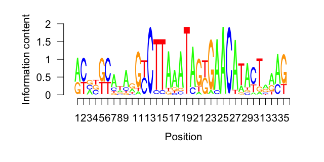
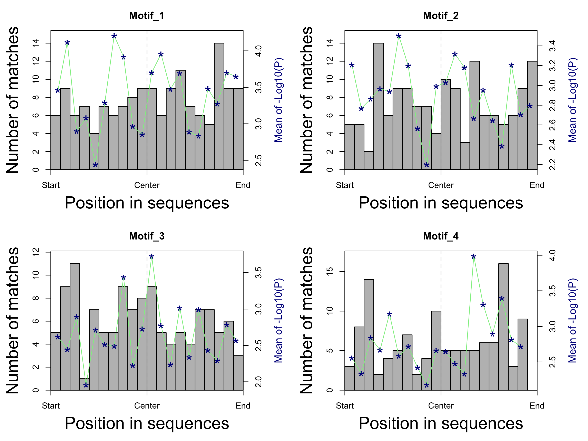
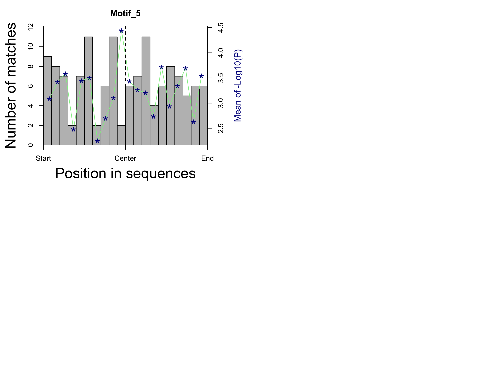

<div style="border:black 1px solid; padding: 0.5cm 0.5cm">

**Introduction** 

This is an R markdown template that implements main functionality of Bioconductor package ***rGADEM***. Please read the package [manual](https://www.bioconductor.org/packages/devel/bioc/vignettes/rGADEM/inst/doc/rGADEM.pdf) first for the background information and parameter options of using this package.

The main input data to this analysis is a set of DNA sequences, within which de novo motifs and their position weighted matrix (PWM) will be discovered. The DNA sequences can be provided as named character vector, an _DNAStringSet_ object, or a set of genomic locations with their reference genome, such as _[BSgenome.Hsapiens.NCBI.GRCh38](http://bioconductor.org/packages/release/data/annotation/html/BSgenome.Hsapiens.NCBI.GRCh38.html)_.

This analysis includes three major steps:

  1. The **GADEM {rGADEM}** function is used to discover de novo motifs from the DNA sequences and report the matches to the motifs
  2. The motifs and matches are summarized and visualized
  3. The motifs are re-matched to the DNA sequences using the **matchPWM {Biostrings}** function and a p value cutoff, to identify extra matches

</div>

&nbsp;


<div align='right'>_[Go to project home](https://github.com/zhezhangsh/RoCA)_</div> 

# Description

## Project


rGADAM wrapper


## Analysis


Search for DNA motifs around TSS of a number of interferon response genes.


<div align='right'>_[Go to project home](https://github.com/zhezhangsh/RoCA)_</div>


# Motif discovery


A total of **68** sequences are used by the **GADEM {rGADEM}** function to discovery de novo motifs (see **Table 1**). The function call uses the following parameters:

  - Seed PWM (_Spwm_): no
  - Number of EM steps (_numEM_): 80
  - P value cutoff of matches (_pValue_): 2e-04
  - Mask low-complexity sequences (_maskR_): yes
  - Maximal number of motifs allowed (_nmotifs_): 25

<div style="color:darkblue; padding:0 2cm">
**Table 1** Length and GC content of the sequences.
</div>

<div align='center', style="padding:0 2cm">


|            |  Min.  | 1st Qu. | Median |  Mean  | 3rd Qu. | Max.  |
|:-----------|:------:|:-------:|:------:|:------:|:-------:|:-----:|
|Length (bp) | 201.00 | 201.00  | 201.00 | 201.00 |  201.0  | 201.0 |
|GC (%)      | 25.87  |  44.16  | 50.75  | 52.02  |  61.2   | 79.6  |


</div>
  
<div align='right'>_[Go to project home](https://github.com/zhezhangsh/RoCA)_</div> 

# Motif summary


The **GADEM {rGADEM}** function discovers **5** motif(s) from the DNA sequences. For each motif, the output includes reports its consensus sequence, PWM, and detailed information about all matches. 

<div style="color:darkblue; padding:0 1cm">
**Table 2** Summary of motifs found from sequences. Click motif name to see full list of matches to each motif and consensus sequence to see its PWM. (***GC_Percent:*** average G/C percent in PWM;  ***Num_Base:*** number of bases of the motif; ***Num_Match:*** total number of matches to the motif in all sequences; and ***Num_Seq:*** number of sequences including one or more matches to the motif.)
</div>

<div align='center', style="padding:0 1cm">


|                Name                 |Consensus                                                          | GC_Percent| Num_Base| Num_Match| Num_Seq |
|:-----------------------------------:|:------------------------------------------------------------------|----------:|--------:|---------:|:-------:|
| [Motif_1](table/Match_Motif_1.html) |[rsnnnnAnyArrGymwTyAGAAAAnsrAAr](table/PWM_Motif_1.html)           |      40.37|       30|        54|   26    |
| [Motif_2](table/Match_Motif_2.html) |[TCTCAAsyAGCCyAGCAryATyTGCAACATCymmAwkGsC](table/PWM_Motif_2.html) |      48.83|       40|        15|   15    |
| [Motif_3](table/Match_Motif_3.html) |[vTykdTkGrkAACCTTGAryyTyGGCCTyTsTmmGsyrGk](table/PWM_Motif_3.html) |      51.78|       40|         7|    7    |
| [Motif_4](table/Match_Motif_4.html) |[ryvbkyAwArGyCTTAAATAGkGAACATACTrrAGn](table/PWM_Motif_4.html)     |      40.66|       36|        14|   14    |
| [Motif_5](table/Match_Motif_5.html) |[sCsCsCsCGCCCmCGCCyCb](table/PWM_Motif_5.html)                     |      81.02|       20|        37|   21    |


</div>

&nbsp;

<div align='center'>


|        Matching position         |           PWM Logo           |
|:--------------------------------:|:----------------------------:|
|  |  |
|  |  |
|  |  |
|  |  |
|  |  |


</div>

<div style="color:darkblue; padding:0 1cm">
**Figure 1.** Motif visualization. The right panel shows the logo of the consensus sequence and the left panel shows the relative positions of the matches to the motif within the sequences. 
</div>

<div align='right'>_[Go to project home](https://github.com/zhezhangsh/RoCA)_</div> 

# Motif re-match


The motifs discovered previously are re-matched to the DNA sequences by applying the following steps on each motif:

  - Calculate average base frequency of all DNA sequences
  - Draw 100000 random sequences of the same length as the motif
  - Calculate the matching scores of the random sequences to get a background distribution
  - Use the cutoff of empirical p value (0.01) to the cutoff of matching score
  - Re-match the motif to the sequences using the cutoff of matching score from the last step

<div style="color:darkblue; padding:0 2cm">
**Table 3** Summary of re-matching result. The columns are: _motif length, number of matches per kilobases, number of total matches, number of sequences including one or more matches, as well as the minimal, average, and maximal matching scores (highest = 100)_. Click on motif names to see the full lists of matches
</div>

<div align='center', style="padding:0 1cm">


|Motif                                 | Len_Motif| Match_Per_Kb| Num_Match| Num_Seq| Strand...| Min_Score| Mean_Score| Max_Score|
|:-------------------------------------|---------:|------------:|---------:|-------:|---------:|---------:|----------:|---------:|
|[Motif_1](table/Rematch_Motif_1.html) |        30|      11.2672|       154|      63|     43.51|      58.0|    69.1818|      93.4|
|[Motif_2](table/Rematch_Motif_2.html) |        40|      10.6819|       146|      68|     44.52|      48.1|    56.3623|      97.0|
|[Motif_3](table/Rematch_Motif_3.html) |        40|       8.9260|       122|      68|     48.36|      53.2|    59.4279|      86.3|
|[Motif_4](table/Rematch_Motif_4.html) |        36|       8.7065|       119|      62|     47.06|      51.2|    58.9109|      97.6|
|[Motif_5](table/Rematch_Motif_5.html) |        20|       9.5844|       131|      49|     56.49|      62.1|    71.2313|      89.0|


</div>

&nbsp;

<div align='center'>

</div>

<div style="color:darkblue; padding:0 1cm">
**Figure 2.** Distribution of relative positions of motif matches within the DNA sequences. Grey bar is the number of matches within each interval and blue star is the average P values (-log10 transformed) of matches within the interval. 
</div>

<div align='right'>_[Go to project home](https://github.com/zhezhangsh/RoCA)_</div>

***

# Appendix 

Check out the **[RoCA home page](http://zhezhangsh.github.io/RoCA)** for more information.  

## Reproduce this report

To reproduce this report: 

  1. Find the data analysis template you want to use and an example of its pairing YAML file  [here](https://github.com/zhezhangsh/RoCA/wiki/Templates-and-examples) and download the YAML example to your working directory

  2. To generate a new report using your own input data and parameter, edit the following items in the YAML file:

    - _output_        : where you want to put the output files
    - _home_          : the URL if you have a home page for your project
    - _analyst_       : your name
    - _description_   : background information about your project, analysis, etc.
    - _input_         : where are your input data, read instruction for preparing them
    - _parameter_     : parameters for this analysis; read instruction about how to prepare input data

  3. Run the code below within ***R Console*** or ***RStudio***, preferablly with a new R session:


```r
if (!require(devtools)) { install.packages('devtools'); require(devtools); }
if (!require(RCurl)) { install.packages('RCurl'); require(RCurl); }
if (!require(RoCA)) { install_github('zhezhangsh/RoCAR'); require(RoCA); }

CreateReport(filename.yaml);  # filename.yaml is the YAML file you just downloaded and edited
```

If there is no complaint, go to the _output_ folder and open the ***index.html*** file to view report. 

## Session information


```
## R version 3.2.2 (2015-08-14)
## Platform: x86_64-apple-darwin13.4.0 (64-bit)
## Running under: OS X 10.10.5 (Yosemite)
## 
## locale:
## [1] en_US.UTF-8/en_US.UTF-8/en_US.UTF-8/C/en_US.UTF-8/en_US.UTF-8
## 
## attached base packages:
##  [1] grid      stats4    parallel  stats     graphics  grDevices utils    
##  [8] datasets  methods   base     
## 
## other attached packages:
##  [1] BSgenome.Hsapiens.NCBI.GRCh38_1.3.1000
##  [2] Agri_0.0.0.9000                       
##  [3] rGADEM_2.20.0                         
##  [4] seqLogo_1.36.0                        
##  [5] BSgenome_1.38.0                       
##  [6] rtracklayer_1.30.4                    
##  [7] Biostrings_2.38.4                     
##  [8] XVector_0.10.0                        
##  [9] GenomicFeatures_1.22.13               
## [10] AnnotationDbi_1.32.3                  
## [11] Biobase_2.30.0                        
## [12] GenomicRanges_1.22.4                  
## [13] GenomeInfoDb_1.6.3                    
## [14] IRanges_2.4.8                         
## [15] S4Vectors_0.8.11                      
## [16] BiocGenerics_0.16.1                   
## [17] htmlwidgets_0.7                       
## [18] DT_0.2                                
## [19] awsomics_0.0.0.9000                   
## [20] yaml_2.1.13                           
## [21] rmarkdown_1.0                         
## [22] knitr_1.13                            
## [23] RoCA_0.0.0.9000                       
## [24] RCurl_1.95-4.8                        
## [25] bitops_1.0-6                          
## [26] devtools_1.12.0                       
## 
## loaded via a namespace (and not attached):
##  [1] Rcpp_0.12.6                highr_0.6                 
##  [3] formatR_1.4                futile.logger_1.4.3       
##  [5] futile.options_1.0.0       tools_3.2.2               
##  [7] zlibbioc_1.16.0            biomaRt_2.26.1            
##  [9] digest_0.6.10              jsonlite_1.0              
## [11] evaluate_0.9               memoise_1.0.0             
## [13] RSQLite_1.0.0              DBI_0.4-1                 
## [15] withr_1.0.2                stringr_1.0.0             
## [17] XML_3.98-1.4               BiocParallel_1.4.3        
## [19] lambda.r_1.1.9             magrittr_1.5              
## [21] Rsamtools_1.22.0           htmltools_0.3.5           
## [23] GenomicAlignments_1.6.3    SummarizedExperiment_1.0.2
## [25] stringi_1.1.1
```

<div align='right'>_[Go to project home](https://github.com/zhezhangsh/RoCA)_</div>

***
_END OF DOCUMENT_
