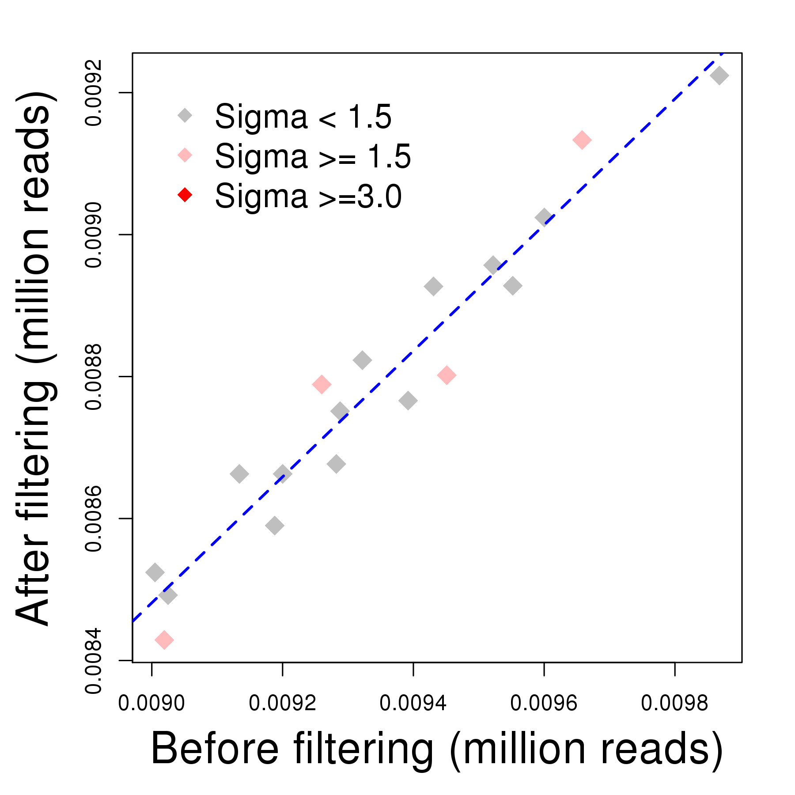
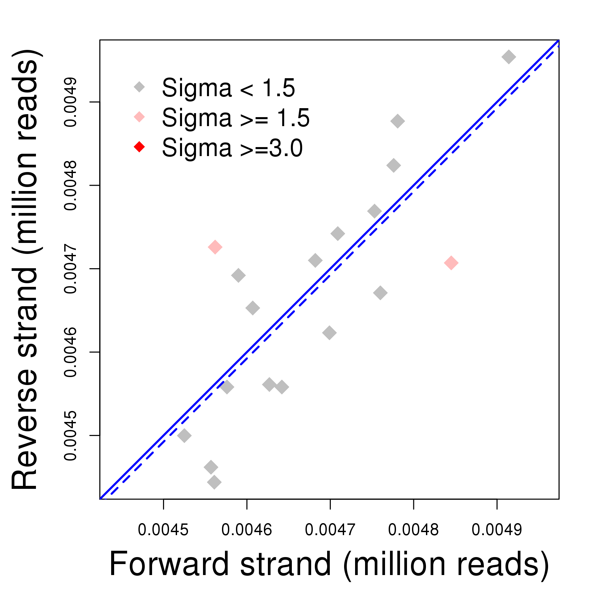
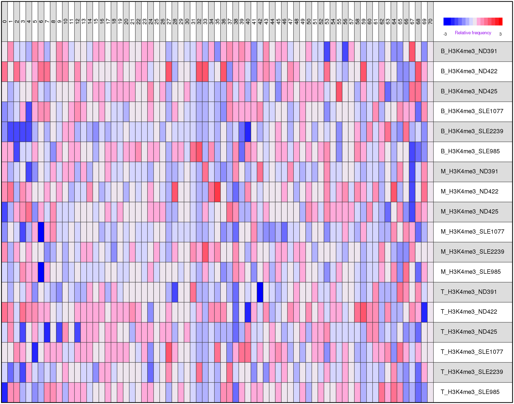
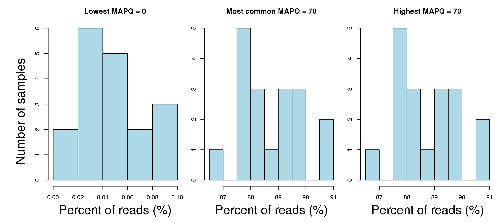
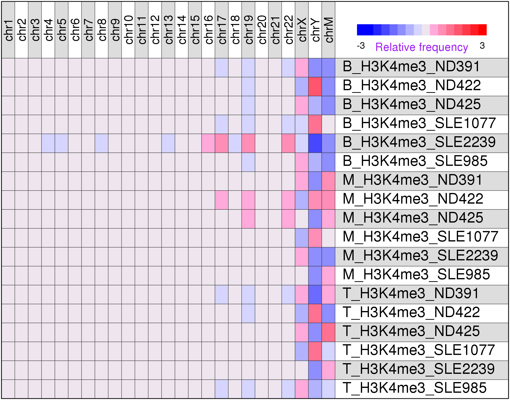
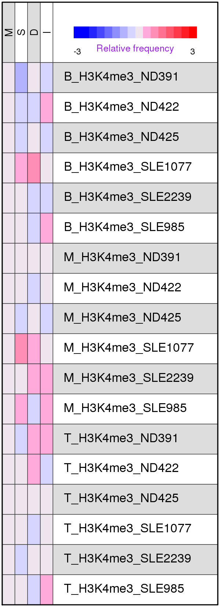

**Introduction** This is a procedure that summarizes and fitlers a set of BAM files based on alignment statistics such as mapping quality scores and CIGAR strings. It was designed to be used on ChIP-seq data sets.

**_[Go back to project home](index.html)_**

# Description

## Project

H3K4me2 and H3K4me3 in immune cells of SLE

## Analyst

Zhe Zhang

**_[Go back to project home](index.html)_**

# Read filtering

Total number of reads before vs. after filtering. The percent of reads passed the filtering was also calculated, based on which outlier samples with much higher or lower percents than the others were identified. Click [here](html/read_count.html) to see the table with summary statistics.

**Figure 1** Numbers of reads before and after filtering. Sigma was estimated for each sample by fitting all the other samples to a linear model, using the model to predict this sample, and calculating the difference between its predicated and actual after-filtering reads. Samples with sigmas greater than 3.0 are likely outliers. The percents of reads passed the filter are between 93.13% and 94.91% (mean = 94%). 

# Summary statistics

## FLAGs and strands

Each alignment software could assign a bitwise value as a combination of FLAGs to each read to represent the result of the alignment, as descrbed in [SAM format manual](https://samtools.github.io/hts-specs/SAMv1.pdf), Section 1.4. The bitwise value is 0 if the read is aligned "normally" and uniquely to the forward strand, and is 16 if the read is aligned "normally" and uniquely to the reverse strand. Any other values would suggest that there is something "wrong" with the alignment. The majority of the alignment will assign a strand to the read, but in some rare occasions, the strand is ambiguous and there is no strand information available for the read. Click [here]() to view the summary statistics about the FLAGs and alignment strands. 

**Figure 2** Numbers of reads aligned to the forward and reverse strands. Outliers were identified via fitting linear models as described in **Figure 1**. The solid blue line corresponds to the same 50%-50% of the reads aligned to the 2 strands, and the dashed lines is the actual fitting lines of a linear model. The percents of reads aligned to the forward strand the are between 49.117% and 50.722% (mean = 50%).

## Mapping quality scores, MAPQ

Each alignment software could use its own algorithm to assign an alignment score to each align reads. The scores are usually non-negative integers, with 0 corresponding to the lowest mapping quality. Click [here](html/mapq_count.html) to view the number of reads in each sample with a given score, or [here](html/mapq_percent.html) to view the percent of reads in each sample with a given score.

**Figure 3** Each cell indicates the relative frequency of reads with a given mapping score, comparing to all the other samples. 

**Figure 4** Each plot shows the distribution of read frequencies with the lowest, highest, and the most common mapping quality scores. 

## Reads by chromosomes

Alignment was broken down by chromosomes. Click [here](html/chromosome_count.html) to view the number of reads aligned to each chromosome, or [here](html/chromosome_percent.html) to view the percent of reads aligned to each chromosome.

**Figure 5** Each cell indicates the relative frequency of reads aligned to a chromosome, comparing to all the other samples. 

## CIGAR string

CIGAR strings indicate the internal structure of each alignment such as the base where insertion or deletion starts. Click [here](html/cigar_count.html) to view the number of bases per read with a given type of CIGAR character, or [here](html/cigar_percent.html) to view the percent of bases per read with a given type of CIGAR character.

**Figure 6** Each cell indicates the relative frequency of reads with a given character in their CIGAR strings, comparing to all the other samples. 

**_[Go back to project home](index.html)_**

***
**END_OF_DOCUMENT**

