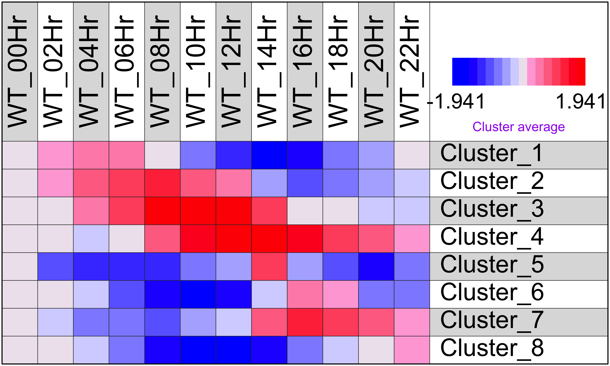

**Introduction: ** This analysis performs a gene-gene clustering procedure that will identify clusters of co-expressed genes across multiple sample groups. It first runs an ANOVA to find genes significantly changed across sample groups and uses these genes as seeds to initiate a number of gene clusters. These clusters will be further refined based on several user-specific paramters. Gene set enrichment analysis is then used to find pre-defined gene sets that are over-represented in each cluster. 

  - **Selection of differentially expressed gene:** ANOVA is used to get each gene a p value 
    for its differential expression across sample groups and false discovery rates are calculated      using the p values. Afterwards, genes are filtered sequentially by their FDR, p value, and         range until the number of remaining genes is smaller than a given minimal number.
  - **Gene clustering analysis:** Remaining genes from the last step are used as seeds for the         _hclust{stat}_ function to generate a hierchical clustering tree; the tree is cut at a given       height to get initial clusters; the cutting height will be lowered if the number of clusters is     less than the number of sample groups; the initial clusters are filtered to remove small           clusters, and refined to remove outlier genes; initial clusters close to each other are merged;     and finally, the clusters are refined through multiple rounds of re-clustering while including     genes with less significant ANOVA p values. 
  - **Gene set enrichment analysis:** Hypergeometric test is used to find predefined gene sets         over-represented in each gene cluster. A collection of gene sets obtained from                     different sources are available for a few model species and can be found at             
    https://github.com/zhezhangsh/RoCA/tree/master/data.
    

&nbsp;

_[Go to project home](http://zhezhangsh.github.io/RoCA)_

# Description

## Project

Perturbed rhythmic activation of signaling pathways in mice deficient for Sterol Carrier Protein 2-dependent diurnal lipid transport and metabolism. (**[GSE67426](http://www.ncbi.nlm.nih.gov/geo/query/acc.cgi?acc=GSE67426)**)

## PubMed

Jouffe C, Gobet C, Martin E, Métairon S et al. Perturbed rhythmic activation of signaling pathways in mice deficient for Sterol Carrier Protein 2-dependent diurnal lipid transport and metabolism. Sci Rep 2016 Apr 21;6:24631. PMID: [27097688](http://www.ncbi.nlm.nih.gov/pubmed/27097688).

## Experimental design

Comparison of liver mRNA expression from Scp2 KO and wild-type mice harvested every 2 hours during 3 consecutive days.

## Analysis

Circadian rhythm in mouse liver, wild type mice only, 3 replicates every 2 hours (12 groups). Each gene was adjusted to its 0 hour mean and rescaled to make its standard deviation equal to 0. As a demonstration, only a subset of genes in the original data with high between sample variance were used.

_[Go to project home](http://zhezhangsh.github.io/RoCA)_

## Data and samples

  - There are 2577 total genes
  - There are 36 total [samples](table/sample.html)
  - There are WT_00Hr, WT_02Hr, WT_04Hr, WT_06Hr, WT_08Hr, WT_10Hr, WT_12Hr, WT_14Hr, WT_16Hr, WT_18Hr, WT_20Hr, WT_22Hr sample groups

The input data matrix was normalized using sample group _WT_00Hr_ as control, so, the data of each gene was substracted by control group mean and had SD equal to 1.0

**Figure 1.** Principal components analysis (PCA) using all genes. Samples were colored by their groups. 

_[Go to project home](http://zhezhangsh.github.io/RoCA)_

# Analysis and results

## Gene-level summary statistics and ANOVA

Summary statistics and ANOVA p value across all sample groups were calculated for each gene.

- [Summary statistics and ANOVA result.](table/anova.html) 

  

**Figure 2.** Distribution of ANOVA p values. 821 genes have p values less than 0.01.

  

_[Go to project home](http://zhezhangsh.github.io/RoCA)_

## Identification of gene clusters

### Selection of differentially expressed genes

Differentially expressed genes (DEGs) were selected as seeds for generating gene clusters, using the following criteria:
  
  - Select genes with FDR less than 0.1
  - Stop if less than 200 genes were left; otherwise, select those with ANOVA p values less than 0.01
  - Stop if less than 200 genes were left; otherwise, select those with range (_max-min_) greater than 1
  - If there are still more than 1000 genes left, select the top 1000 with the biggest ranges

A total of **232** genes were selected. These genes would be used as seeds to generate gene clusters in the next step.

**Figure 3.** Hierarchical clustering of samples using all genes (unsupervised) or selected DEGs (supervised).

_[Go to project home](http://zhezhangsh.github.io/RoCA)_

### Idetnfication of gene clusters

Gene clusters were identified from the DEG seeds with the following steps:
  
  - Create a hierchical tree based on gene-gene correlation
  - Cut the tree at height 1.2, which will classify genes into clusters. Then apply the following steps to refine the clusters
  - Calculate correlation of each gene to the centroid (median) of its cluster. Remove the genes if the correlation is less than 0.6
  - Remove clusters with size less than 20% of the expected size (the expected size is 50 if there are 500 genes and 10 clusters)
  - If there are less than 12 (the number of sample groups) clusters left, reduce the height cutoff by 0.05 and repeat this step until there are enough clusters
  - Merge the 2 most similar clusters if the correlation of their centroids is greater than or equal to 0.6. Repeat this step until no 2 clusters are that similar

**8** gene clusters of **221** genes were identified from **232** seed DEGs.

**Figure 4.** Color of each block corresponds to the average expression (normalized) of each initial gene cluster in each sample (red = higher).

_[Go to project home](http://zhezhangsh.github.io/RoCA)_

### Refinement of gene clusters

The gene clusters identified from the DEG seeds were further refined with the following steps: 

  - Select all 821 genes with p values less than 0.01 to continue
  - Assign selected genes to clusters:
  - Calculate centroid (median expression level of all genes in the cluster) of each cluster
  - Calculate correlation coefficient of each gene to centroid of each cluster to get a 821 X 8 matrix
  - Assign a gene to a cluster if its correlation coefficient to the cluster is greater than 0.6, and the correlation coefficient to any other cluster is at least 0.1 less
  - Repeat this reclustering steps for 20 times unless the reclustering converged
  - Finally, remove clusters with number of genes less than 5.525
  
The reclustering didn't converge after 20 cycles

A total of **554** genes were clustered after refinement. 

**Figure 5.** Color of each block corresponds to the average expression (normalized) of each refined gene cluster in each sample (red = higher).

More info:

  - [Original data of clustered genes](table/clustered_data.html) ([download table](table/clustered_data.csv))
  - [Statistic result of clustered genes](table/clustered_stat.html) ([download table](table/clustered_stat.csv))

_[Go to project home](http://zhezhangsh.github.io/RoCA)_

## Analysis of individual clusters

### Summary statistics and visualization of individual clusters

**Table 1** Summary of individual clusters, with the average expression (normalized) of all genes of each cluster in all sample groups. Click on cluster name for visualization of each cluster: 1). the average and standard error of sample averages in each group; 2). hierarchical sample clustering using all genes of the cluster; and 3). heatmap of all genes and samples of the cluster.

|Cluster                            | Num_Gene| Mean_WT_00Hr| Mean_WT_02Hr| Mean_WT_04Hr| Mean_WT_06Hr| Mean_WT_08Hr| Mean_WT_10Hr| Mean_WT_12Hr| Mean_WT_14Hr| Mean_WT_16Hr| Mean_WT_18Hr| Mean_WT_20Hr| Mean_WT_22Hr|
|:----------------------------------|--------:|------------:|------------:|------------:|------------:|------------:|------------:|------------:|------------:|------------:|------------:|------------:|------------:|
|[Cluster_1](cluster/Cluster_1.pdf) |       74|            0|        0.320|       0.4003|       0.4754|      -0.0674|      -0.8074|      -1.3232|      -1.7725|      -1.4775|      -0.8675|      -0.4452|        0.038|
|[Cluster_2](cluster/Cluster_2.pdf) |       92|            0|        0.220|       0.6953|       1.1131|       1.3442|       0.7731|       0.5681|      -0.5761|      -1.1411|      -0.8391|      -0.4592|       -0.140|
|[Cluster_3](cluster/Cluster_3.pdf) |       76|            0|        0.027|       0.4720|       0.9529|       1.6852|       1.7297|       1.8217|       1.0513|       0.1103|      -0.0200|      -0.1501|       -0.150|
|[Cluster_4](cluster/Cluster_4.pdf) |       68|            0|       -0.110|      -0.2174|       0.0500|       0.8026|       1.5266|       1.9326|       1.9415|       1.4404|       1.0700|       0.7313|        0.170|
|[Cluster_5](cluster/Cluster_5.pdf) |       22|            0|       -0.910|      -1.3292|      -1.3408|      -1.3086|      -0.8028|      -0.5605|       1.1441|      -0.4487|      -0.9260|      -1.4410|       -0.760|
|[Cluster_6](cluster/Cluster_6.pdf) |       41|            0|        0.120|      -0.3093|      -1.0027|      -1.6774|      -1.6972|      -1.4500|      -0.3144|       0.4795|       0.2814|      -0.7223|       -0.760|
|[Cluster_7](cluster/Cluster_7.pdf) |       81|            0|       -0.360|      -0.7090|      -0.8816|      -1.0076|      -0.4168|      -0.1783|       0.7138|       1.1981|       1.1456|       0.8200|        0.290|
|[Cluster_8](cluster/Cluster_8.pdf) |      100|            0|       -0.110|      -0.3746|      -0.7491|      -1.5633|      -1.8686|      -1.9389|      -1.6773|      -0.7202|      -0.1745|       0.1049|        0.150|

_[Go to project home](http://zhezhangsh.github.io/RoCA)_

### Gene set enrichment analysis

Find predefined gene sets enriched in gene cluster comparing to the background. 

**Table 2** Numbers of predefined gene sets significantly enriched in each gene cluster. Gene sets were split based on their sources, such as the NCBI BioSystems and KEGG databases. Click on each number to see list of the gene sets. 

|          |                BioSystems                |               KEGG                |                MSigDb                |               PubTator               |
|:---------|:----------------------------------------:|:---------------------------------:|:------------------------------------:|:------------------------------------:|
|Cluster_1 | [65](cluster/Cluster_1/BioSystems.html)  | [3](cluster/Cluster_1/KEGG.html)  | [129](cluster/Cluster_1/MSigDb.html) |                  0                   |
|Cluster_2 | [48](cluster/Cluster_2/BioSystems.html)  |                 0                 | [152](cluster/Cluster_2/MSigDb.html) |                  0                   |
|Cluster_3 | [92](cluster/Cluster_3/BioSystems.html)  | [9](cluster/Cluster_3/KEGG.html)  | [177](cluster/Cluster_3/MSigDb.html) |                  0                   |
|Cluster_4 | [155](cluster/Cluster_4/BioSystems.html) | [11](cluster/Cluster_4/KEGG.html) | [249](cluster/Cluster_4/MSigDb.html) |                  0                   |
|Cluster_5 | [39](cluster/Cluster_5/BioSystems.html)  | [2](cluster/Cluster_5/KEGG.html)  | [137](cluster/Cluster_5/MSigDb.html) | [1](cluster/Cluster_5/PubTator.html) |
|Cluster_6 | [54](cluster/Cluster_6/BioSystems.html)  | [6](cluster/Cluster_6/KEGG.html)  | [186](cluster/Cluster_6/MSigDb.html) |                  0                   |
|Cluster_7 | [77](cluster/Cluster_7/BioSystems.html)  | [2](cluster/Cluster_7/KEGG.html)  | [134](cluster/Cluster_7/MSigDb.html) |                  0                   |
|Cluster_8 | [105](cluster/Cluster_8/BioSystems.html) | [10](cluster/Cluster_8/KEGG.html) | [119](cluster/Cluster_8/MSigDb.html) |                  0                   |

_[Go to project home](http://zhezhangsh.github.io/RoCA)_

## More plots

**Figure 6.**  Plot the patterns of all clusters using the mean and standard error of samples of each group.

&nbsp;

**Figure 7.**  Color represents the average expression (normalized across samples) of all genes in the same cluster and all samples in the same group (red = higher).

&nbsp;

**Figure 8.**  Color represents the average expression (normalized across samples) of individual genes in all samples of the same group (red = higher).

&nbsp;

**Figure 9.**  Color represents the expression level (normalized across samples) of each gene and each sample (red = higher).

&nbsp;

**Figure 10.** Color represents the size of each cluster (number of genes) after a reclustering cycle.  

_[Go to project home](http://zhezhangsh.github.io/RoCA)_

***
_END OF DOCUMENT_

