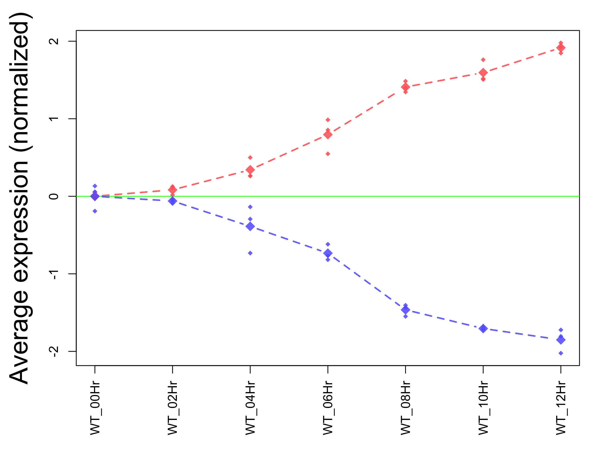
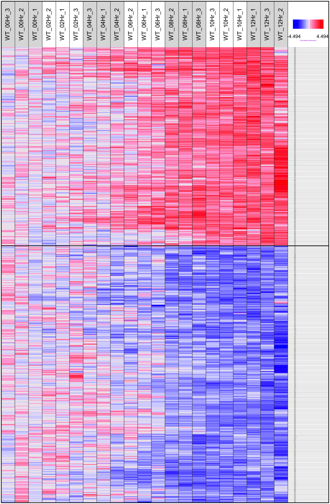

<div style="border:black 1px solid; padding: 0.5cm 0.5cm">

**Introduction: ** The goal of this analysis is to find genes in a microarray or RNA-seq data set correlated to a series of sample feature, such as time and drug dosage. It first calculates the correlation between the sample feature and the expression level of each gene. Depending on the nature of the sample feature, the correlation could be linear or non-linear. The genes with the strongest correlation are then selected based on their correlation coefficient, p value, false discovery rate, and range across samples. The selected genes are further analyzed to identify pre-defined gene sets over-represented in these genes. 

</div>

&nbsp;


<div align='right'>_[Go to project home](http://zhezhangsh.github.io/RoCA)_</div>

# Description

## Project


Perturbed rhythmic activation of signaling pathways in mice deficient for Sterol Carrier Protein 2-dependent diurnal lipid transport and metabolism. (**[GSE67426](http://www.ncbi.nlm.nih.gov/geo/query/acc.cgi?acc=GSE67426)**)


## PubMed


Jouffe C, Gobet C, Martin E, Métairon S et al. Perturbed rhythmic activation of signaling pathways in mice deficient for Sterol Carrier Protein 2-dependent diurnal lipid transport and metabolism. Sci Rep 2016 Apr 21;6:24631. PMID: [27097688](http://www.ncbi.nlm.nih.gov/pubmed/27097688).


## Experimental design


Comparison of liver mRNA expression from Scp2 KO and wild-type mice harvested every 2 hours during 3 consecutive days. Circadian rhythm in mouse liver, wild type mice only, 3 replicates every 2 hours (12 groups).


## Analysis


Each gene was adjusted to its 0 hour mean and rescaled to make its standard deviation equal to 0. This analysis looks for genes with continuous increased or decreased expression from 0 (midnight) to 12 hour (noon).


<div align='right'>_[Go to project home](http://zhezhangsh.github.io/RoCA)_</div>

## Data and samples


  - There are **12065** total genes.
  - There are **21** total [samples](table/sample.html).
  - There are **7** sample groups: ***WT_00Hr; WT_02Hr; WT_04Hr; WT_06Hr; WT_08Hr; WT_10Hr; WT_12Hr***. 
  
The input data matrix was normalized using sample group _WT_00Hr_ as control, so the data of each gene was substracted by control group mean and had SD equal to 1.0

<div align='right'>_[Go to project home](http://zhezhangsh.github.io/RoCA)_</div>

# Analysis and results

## Selection of correlated genes


<div style="color:darkblue; padding:0 2cm">
**Table 1** Selected genes positively or negatively correlated to time of the day. Click on the clicks veiw full gene list. Summary statistics are the maximums of p value and FDR and the minimums of correlation coefficient and data range of selected genes. 
</div>
  
<div align='center', style="padding:0 2cm">


|Direction                            | Num_Gene| Min_Corr| Max_Pval| Max_FDR| Min_Range|
|:------------------------------------|--------:|--------:|--------:|-------:|---------:|
|[Positive](table/stat_positive.html) |      303|     0.62|   0.0029|    0.05|    2.3320|
|[Negative](table/stat_negative.html) |      392|     0.62|   0.0029|    0.05|    2.7194|


</div>

<div align='center'>

</div>

<div style="color:darkblue; padding:0 2cm">
**Figure 1.** The averages of normalized expression level of selected genes positively (red) and negatively (blue) correlated to time of the day. The larger diamonds are the averages of sample groups and the smaller ones correspond to the individual samples. 
</div>

<div align='right'>_[Go to project home](http://zhezhangsh.github.io/RoCA)_</div>

## Gene set enrichment analysis

Find predefined gene sets over-represented in the two groups of genes correlated to time of the day. 
  


<div style="color:darkblue; padding:0 2cm">
**Table 2** Predefined gene sets significantly over-represented in the genes correlated to the time of the day. The test is run on the two groups of genes with positive and negative correlation separately and then jointly. Click on links to see full tables of statistical results.
</div>
  
<div align='center', style="padding:0 2cm">


|BioSystems                          |KEGG                         |MSigDb                          |PubTator                         |
|:-----------------------------------|:----------------------------|:-------------------------------|:--------------------------------|
|[743](ora/positive/BioSystems.html) |[63](ora/positive/KEGG.html) |[936](ora/positive/MSigDb.html) |[35](ora/positive/PubTator.html) |
|[513](ora/negative/BioSystems.html) |[46](ora/negative/KEGG.html) |[883](ora/negative/MSigDb.html) |[8](ora/negative/PubTator.html)  |
|[909](ora/both/BioSystems.html)     |[75](ora/both/KEGG.html)     |[1385](ora/both/MSigDb.html)    |[17](ora/both/PubTator.html)     |


</div>

<div align='center'>

</div>

<div style="color:darkblue; padding:0 1cm">
**Figure 2.** Heatmap of all genes correlated, positively or negatively, to time of the day. The colors represent the normalized expression levels (red = higher). 
</div>

<div align='right'>_[Go to project home](http://zhezhangsh.github.io/RoCA)_</div>

***

# Appendix 

Check out the **[RoCA home page](http://zhezhangsh.github.io/RoCA)** for more information.  

## Reproduce this report

To reproduce this report: 

  1. Find the data analysis template you want to use and an example of its pairing YAML file  [here](https://github.com/zhezhangsh/RoCA/wiki/Templates-and-examples) and download the YAML example to your working directory

  2. To generate a new report using your own input data and parameter, edit the following items in the YAML file:

    - _output_        : where you want to put the output files
    - _home_          : the URL if you have a home page for your project
    - _analyst_       : your name
    - _description_   : background information about your project, analysis, etc.
    - _input_         : where are your input data, read instruction for preparing them
    - _parameter_     : parameters for this analysis; read instruction about how to prepare input data

  3. Run the code below within ***R Console*** or ***RStudio***, preferablly with a new R session:


```r
if (!require(devtools)) { install.packages('devtools'); require(devtools); }
if (!require(RCurl)) { install.packages('RCurl'); require(RCurl); }
if (!require(RoCA)) { install_github('zhezhangsh/RoCAR'); require(RoCA); }

CreateReport(filename.yaml);  # filename.yaml is the YAML file you just downloaded and edited for your analysis
```

If there is no complaint, go to the _output_ folder and open the ***index.html*** file to view report. 
## Session information


```
## R version 3.2.2 (2015-08-14)
## Platform: x86_64-apple-darwin13.4.0 (64-bit)
## Running under: OS X 10.10.5 (Yosemite)
## 
## locale:
## [1] en_US.UTF-8/en_US.UTF-8/en_US.UTF-8/C/en_US.UTF-8/en_US.UTF-8
## 
## attached base packages:
## [1] stats     graphics  grDevices utils     datasets  methods   base     
## 
## other attached packages:
##  [1] gplots_3.0.1        rchive_0.0.0.9000   htmlwidgets_0.6    
##  [4] DT_0.1              awsomics_0.0.0.9000 yaml_2.1.13        
##  [7] rmarkdown_0.9.6     knitr_1.13          RoCA_0.0.0.9000    
## [10] RCurl_1.95-4.8      bitops_1.0-6        devtools_1.12.0    
## 
## loaded via a namespace (and not attached):
##  [1] Rcpp_0.12.5        magrittr_1.5       stringr_1.0.0     
##  [4] highr_0.6          caTools_1.17.1     tools_3.2.2       
##  [7] KernSmooth_2.23-15 withr_1.0.2        htmltools_0.3.5   
## [10] gtools_3.5.0       digest_0.6.9       formatR_1.4       
## [13] memoise_1.0.0      evaluate_0.9       gdata_2.17.0      
## [16] stringi_1.1.1      jsonlite_0.9.22
```

<div align='right'>_[Go to project home](http://zhezhangsh.github.io/RoCA)_</div>

***
_END OF DOCUMENT_

