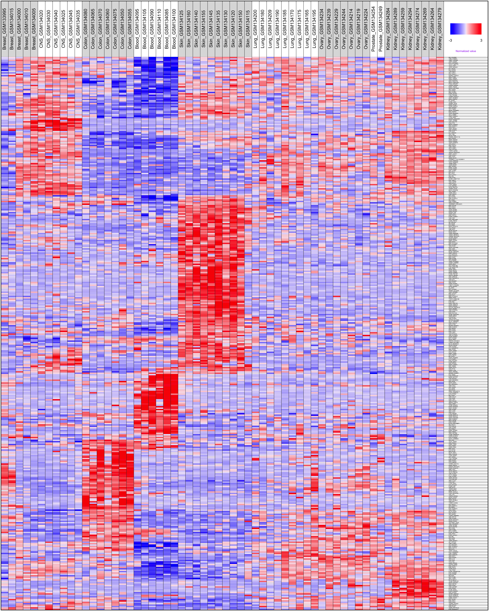

<div style="border:black 1px solid; padding: 0.5cm 0.5cm">
**Introduction** This analysis runs a simple procedure that identifies variables significantly different across sample groups via ANOVA and then plots a heatmap of these variables.
</div>

&nbsp;


<div align='right'>_[Go to project home](http://www.ncbi.nlm.nih.gov/geo/query/acc.cgi?acc=GSE67426)_</div>

# Description

## Project


Comparison between cell lines from 9 different cancer tissues (NCI-60); **[GSE5949](http://www.ncbi.nlm.nih.gov/geo/query/acc.cgi?acc=GSE5949)**


## PubMed


Reinhold WC, Reimers MA, Lorenzi P, Ho J et al. **Multifactorial regulation of E-cadherin expression: an integrative study.** Mol Cancer Ther 2010 Jan;9(1):1-16. PMID: [20053763](http://www.ncbi.nlm.nih.gov/pubmed/20053763).


## Experimental design


Comparison between cell lines from 9 different cancer tissue of origin types (Breast, Central Nervous System, Colon, Leukemia, Melanoma, Non-Small Cell Lung, Ovarian, Prostate, Renal) from NCI-60 panel


## Analysis


Cluster genes co-expressed acroo 9 tissues/organs


<div align='right'>_[Go to project home](http://www.ncbi.nlm.nih.gov/geo/query/acc.cgi?acc=GSE67426)_</div>

# Summary statistics


The input data matrix has

  - 9 sample groups
  - 60 total samples
  - 3105 total variables
    * there are no variables including missing values.


<div style="color:darkblue; padding:0 3cm">
**Table 1.** The mean, standard deviation, and range of all variables.
</div>

<div align='center', style="padding:0 3cm">


|      | Min.  | 1st Qu. | Median |  Mean  | 3rd Qu. |  Max.  |
|:-----|:-----:|:-------:|:------:|:------:|:-------:|:------:|
|Mean  | 2.274 | 4.3560  | 5.6260 | 5.6820 | 6.8810  | 12.160 |
|SD    | 0.500 | 0.5625  | 0.6536 | 0.7684 | 0.8506  | 3.108  |
|Range | 2.010 | 2.7500  | 3.2900 | 3.6180 | 4.2000  | 8.840  |


</div>

<div align='right'>_[Go to project home](http://www.ncbi.nlm.nih.gov/geo/query/acc.cgi?acc=GSE67426)_</div>

# Variable selection

## Run ANOVA


Run 1-way ANOVA on each variable to identify those significantly different across all sample groups.

<div align='center'>

</div>

<div style="color:darkblue; padding:0 3cm">
**Figure 1.** Distribution of ANOVA p values. Number of variables with p values within each 0.01 interval.
</div>

## Select variables


Significant variables were selected using the following criteria:

  - Select variables with ANOVA p values less than **10<sup>-5</sup>**
  - Stop if the number of remaining variables is between **100** and **2000**, else
    * if the number remaining variable is less than 100, select the top 100 variables with the smallest p values
    * if the number remaining variable is greater than 2000, select the top 2000 variables with the smallest p values

As a result, **396** variables were selected. Click [here](table/selected.html) to view these variables.

<div align='right'>_[Go to project home](http://www.ncbi.nlm.nih.gov/geo/query/acc.cgi?acc=GSE67426)_</div>

# Heatmap


<div align='center'>

</div>

<div style="color:darkblue; padding:0 2cm">
**Figure 2.** Color-coded data of selected variables different across sample groups (red = higher). Variables (rows) were clustered based on their correlation to each other and samples were arranged by groups.
</div>

<div align='right'>_[Go to project home](http://www.ncbi.nlm.nih.gov/geo/query/acc.cgi?acc=GSE67426)_</div>

***

# Appendix 

Check out the **[RoCA home page](http://zhezhangsh.github.io/RoCA)** for more information.  

## Reproduce this report

To reproduce this report: 

  1. Find the data analysis template you want to use and an example of its pairing YAML file  [here](https://github.com/zhezhangsh/RoCA/wiki/Templates-and-examples) and download the YAML example to your working directory

  2. To generate a new report using your own input data and parameter, edit the following items in the YAML file:

    - _output_        : where you want to put the output files
    - _home_          : the URL if you have a home page for your project
    - _analyst_       : your name
    - _description_   : background information about your project, analysis, etc.
    - _input_         : where are your input data, read instruction for preparing them
    - _parameter_     : parameters for this analysis; read instruction about how to prepare input data

  3. Run the code below within ***R Console*** or ***RStudio***, preferablly with a new R session:


```r
if (!require(devtools)) { install.packages('devtools'); require(devtools); }
if (!require(RCurl)) { install.packages('RCurl'); require(RCurl); }
if (!require(RoCA)) { install_github('zhezhangsh/RoCAR'); require(RoCA); }

CreateReport(filename.yaml);  # filename.yaml is the YAML file you just downloaded and edited for your analysis
```

If there is no complaint, go to the _output_ folder and open the ***index.html*** file to view report. 

## Session information


```
## R version 3.2.2 (2015-08-14)
## Platform: x86_64-apple-darwin13.4.0 (64-bit)
## Running under: OS X 10.10.5 (Yosemite)
## 
## locale:
## [1] en_US.UTF-8/en_US.UTF-8/en_US.UTF-8/C/en_US.UTF-8/en_US.UTF-8
## 
## attached base packages:
## [1] stats4    parallel  stats     graphics  grDevices utils     datasets 
## [8] methods   base     
## 
## other attached packages:
##  [1] gplots_3.0.1                           
##  [2] htmlwidgets_0.7                        
##  [3] DT_0.2                                 
##  [4] awsomics_0.0.0.9000                    
##  [5] yaml_2.1.13                            
##  [6] rmarkdown_1.0                          
##  [7] knitr_1.13                             
##  [8] RoCA_0.0.0.9000                        
##  [9] RCurl_1.95-4.8                         
## [10] bitops_1.0-6                           
## [11] devtools_1.12.0                        
## [12] BiocInstaller_1.20.3                   
## [13] GenomicAlignments_1.6.3                
## [14] Rsamtools_1.22.0                       
## [15] Biostrings_2.38.4                      
## [16] XVector_0.10.0                         
## [17] SummarizedExperiment_1.0.2             
## [18] org.Hs.eg.db_3.2.3                     
## [19] RSQLite_1.0.0                          
## [20] DBI_0.4-1                              
## [21] TxDb.Hsapiens.UCSC.hg38.knownGene_3.1.3
## [22] GenomicFeatures_1.22.13                
## [23] AnnotationDbi_1.32.3                   
## [24] Biobase_2.30.0                         
## [25] GenomicRanges_1.22.4                   
## [26] GenomeInfoDb_1.6.3                     
## [27] IRanges_2.4.8                          
## [28] S4Vectors_0.8.11                       
## [29] ggbio_1.18.5                           
## [30] ggplot2_2.1.0                          
## [31] BiocGenerics_0.16.1                    
## 
## loaded via a namespace (and not attached):
##  [1] jsonlite_1.0             splines_3.2.2           
##  [3] gtools_3.5.0             Formula_1.2-1           
##  [5] highr_0.6                latticeExtra_0.6-28     
##  [7] RBGL_1.46.0              BSgenome_1.38.0         
##  [9] lattice_0.20-33          biovizBase_1.18.0       
## [11] chron_2.3-47             digest_0.6.10           
## [13] RColorBrewer_1.1-2       colorspace_1.2-6        
## [15] htmltools_0.3.5          Matrix_1.2-6            
## [17] plyr_1.8.4               OrganismDbi_1.12.1      
## [19] XML_3.98-1.4             biomaRt_2.26.1          
## [21] zlibbioc_1.16.0          scales_0.4.0            
## [23] gdata_2.17.0             BiocParallel_1.4.3      
## [25] withr_1.0.2              nnet_7.3-12             
## [27] survival_2.39-5          magrittr_1.5            
## [29] memoise_1.0.0            evaluate_0.9            
## [31] GGally_1.2.0             foreign_0.8-66          
## [33] graph_1.48.0             rsconnect_0.4.3         
## [35] tools_3.2.2              data.table_1.9.6        
## [37] formatR_1.4              stringr_1.0.0           
## [39] munsell_0.4.3            cluster_2.0.4           
## [41] lambda.r_1.1.9           caTools_1.17.1          
## [43] futile.logger_1.4.3      grid_3.2.2              
## [45] dichromat_2.0-0          VariantAnnotation_1.16.4
## [47] labeling_0.3             gtable_0.2.0            
## [49] reshape_0.8.5            reshape2_1.4.1          
## [51] gridExtra_2.2.1          rtracklayer_1.30.4      
## [53] Hmisc_3.17-4             futile.options_1.0.0    
## [55] KernSmooth_2.23-15       stringi_1.1.1           
## [57] Rcpp_0.12.6              rpart_4.1-10            
## [59] acepack_1.3-3.3
```

<div align='right'>_[Go to project home](http://www.ncbi.nlm.nih.gov/geo/query/acc.cgi?acc=GSE67426)_</div>

***
_END OF DOCUMENT_
