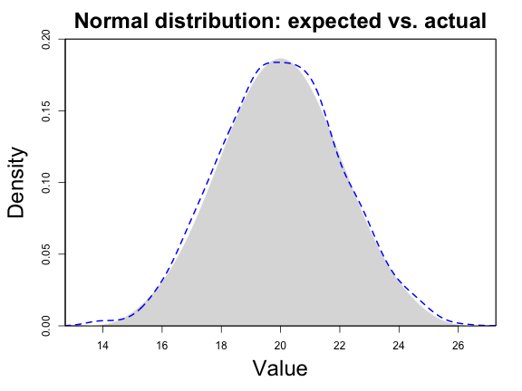

**Introduction** This is a procedure that randomly generates a vector of _X_ values following a normal distribution, with given mean and standard deviation.


# Description


## Project


Reporting of customized workflow (RoCA)


## Analysis


This is a demo of the RoCA framework that generates random values with normal distribution.


# Sampling

## Summary statistics


<div align='center'>**Table 1** Sampling results: expected vs. actual mean and standard deviation</div>

|              | Length   | Mean    | Standard deviation |
|:-------------|---------:|--------:|-------------------:|                  
| **Expected** | 1000 | 20 | 2            |
| **Actual**   | 1000 | 19.9340151 | 2.0346091            |


```
Summary statistics:
   Min. 1st Qu.  Median    Mean 3rd Qu.    Max. 
  13.66   18.58   20.00   19.93   21.31   27.27 

	Shapiro-Wilk normality test

data:  v
W = 0.99822, p-value = 0.386
```

## Plot distribution

<div align='center'>

</div>

**Figure 1** This figure compares the expected data distribution with given mean and standard deviation (grey) and actual distribution of sampled data vector (blue line). 

## Outputs


The output folder, <**output**>, includes the following files: 

  - **sample_normal.Rmd**: The Rmarkdown file that generates this report
  - **sample_normal.yml**: The Yaml configuration file that specifies this run
  - **index.html**: The Html index file of this report
  - **vector.rds**: The randomly generated values saved as an R vector
  - **vector.csv**: The randomly generated values saved as text file
  

***
**END_OF_DOCUMENT**
