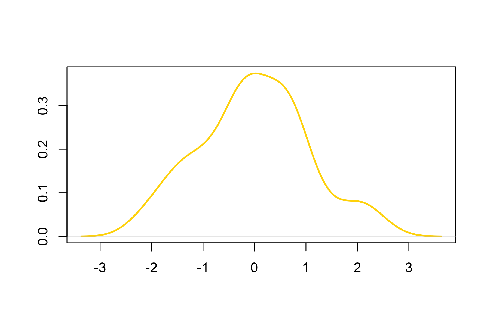

<div style="border:black 1px solid; padding: 0.5cm 0.5cm">
**Introduction** 

Developer of this R Markdown template should describe here the goal, scope, input data and major steps of this analysis. 

This skeleton helps developers to implement their own reproducible analysis using the RoCA framework. Visit the [RoCA site](http://zhezhangsh.github.io/RoCA) for more information about this project.

Definitation of terms: 

  - ***RoCA framework***       : RoCA is a paradigm of reproducible data analysis for bioinformaticians to share their custom analysis procedure. It creates dynamic data analysis reports based on R Markdown templates. Visit [RoCA home](http://zhezhangsh.github.io/RoCA) for more information.
  - ***R Markdown template***  : An .Rmd document that includes both R code and documentation of a data analysis procedure. It generates dynamic report according to user-specific input data and parameters for each analysis.
  - ***YAML key-value pairs*** : The pairs are specifications of each analysis performed using the R Markdown template. They are formatted and saved together as a [YAML file](http://www.yaml.org). It is highly recommended to pair each R Markdown template with a YAML file having the same file name. 
  - ***Knitr report***         : Data analysis report in HTML, PDF, or Word file, generated by the [knitr tool](http://yihui.name/knitr) for each analysis, based on the R Markdown template and the YAML specifications.
  - ***Developer***            : A developer implements a data analysis procedure into a R Markdown template, so the analysis can be repeated by any data analysts using their own data and parameters. The developer should also provide introduction and examples about how to set up an analysis using the template.
  - ***Analyst***              : Given an available R Markdown template generated by a developer, an analyst only needs to work with the pairing YAML file to set up a specific analysis. The analyst should follow instructions to prepare input data and choose parameters for each analysis. 
  
</div>

&nbsp;


<div align='right'>_[Go to project home](https://github.com/zhezhangsh/RoCA)_</div> <!-- plug this line anywhere you want to add a link to the project home page in the report -->

<!--
This whole section is dedicated to the <description> block in the YAML file.
Each key-value pair in that block will be written out as a subsection. 
Keep it unchanged for all RoCA templates
-->

# Description

## Project


Reporting of Custom Analysis


## Analysis


Just a skeleton for developer to write their own Rmd templates


<div align='right'>_[Go to project home](https://github.com/zhezhangsh/RoCA)_</div>


# The first result section <!-- Change section title -->

<!-- replace this paragraph in your template -->
[R Markdown](http://rMarkdown.rstudio.com) generates dynamic documents using R code for data analysis and [Markdown](https://daringfireball.net/projects/markdown) markup language for text. For each analysis step in an R Markdown file, the deveoper should describe the analysis in terms of its goal, rational, method, etc.

<!-- this is a silent code chunk that does some analysis but will not be written into the report -->


## The first subsection <!-- Change subsection title -->

<!-- replace this paragraph in your template -->
There are two ways to show a table: by using the kable function to include a small table in the final report, or by adding a [link](table/chromosome.html) that points to an HTML table in Jave DataTables format. By default, all HTML tables will be saved in the _table/_ subfolder.

<!-- this is a code chunk that prepares for a summary table to be included in the report -->


<div style="color:darkblue; padding:0 3cm">
**Table 1** Write the table title and caption here.
</div>

<div align='center', style="padding:0 3cm"> <!-- Horizontally align the table at the center of the page -->
<!-- Use the kable function to directly put a small table in the report -->


|       |  Min.  | 1st Qu. |  Median   |   Mean    | 3rd Qu. | Max.  |
|:------|:------:|:-------:|:---------:|:---------:|:-------:|:-----:|
|Draw_1 | -2.257 | -0.6439 | 0.132400  | 0.032890  | 0.7073  | 2.501 |
|Draw_2 | -2.489 | -0.8184 | -0.012930 | -0.002154 | 0.7198  | 2.854 |
|Draw_3 | -2.622 | -0.6294 | 0.031190  | 0.035480  | 0.7299  | 3.083 |
|Draw_4 | -2.738 | -0.7021 | -0.004288 | -0.007244 | 0.8318  | 2.224 |


</div>

## The second subsection <!-- Change subsection title -->

<!-- replace this paragraph in your template -->
By default, all figures will be saved in the _figure/_ subfolder as both .pdf and .png files.

<!-- this is a code chunk that will generate a plot to be written into the report -->
<div align='center'> <!-- Horizontally align the figure at the center of the page -->

</div>

<div style="color:darkblue; padding:0 3cm">
**Figure 1.** Write the figure caption here. 
</div>

<div align='right'>_[Go to project home](https://github.com/zhezhangsh/RoCA)_</div>

# The second result section <!-- Change section title -->

<!-- replace this paragraph in your template -->
The develop will decide how to split a full data analysis procedure into multiple steps and present the results in different sections and subsection. Be careful with the dependency between steps. 

<!-- this is a silent code chunk that does some analysis but will not be written into the report -->


# More sections ...

<div align='right'>_[Go to project home](https://github.com/zhezhangsh/RoCA)_</div>

<!-- Keep this section unchanged for all RoCA templates -->
# Appendix 

Check out the **[RoCA home page](http://zhezhangsh.github.io/RoCA)** for more information.  

## Reproduce this report

To reproduce this report: 

  1. Find the data analysis template you want to use and an example of its pairing YAML file  [here](https://github.com/zhezhangsh/RoCA/wiki/Templates-and-examples) and download the YAML example to your working directory

  2. To generate a new report using your own input data and parameter, edit the following items in the YAML file:

    - _output_        : where you want to put the output files
    - _home_          : the URL if you have a home page for your project
    - _analyst_       : your name
    - _description_   : background information about your project, analysis, etc.
    - _input_         : where are your input data, read instruction for preparing them
    - _parameter_     : parameters for this analysis; read instruction about how to prepare input data

  3. Run the code below within ***R Console*** or ***RStudio***, preferablly with a new R session:


```r
if (!require(devtools)) { install.packages('devtools'); require(devtools); }
if (!require(RCurl)) { install.packages('RCurl'); require(RCurl); }
if (!require(RoCA)) { install_github('zhezhangsh/RoCAR'); require(RoCA); }

CreateReport(filename.yaml);  # filename.yaml is the YAML file you just downloaded and edited for your analysis
```

If there is no complaint, go to the _output_ folder and open the ***index.html*** file to view report. 

## Session information


```
## R version 3.2.2 (2015-08-14)
## Platform: x86_64-apple-darwin13.4.0 (64-bit)
## Running under: OS X 10.10.5 (Yosemite)
## 
## locale:
## [1] en_US.UTF-8/en_US.UTF-8/en_US.UTF-8/C/en_US.UTF-8/en_US.UTF-8
## 
## attached base packages:
## [1] stats4    parallel  stats     graphics  grDevices utils     datasets 
## [8] methods   base     
## 
## other attached packages:
##  [1] GenomicRanges_1.22.4 GenomeInfoDb_1.6.3   IRanges_2.4.8       
##  [4] S4Vectors_0.8.11     BiocGenerics_0.16.1  htmlwidgets_0.5     
##  [7] DT_0.1               awsomics_0.0.0.9000  yaml_2.1.13         
## [10] rmarkdown_0.9.6      knitr_1.12.3         RoCA_0.0.0.9000     
## [13] RCurl_1.95-4.8       bitops_1.0-6         devtools_1.11.1     
## 
## loaded via a namespace (and not attached):
##  [1] Rcpp_0.12.4     XVector_0.10.0  magrittr_1.5    zlibbioc_1.14.0
##  [5] highr_0.5.1     stringr_1.0.0   tools_3.2.2     withr_1.0.1    
##  [9] htmltools_0.3.5 digest_0.6.9    formatR_1.3     memoise_1.0.0  
## [13] evaluate_0.9    stringi_1.0-1   jsonlite_0.9.20
```

<div align='right'>_[Go to project home](https://github.com/zhezhangsh/RoCA)_</div>

***
_END OF DOCUMENT_
