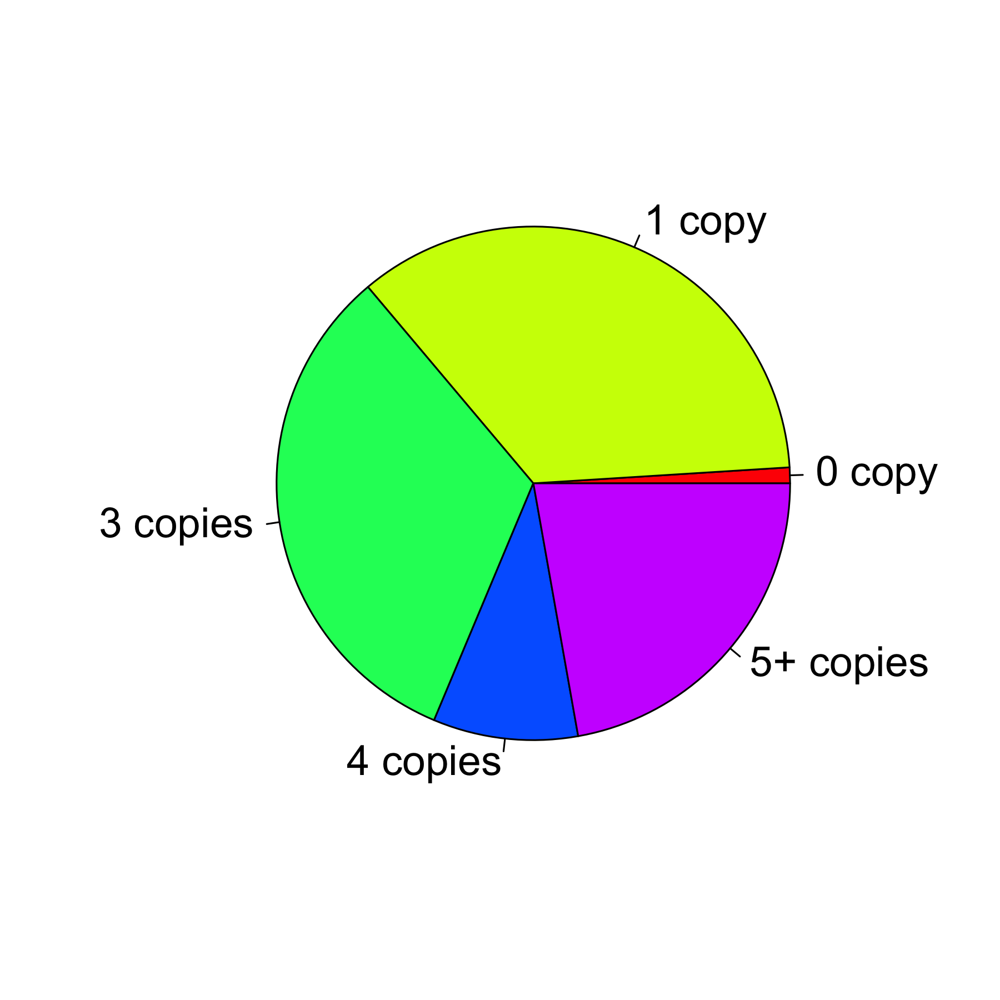
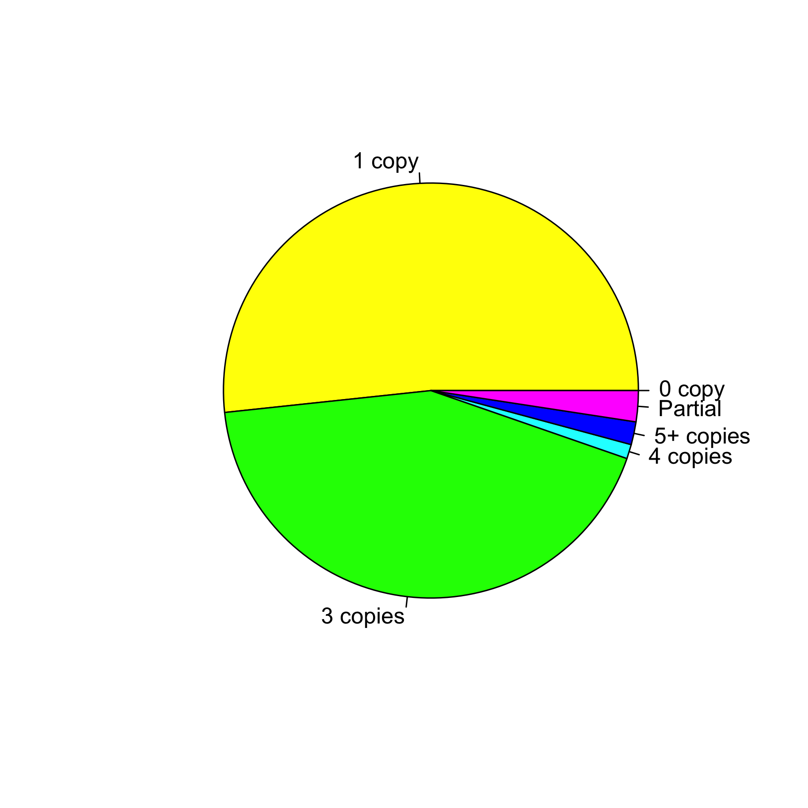
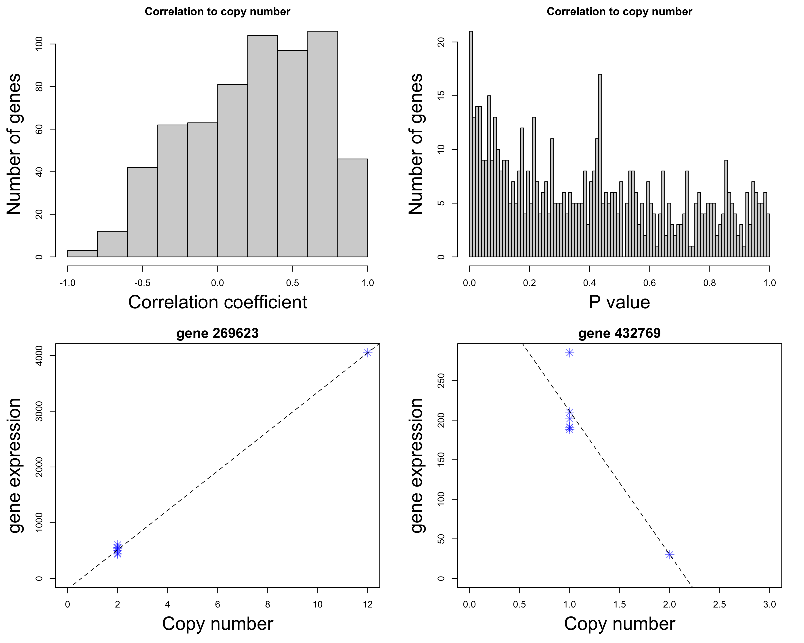
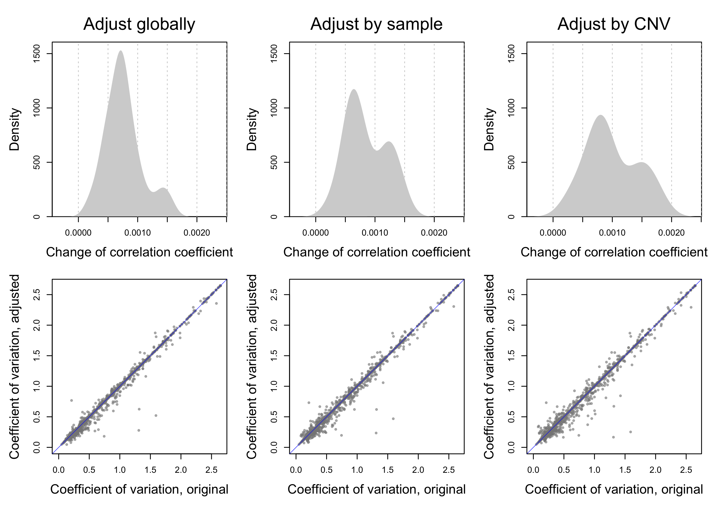

<div style="border:black 1px solid; padding: 0.5cm 0.5cm">

**Introduction** This analysis looks into the association between DNA copy number variation (CNV) and a quantitative genomic feature, most commonly the expression level of genes. It requires two types of input data: **1)** the location and copy of CNVs identified from a number of whole genome/exome sequencing samples, and **2)** a matrix of measurements made from the same samples. The rows of this matrix corresponds to a quantitative genomic feature, such as exon, gene, and DHS. The measurements in this matrix should be the number of reads from RNA-seq or similar data mapped to each region. These input data will be used for the following three steps:

  - ***Mapping.*** The location of CNV is mapped to the quantitative feature to identify overlapping pairs. The mapping can be done at multiple levels, such as exons to transcripts to genes. The result of the mapping is two matching matrix with the same number of rows (feature) and columns (samples). In the case of RNA-seq gene expression data, each cell of the first matrix is the average copy number of each gene in each sample, and the corresponding cell of the second matrix is the number of sequence reads mapped to the same gene in the same sample. The mapping results is further summarized by CNV (**Figure 1**) and then by the genomic feature (**Figure 2**).
  - ***Association.*** The impact of CNVs on the quantitative feature is evaluated with two strategies. First, the correlation between copy number and read count is calculated. In the case of RNA-seq gene expression data, genes with expression level correlated to their copy number variation will be identified (**Figure 3**). Second, using CNVs with heterozygous deletion/duplication, the average change of the read count caused by one copy loss/gain is then calculated globally for all sample, individually for each  sample (**Figure 4**) and individually for each CNV (**Figure 5**). The results will be used for adjusting data in the next step.
  - ***Adjustment.*** The read count matrix is adjusted for copy number with the goal of reducing between-sample variance. The adjustment is done using 3 different strategy: glabally, for each sample, and for each CNV, based on the results from the last step. In the case of RNA-seq gene expression data, the adjustment will reduce the side effect of copy number on gene expression level, assuming that the following analysis of differential expression is not interested CNV-caused difference. The effect of the adjustment is evaluated based on correlation between sample pairs and between sample variance (**Figure 6**). 

_While this analysis is designed for RNA-seq gene expression data, it can be used for data with similar quantitative characteristics, such as the ChIP-seq reads of H3K4me3 mapped to transcription start sites._

</div>

&nbsp;


<div align='right'>_[Go to project home](index.html)_</div>

# Description

## Project


Genomics of mouse brain tumors


## Experiment


RNA-seq data and CNV calls from whole genome sequencing were generated from the same mouse tumors.


## Analysis


The RNA-seq data was processed to get gene-level read counts. The relationship between CNVs and gene-level is evaluated.


<div align='right'>_[Go to project home](index.html)_</div>

# CNV-gene mapping

CNVs are mapped to genes in all 7 samples with both CNV and gene expression data. This section summarizes the mapping results. 

## Mapping results by CNV


Summary of CNV-to-gene mapping by CNV. 

  - Therea are a total of **1,306** CNVs in all samples, or **186.57** CNVs per sample.
  - The average size of CNVs is **3,144,094**.
  - **48.851**% of the CNVs are mapped to at least one gene.
  - [Summary table](table/summary_cnv.html)

<div align='center'>

</div>

<div style="color:darkblue; padding:0 2cm">
**Figure 1.** The split of all 1306 CNVs with abnormal copy numbers (***0 copy*** = homozygous deletion, ...). CNVs with 5 or more copies are combined. 
</div>

<div align='right'>_[Go to project home](index.html)_</div>

<div align='right'>_[Go to project home](index.html)_</div>

## Mapping results by gene


Summary of CNV-to-gene mapping by gene. 

  - There are a total of 2500 genes to be mapped to CNVs.
    * 45.6% are not mapped to any CNVs of any samples.
    * 13.4% are mapped to CNVs of one and only one sample.
    * 41% are mapped to CNVs of multiple samples.
    * 0.4% are mapped to CNVs of all 7 samples.
  - On average, each sample has 21.503% of all genes mapped to its CNVs.
    * 11.114% have heterozygous deletion. 
    * 9.246% have heterozygous duplication.
    * 0.52% have changed copy numbers with in them.
  - [Summary of samples](table/summary_gene.html)
  - [Full table](table/full_gene.html)

<div align='center'>

</div>

<div style="color:darkblue; padding:0 2cm">
**Figure 2.** The split of all 1360 genes with abnormal copy numbers (***0 copy*** = homozygous deletion, ...). The genes with 5 or more copies are combined, as well as those with changed copy numbers within them. 
</div>

<div align='right'>_[Go to project home](index.html)_</div>

# CNV-gene expressionassociation

This section uses a few statistical methods to evaluate the impact of copy number variations on gene expression. Since heterozygous deletion/duplication are the most common CNVs, they are main categories to be used for the evaluation. 


For the analysis in this section, it's strongly recommended to filter the genes first to remove those with missing values and/or low read counts. The following rules are applied for this data set:

  - There are totally 2500 genes mapped to CNVs.
  - 1535 of them have measured gene expression data.
  - 1535 of the rest have no missing values.
  - 1326 of the rest have at least 1 non-zero value in all samples.
  - 1204 of the rest have enough counts for further analysis.

The filtering generates two matching matrix of copy numbers and gene expression measurements. Both with 1204 rows and 7 columns and identical row (gene) and column (sample) names. Both matrix will be used for the remaining analysis of this section.

<div align='right'>_[Go to project home](index.html)_</div>

## Copy number to gene expression correlation


This analysis asks which gene has its copy numbers correlated to its expression across all samples. A correlation coefficient and corresponding p value are calculated for each gene. It is expected that the majority of correlation coefficients are positive. 

  - [Full result table of CNV-gene correlation](table/corr2cnv.html)
  
<div align='center'>

</div>

<div style="color:darkblue; padding:0 1cm">
**Figure 3.** The correlation between copy numbers and gene expression measurements of all samples is calculated for each gene. The top 2 panels are the distributions of correlation coefficients (left) and the corresponding p values (right) of all genes. Only those with different copy numbers between samples are used. The bottom 2 panels are two selected examples with the highest (left) and lowest (right) correlation coefficients.
</div>

<div align='right'>_[Go to project home](index.html)_</div>

## Impact of CNVs on the measurements

This analysis is used to calculate the expected change of gene expression due to copy number variations. Each measurement of gene with CNV is compared to the measurements of the same gene of samples without CNV and the average difference of all pairs is calculated for each CNV and sample. The results will be used as rescaling factors of data adjustment in the next section.

### Average of all CNVs


Using heterozygous deletion/duplication, the average percent change of gene expression in response to the loss/gain of one copy is calculated for all samples globally and each sample individually. On average, heterozygous deletion reduces gene expression by -5.204% and heterozygous duplication increases it by 36.71%. 

  - [CNV vs. diploid average](table/CNV_vs_Diploid.html)
  - [Average change by sample](table/average_change_by_sample.html) (see **Figure 4** for visualization)

<div align='center'>

</div>

<div style="color:darkblue; padding:0 1cm">
**Figure 4.** The average change of gene expression due to heterozygous deletion/duplication. Each violin plot shows the distribution of all samples.  
</div>

### Individual CNVs


Using CNVs with 0 to 5 copies, the average change caused by copy loss/gain is calculated for individual CNVs. A p value is also calculated for each CNV, to indicate whether the overall change due to this CNV is significant. 

  - [Average change of CNVs](table/average_change_by_sample.html)

<div align='center'>

</div>

<div style="color:darkblue; padding:0 1cm">
**Figure 5. ** Each violin shows the distribution of average change of all CNVs (left) and significant CNVs (right). 
</div>

<div align='right'>_[Go to project home](index.html)_</div>

# Adjust data for CNVs


In tumors or similar samples, many somatic CNVs are downstream events of tumor progression and might cause extra, unwanted variance in data. To use the data for statistical analysis, such as differential gene expression based on RNA-seq data, there is potential benefit to adjust the data to reduce the variance caused by CNVs. There are three different ways to do the adjustment, using the results from the last section. 

  1. Adjust all samples using the glabol average of CNV-caused changes, assumming CNVs have the same average effect on all samples.
  2. Adjust individual samples separately by their own average of CNV-caused changes, assuming CNVs have different effect on different samples, but the same average effect on the same sample. 
  3. Adjust individual CNVs separately that have changed genes mapped to it with significance (p < 0.05), assuming different CNVs have different effect, but each CNV has the same effect on all genes within it. For those CNVs do not cause change with significance, the adjustment is done at the sample level.

<div align='center'>

</div>

<div style="color:darkblue; padding:0 1cm">
**Figure 6** These plots summarize the consequences of data adjustment by three different methods. The correlation of gene expression between each pair of samples is calculated before and after adjustment. The top panels plot the change of correlation coefficients of all sample pairs. Most pairs should have increased correlation coefficient if the adjustment decreases overall variance. The bottom panels compare the coefficient of variation of all genes before and after adjustment. 
</div>

  
In most cases, these adjustment methods, by their order, have increased specificity and are expected to reduce overall variance more and more, but also have increasing risk of overfitting. Whether to use adjusted data for statistical analysis or which adjustment method to choose should be determined by the nature of the study, the goal of the analysis, and the effect of the adjustment. In this data set, these methods reduce the overall variance by 0.729 to 0.881 percent on average.
  
  - [gene-level coefficient of variation (CV) before and after adjustment](table/CV_adjustment.html)


<div style="color:darkblue; padding:0 1cm">
**Table 1** The percentage of genes whose coefficient of variation is relatively decreased (up-right corner) or increased (bottom-left corner) by 10% or more after the adjustment.
</div>

<div align='center', style="padding:0 2cm">


|                  | > Original | > Adjusted_Global | > Adjusted_Sample | > Adjusted_CNV |
|:-----------------|:----------:|:-----------------:|:-----------------:|:--------------:|
|Original >        |    ---     |       7.948       |       8.574       |     9.249      |
|Adjusted_Global > |    1.59    |        ---        |       2.457       |     3.565      |
|Adjusted_Sample > |    3.95    |       3.565       |        ---        |     1.975      |
|Adjusted_CNV >    |   4.624    |       3.95        |       1.493       |      ---       |


</div>

<div align='right'>_[Go to project home](index.html)_</div>

***

# Appendix 

Check out the ***[RoCA project](http://zhezhangsh.github.io/RoCA)*** for more information.  

## Reproduce this report

To reproduce this report: 

  1. Copy this ***[YAML](https://raw.githubusercontent.com/zhezhangsh/RoCA/master/template/gri/cnv_impact/cnv_impact.yaml)*** file to your working directory

  2. To use your own data and parameters, edit the ***YAML*** file:

    - _output_: where you want to put the output files
    - _home_: the URL if you have a home page for your project
    - _analyst_: your name
    - _description_: background information about your project, analysis, etc.
    - _input_: where are your input data, read instruction for preparing them
    - _parameter_: parameters for this analysis; read instruction about how to prepare input data

  3. Run the code below, preferablly after starting a new R session:


```r
if (!require(devtools)) { install.packages('devtools'); require(devtools); }
if (!require(RCurl)) { install.packages('RCurl'); require(RCurl); }
if (!require(RoCA)) { install_github('zhezhangsh/RoCAR'); require(RoCA); }

CreateReport("cnv_impact.yaml");
```

If there is no complaint, go to the _output_ folder and open the ***index.html*** file to view report. 

## Session information


```
## R version 3.2.2 (2015-08-14)
## Platform: x86_64-apple-darwin13.4.0 (64-bit)
## Running under: OS X 10.10.5 (Yosemite)
## 
## locale:
## [1] en_US.UTF-8/en_US.UTF-8/en_US.UTF-8/C/en_US.UTF-8/en_US.UTF-8
## 
## attached base packages:
##  [1] splines   stats4    parallel  stats     graphics  grDevices utils    
##  [8] datasets  methods   base     
## 
## other attached packages:
##  [1] CHOPseq_0.0.0.9000   Agri_0.0.0.9000      rchive_0.0.0.9000   
##  [4] edgeR_3.10.2         limma_3.26.9         NOISeq_2.16.0       
##  [7] GenomicRanges_1.22.4 GenomeInfoDb_1.6.3   IRanges_2.4.8       
## [10] S4Vectors_0.8.11     Biobase_2.28.0       BiocGenerics_0.16.1 
## [13] Matrix_1.2-2         htmlwidgets_0.5      DT_0.1              
## [16] vioplot_0.2          sm_2.2-5.4           gplots_3.0.1        
## [19] awsomics_0.0.0.9000  yaml_2.1.13          rmarkdown_0.9.6     
## [22] knitr_1.12.3         RoCA_0.0.0.9000      RCurl_1.95-4.8      
## [25] bitops_1.0-6         devtools_1.11.1     
## 
## loaded via a namespace (and not attached):
##  [1] Rcpp_0.12.4        highr_0.5.1        formatR_1.3       
##  [4] XVector_0.10.0     tools_3.2.2        zlibbioc_1.14.0   
##  [7] digest_0.6.9       jsonlite_0.9.20    evaluate_0.9      
## [10] memoise_1.0.0      lattice_0.20-33    withr_1.0.1       
## [13] stringr_1.0.0      gtools_3.5.0       caTools_1.17.1    
## [16] grid_3.2.2         gdata_2.17.0       magrittr_1.5      
## [19] htmltools_0.3.5    KernSmooth_2.23-15 stringi_1.0-1
```

<div align='right'>_[Go to project home](index.html)_</div>

***

_END OF DOCUMENT_
