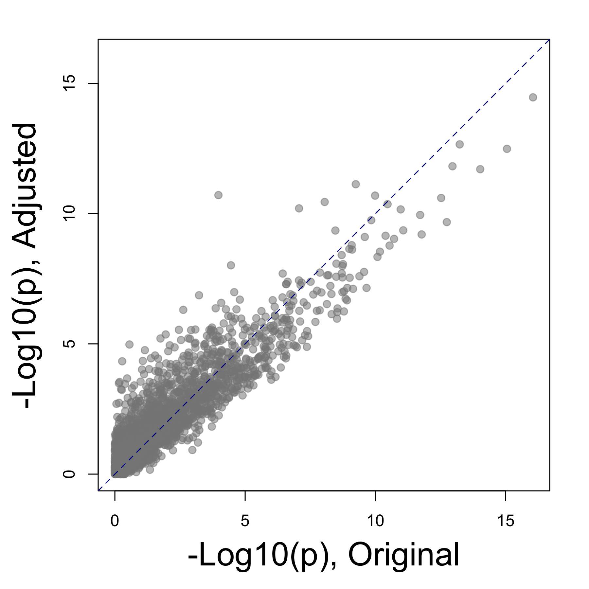
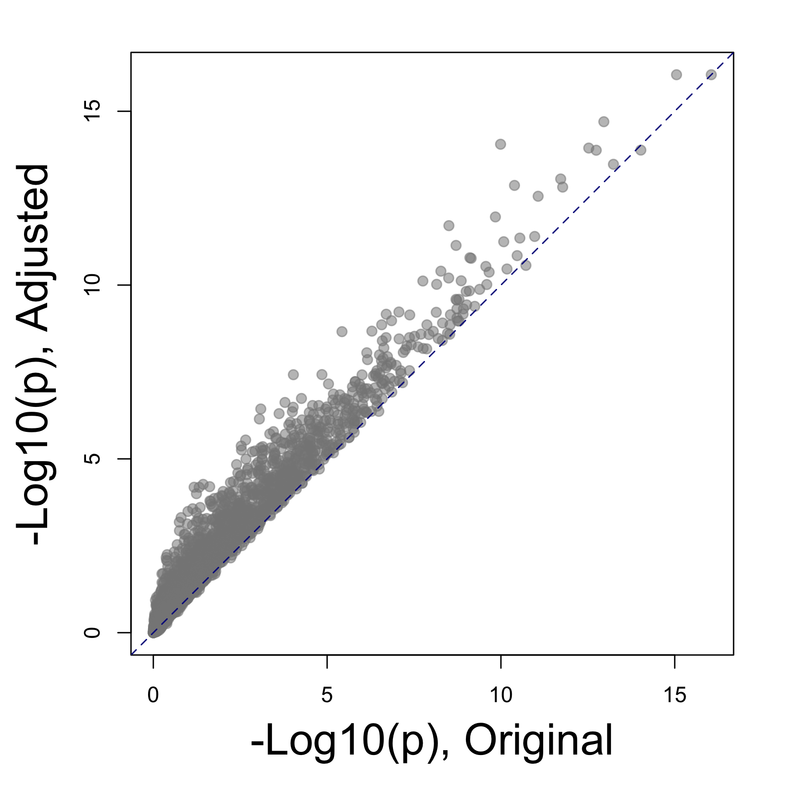
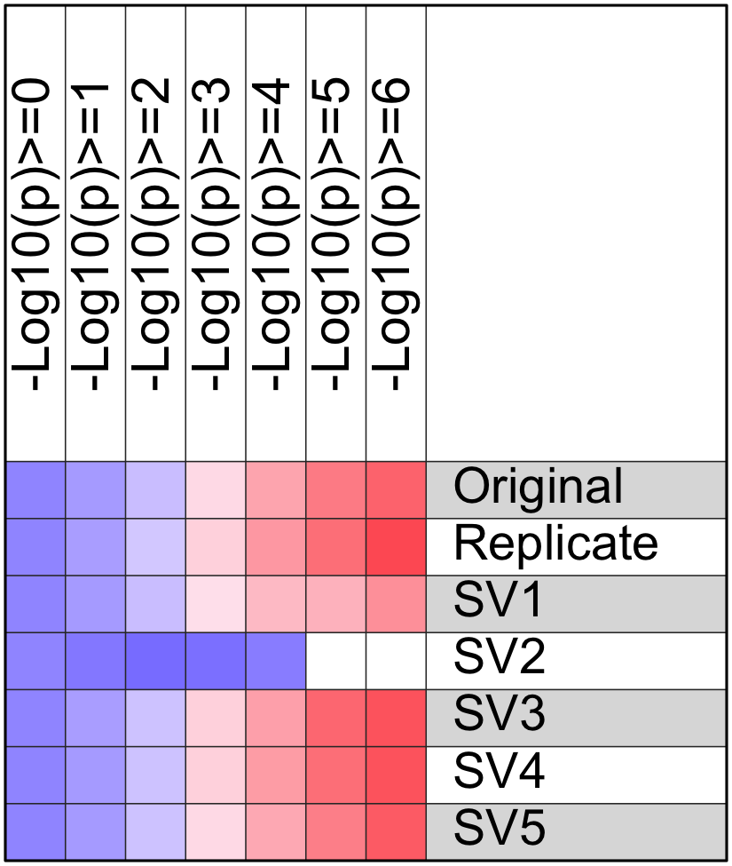

**Introduction: ** This analysis applies the Bioconductor ***[SVA](https://bioconductor.org/packages/release/bioc/html/sva.html)*** (Surrogate Variable Analysis) package and other methods to evaluate and adjust for known or unknown batch effect. It includes the following steps:

  - Analyst provides the original data matrix and sample description with one or multiple features, and specifies
    - one or multiple features as variable(s) of interest
    - zero or one feature known to cause batch or other confounding effect
  - One to several surrogate variables will be identified from the original matrix, each accounts for a portion of the total data variation
    - The association between each sample feature and surrogate variable will be evaluated by ANOVA (categoral feature) or Pearson's correlation (numeric feature)
    - Samples are grouped by variable(s) of interest. P values of 1-way ANOVA across all sample groups is obtained for each gene, using the original data matrix or the data matrix adjusted by surrogate variables. 
  - Create an adjusted data matrix from the original one by removing known or potential batch effect.
    - A new data matrix is generated after adjusting the original ones for the sample feature known to cause the confoundering or batch effect. The ***[ComBat](combat batch effect correction)*** and ***[limma](http://bioinf.wehi.edu.au/limma/)*** methods will be used respectively for categoral and numeric variables. Adjust data for surrogate variable(s) instead if no sample feature is known to cause batch effect.
    - P values of 1-way ANOVA are compared between the original and the adjusted data matrix.
  - Adjust the data matrix by sample features and surrogate variables one by one and compare the ANOVA p values.

&nbsp;

_[Go to project home](http://www.ncbi.nlm.nih.gov/geo/query/acc.cgi?acc=GSE67426)_

# Description

## Project

Perturbed rhythmic activation of signaling pathways in mice deficient for Sterol Carrier Protein 2-dependent diurnal lipid transport and metabolism. (**[GSE67426](http://www.ncbi.nlm.nih.gov/geo/query/acc.cgi?acc=GSE67426)**)

## PubMed

Jouffe C, Gobet C, Martin E, Métairon S et al. Perturbed rhythmic activation of signaling pathways in mice deficient for Sterol Carrier Protein 2-dependent diurnal lipid transport and metabolism. Sci Rep 2016 Apr 21;6:24631. PMID: [27097688](http://www.ncbi.nlm.nih.gov/pubmed/27097688).

## Experimental design

Comparison of liver mRNA expression from Scp2 KO and wild-type mice harvested every 2 hours during 3 consecutive days.

## Analysis

This analysis evaluates the potential batch effect of different days, a sample feature named ***Replicate***, on which the mice were harvested.

_[Go to project home](http://www.ncbi.nlm.nih.gov/geo/query/acc.cgi?acc=GSE67426)_

# Samples and variable(s) of interest

A total of 72 samples and 4 sample features was provided by the input data. Click [here](html/sample.html) to see a full list of samples and samples features. 

  - Sample feature(s) to be studied by this project (variables of interest): ***Genotype; Hour***
  - Sample feature with potential batch effect: ***Replicate***
  - All other known sample feature(s): ***Group*** 

**Table 1** All sample features provided by the input data, which could include 1 or many variables of interest and 0 or 1 confounding variable known to be responsible for the batch effect in data. (**Sample_feature:** all sample features given in the input data; **Num_level:** number of unique values of each sample feature; **Variable_of_interest:** whether this sample feature is a variable of interest in this project; and **Batch_effect** whether this sample feature is a known source of batch effect)

| Sample_feature |  Type   | Num_level | Variable_of_interest | Batch_effect |
|:--------------:|:-------:|:---------:|:--------------------:|:------------:|
|     Group      | factor  |    24     |        FALSE         |    FALSE     |
|    Genotype    | factor  |     2     |         TRUE         |    FALSE     |
|   Replicate    | factor  |     3     |        FALSE         |     TRUE     |
|      Hour      | integer |    12     |         TRUE         |    FALSE     |

_[Go to project home](http://www.ncbi.nlm.nih.gov/geo/query/acc.cgi?acc=GSE67426)_

# Identification and evaluation of surrogate variables 

The _sva()_ function was used to identify  surrogate variables from the original data matrix. Each surrogate variable is responsible for part of the overall data variation, and may or may not be related to known sample features, such as any variables of interest or experiment batch. Since each sample was assigned a value of each surrogate variable by the _sva_ function, these values were used to evaluate the association between surrogate variables and sample features using ANOVA for categoral variables or Pearson's correlation for numeric variables.

**Table 2** ANOVA p value for the association between surrogate variables and sample features. 

|          | SV1  |   SV2   |  SV3  | SV4  | SV5  |
|:---------|:----:|:-------:|:-----:|:----:|:----:|
|Group     | 0.00 | 0.0e+00 | 0.110 | 0.99 | 0.48 |
|Genotype  | 0.66 | 2.2e-02 | 0.700 | 0.16 | 0.99 |
|Replicate | 0.88 | 5.5e-01 | 0.099 | 0.88 | 0.24 |
|Hour      | 0.76 | 8.7e-05 | 0.048 | 0.25 | 0.84 |

The _f.pvalue()_ function was used to run ANOVA tests using the variable(s) of interest and original data matrix, so each gene got an ANOVA p value. The test was then run again after adjusting the data matrix for surrogate variables that were not significantly associated with the surrogate variables (p < 0.01). The goal is to evaluate if the global statistical power was improved after the confounding effect of surrogate variables was removed.

**Figure 1.** Comparison of the ANOVA p values obtained using the original data matrix and the matrix adjusted by surrogate variables not significantly associated with any variable(s) of interest. 

_[Go to project home](http://www.ncbi.nlm.nih.gov/geo/query/acc.cgi?acc=GSE67426)_

# Adjust data for batch effect

Since sample feature, _Replicate_, was known to cause batch effect in the data, the original data matrix was then adjusted to remove its effect using the [_ComBat_](http://biostatistics.oxfordjournals.org/content/8/1/118.abstract) method if it is a categoral variable or the limma method if it is a numerical variable

 

**Figure 2.** Same plot as **Figure 1**, except that the y-axis p values were based on the data adjusted by the known batch effect variable using the _ComBat_ (categoral) or _limma_ (numeric) method.

_[Go to project home](http://www.ncbi.nlm.nih.gov/geo/query/acc.cgi?acc=GSE67426)_

# Evaluate all variables

Finally, the confounding or batch effect of all sample features and surrogate variables was evaluated one by one, after removing it from the original data matrix. 

**Figure 3.** After adjusting the original data for each of the sample features or surrogate variables, ANOVA p values were calculated again for each gene. The numbers of significant genes obtaining from each adjusted data matrix were compared to the numbers of genes obtained from the original matrix. The color in this plot represents relative frequency of genes (red = more). Clcik [here](table/gene_count_adjusted.html) to view table of gene counts.

_[Go to project home](http://www.ncbi.nlm.nih.gov/geo/query/acc.cgi?acc=GSE67426)_

***
**END OF DOCUMENT**

