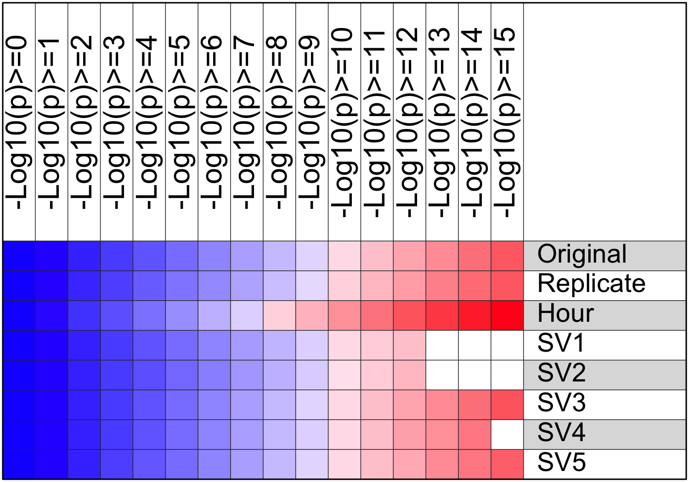

<div style="border:black 1px solid; padding: 0.5cm 0.5cm">
**Introduction: ** This analysis applies the Bioconductor ***[SVA](https://bioconductor.org/packages/release/bioc/html/sva.html)*** (Surrogate Variable Analysis) package and other methods to evaluate and adjust for known or unknown batch effect. It includes the following steps:

  - This analysis requires an original data matrix and sample description with one or multiple features, and parameters including
    * One or multiple features as variable(s) of interest
    * Zero or one feature known to be the source of batch effect
    * The number of surrogate variables (default=5) to be identified from the data matrix
  - The _sva_ function will first identify the given number of surrogate variables, each accounting for a portion of the total data variation. These surrogate variables will be evaluated as below. 
    * The association between each sample feature and each surrogate variable will be evaluated by ANOVA (categoral feature) or Pearson's correlation (numeric feature)
    * By grouping samples according variable(s) of interest, 2 sets of 1-way ANOVA p values, using the data matrix and the matrix adjusted for all surrogate variables, will be compared to evaluate whether removing potential batch effect will improve the signal/noise ratio in the data set. 
  - A new data matrix will be generated after adjusting for batch effect. 
    * If a sample feature is known to be the source of batch effect, the original matrix will be adjusted for it using  ***[ComBat](combat batch effect correction)*** (categoral variable) or ***[limma](http://bioinf.wehi.edu.au/limma/)*** (continuous variable). It will be adjusted for all surrogate variables instead otherwise.
    * Same as the last step, the impact of data adjustment will be evaluated with 1-way ANOVA of samples grouped by variable(s) of interest.
  - An extra step will be carried out to adjust the original data matrix for all sample features and surrogate variables one by one, and evaluate the consequence. 
</div>

&nbsp;


<div align='right'>_[Go to project home](http://zhezhangsh.github.io/RoCA)_</div>

# Description

## Project


Perturbed rhythmic activation of signaling pathways in mice deficient for Sterol Carrier Protein 2-dependent diurnal lipid transport and metabolism. (**[GSE67426](http://www.ncbi.nlm.nih.gov/geo/query/acc.cgi?acc=GSE67426)**)


## PubMed


Jouffe C, Gobet C, Martin E, Métairon S et al. Perturbed rhythmic activation of signaling pathways in mice deficient for Sterol Carrier Protein 2-dependent diurnal lipid transport and metabolism. Sci Rep 2016 Apr 21;6:24631. PMID: [27097688](http://www.ncbi.nlm.nih.gov/pubmed/27097688).


## Experimental design


Comparison of liver mRNA expression from Scp2 KO and wild-type mice harvested every 2 hours during 3 consecutive days.


## Analysis


This analysis evaluates the potential batch effect of different days, a sample feature named ***Replicate***, on which the mice were harvested. Only the wildtype mice and a subset of genes with high between sample variance were used for demonstration.


<div align='right'>_[Go to project home](http://zhezhangsh.github.io/RoCA)_</div>

# Samples and variable(s) of interest


A total of 36 samples and 3 sample features was provided by the input data. Click [here](html/sample.html) to see a full list of samples and samples features. 

  - Sample feature(s) to be studied by this project (variables of interest): ***Group***
  - Sample feature with potential batch effect: ***Replicate***
  - All other known sample feature(s): ***Hour*** 

<div style="color:darkblue; padding:0 2cm">
**Table 1** All sample features provided by the input data, which could include 1 or many variables of interest and 0 or 1 confounding variable known to be responsible for the batch effect in data. (**Sample_feature:** all sample features given in the input data; **Num_level:** number of unique values of each sample feature; **Variable_of_interest:** whether this sample feature is a variable of interest in this project; and **Batch_effect** whether this sample feature is a known source of batch effect)
</div>

<div align='center', style="padding:0 2cm">


| Sample_feature |  Type   | Num_level | Variable_of_interest | Batch_effect |
|:--------------:|:-------:|:---------:|:--------------------:|:------------:|
|     Group      | factor  |    12     |         TRUE         |    FALSE     |
|   Replicate    | factor  |     3     |        FALSE         |     TRUE     |
|      Hour      | integer |    12     |        FALSE         |    FALSE     |


</div>

<div align='right'>_[Go to project home](http://zhezhangsh.github.io/RoCA)_</div>

# Identification and evaluation of surrogate variables 


The _sva()_ function was used to identify  surrogate variables from the original data matrix. Each surrogate variable is responsible for part of the overall data variation, and may or may not be related to known sample features, such as any variables of interest or experiment batch. Since each sample was assigned a value of each surrogate variable by the _sva_ function, these values were used to evaluate the association between surrogate variables and sample features using ANOVA for categoral variables or Pearson's correlation for numeric variables.

<div style="color:darkblue; padding:0 2cm">
**Table 2** ANOVA p value for the association between surrogate variables and sample features. 
</div>

<div align='center', style="padding:0 1cm">


|          | SV1  | SV2  |  SV3  |   SV4   | SV5  |
|:---------|:----:|:----:|:-----:|:-------:|:----:|
|Group     | 0.55 | 0.50 | 0.800 | 7.0e-01 | 0.94 |
|Replicate | 0.11 | 0.05 | 0.032 | 8.5e-05 | 0.96 |
|Hour      | 0.89 | 0.77 | 0.100 | 3.4e-01 | 0.96 |


</div>

The _f.pvalue()_ function was used to run ANOVA tests using the variable(s) of interest and original data matrix, so each gene got an ANOVA p value. The test was then run again after adjusting the data matrix for surrogate variables that were not significantly associated with the surrogate variables (p < 0.01). The goal is to evaluate if the global statistical power was improved after the confounding effect of surrogate variables was removed.

<div align='center'>

</div>

<div style="color:darkblue; padding:0 2cm">
**Figure 1.** Comparison of the ANOVA p values obtained using the original data matrix and the matrix adjusted by surrogate variables not significantly associated with any variable(s) of interest. 
</div>

<div align='right'>_[Go to project home](http://zhezhangsh.github.io/RoCA)_</div>

# Adjust data for batch effect


Since sample feature, _Replicate_, was known to cause batch effect in the data, the original data matrix was then adjusted to remove its effect using the [_ComBat_](http://biostatistics.oxfordjournals.org/content/8/1/118.abstract) method if it is a categoral variable or the limma method if it is a numerical variable


<div align='center'> 

</div>

<div style="color:darkblue; padding:0 2cm">
**Figure 2.** Same plot as **Figure 1**, except that the y-axis p values were based on the data adjusted by the known batch effect variable using the _ComBat_ (categoral) or _limma_ (numeric) method.
</div>

<div align='right'>_[Go to project home](http://zhezhangsh.github.io/RoCA)_</div>

# Evaluate all variables

Finally, the confounding or batch effect of all sample features and surrogate variables was evaluated one by one, after removing it from the original data matrix. 


<div align='center'>

</div>

<div style="color:darkblue; padding:0 2cm">
**Figure 3.** After adjusting the original data for each of the sample features or surrogate variables, ANOVA p values were calculated again for each gene. The numbers of significant genes obtaining from each adjusted data matrix were compared to the numbers of genes obtained from the original matrix. The color in this plot represents relative frequency of genes (red = more). Clcik [here](table/gene_count_adjusted.html) to view table of gene counts.
</div>

<div align='right'>_[Go to project home](http://zhezhangsh.github.io/RoCA)_</div>

***

# Appendix 

Check out the **[RoCA home page](http://zhezhangsh.github.io/RoCA)** for more information.  

## Reproduce this report

To reproduce this report: 

1. Find the data analysis template you want to use and an example of its pairing YAML file  [here](https://github.com/zhezhangsh/RoCA/wiki/Templates-and-examples) and download the YAML example to your working directory

2. To generate a new report using your own input data and parameter, edit the following items in the YAML file:

- _output_        : where you want to put the output files
- _home_          : the URL if you have a home page for your project
- _analyst_       : your name
- _description_   : background information about your project, analysis, etc.
- _input_         : where are your input data, read instruction for preparing them
- _parameter_     : parameters for this analysis; read instruction about how to prepare input data

3. Run the code below within ***R Console*** or ***RStudio***, preferablly with a new R session:


```r
if (!require(devtools)) { install.packages('devtools'); require(devtools); }
if (!require(RCurl)) { install.packages('RCurl'); require(RCurl); }
if (!require(RoCA)) { install_github('zhezhangsh/RoCAR'); require(RoCA); }

CreateReport(filename.yaml);  # filename.yaml is the YAML file you just downloaded and edited for your analysis
```

If there is no complaint, go to the _output_ folder and open the ***index.html*** file to view report. 

## Session information


```
## R version 3.2.2 (2015-08-14)
## Platform: x86_64-apple-darwin13.4.0 (64-bit)
## Running under: OS X 10.10.5 (Yosemite)
## 
## locale:
## [1] en_US.UTF-8/en_US.UTF-8/en_US.UTF-8/C/en_US.UTF-8/en_US.UTF-8
## 
## attached base packages:
## [1] stats4    parallel  stats     graphics  grDevices utils     datasets 
## [8] methods   base     
## 
## other attached packages:
##  [1] sva_3.18.0            genefilter_1.50.0     mgcv_1.8-7           
##  [4] nlme_3.1-121          gplots_3.0.1          DESeq_1.20.0         
##  [7] lattice_0.20-33       locfit_1.5-9.1        Biobase_2.28.0       
## [10] edgeR_3.10.2          limma_3.26.9          DEGandMore_0.0.0.9000
## [13] snow_0.4-1            awsomics_0.0.0.9000   Rnaseq_0.0.0.9000    
## [16] GenomicRanges_1.22.4  GenomeInfoDb_1.6.3    IRanges_2.4.8        
## [19] S4Vectors_0.8.11      BiocGenerics_0.16.1   fpc_2.1-10           
## [22] vioplot_0.2           sm_2.2-5.4            htmlwidgets_0.5      
## [25] DT_0.1                yaml_2.1.13           knitr_1.12.3         
## [28] rmarkdown_0.9.6       RoCA_0.0.0.9000       RCurl_1.95-4.8       
## [31] bitops_1.0-6          devtools_1.11.1      
## 
## loaded via a namespace (and not attached):
##  [1] mclust_5.0.2         Rcpp_0.12.4          mvtnorm_1.0-3       
##  [4] class_7.3-13         gtools_3.5.0         digest_0.6.9        
##  [7] R6_2.1.2             RSQLite_1.0.0        evaluate_0.9        
## [10] highr_0.5.1          httr_1.1.0           zlibbioc_1.14.0     
## [13] diptest_0.75-7       curl_0.9.7           annotate_1.46.1     
## [16] gdata_2.17.0         kernlab_0.9-22       Matrix_1.2-2        
## [19] splines_3.2.2        geneplotter_1.46.0   stringr_1.0.0       
## [22] htmltools_0.3.5      nnet_7.3-10          XML_3.98-1.3        
## [25] withr_1.0.1          MASS_7.3-43          grid_3.2.2          
## [28] jsonlite_0.9.20      xtable_1.7-4         DBI_0.3.1           
## [31] git2r_0.15.0         magrittr_1.5         formatR_1.3         
## [34] KernSmooth_2.23-15   stringi_1.0-1        XVector_0.10.0      
## [37] flexmix_2.3-13       robustbase_0.92-5    RColorBrewer_1.1-2  
## [40] tools_3.2.2          trimcluster_0.1-2    DEoptimR_1.0-3      
## [43] survival_2.38-3      AnnotationDbi_1.30.1 cluster_2.0.3       
## [46] caTools_1.17.1       prabclus_2.2-6       memoise_1.0.0       
## [49] modeltools_0.2-21
```

<div align='right'>_[Go to project home](http://zhezhangsh.github.io/RoCA)_</div>

***
**END OF DOCUMENT**

