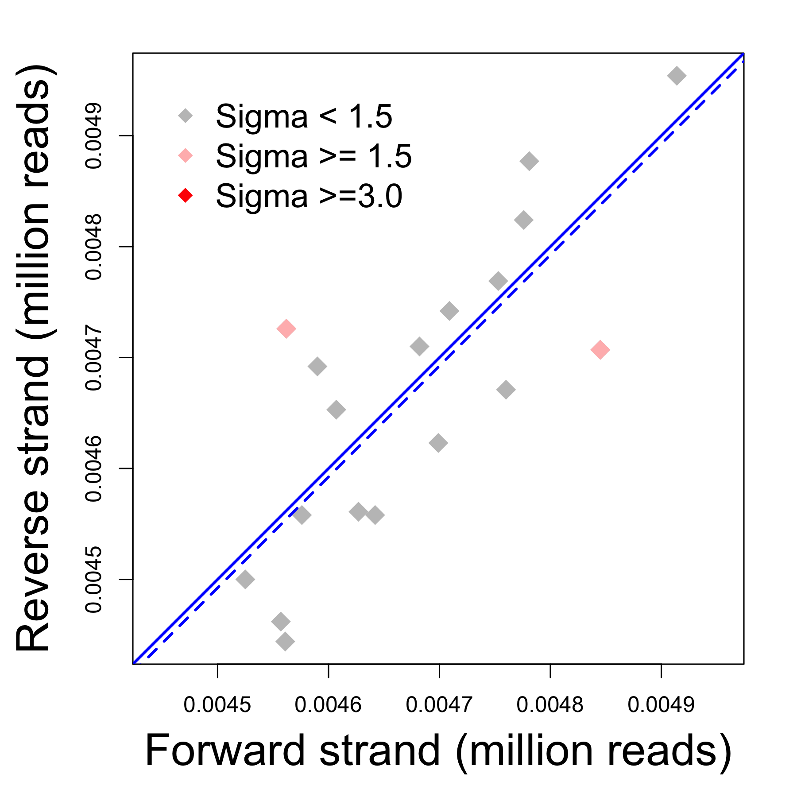

<div style="border:black 1px solid; padding: 0.5cm 0.5cm">

**Introduction** This analysis summarizes and filters sequencing reads that have been aligned to the reference based on SAM fields such as ***FLAG***, ***MAPQ***, and ***CIGAR***. It uses the readGAlignments (single-ended reads) and readGAlignmentPairs (pair-ended reads) to import aligned reads from indexed BAM files. Summary statistics of imported reads are compared between samples for consistence and potential outliers. These statistics are

  - ***strand balance:*** reads mapped to forward vs. reverse strands
  - ***mapping flag:*** a single bitwise value that summarizes the alignment result of each read
  - ***mapping quality:*** p value of mapping certainty assigned by the aligment program
  - ***base count:*** number of bases in each read with insertion, getting trimmed, etc. (CIGAR operations)
  - ***matching length:*** total number of bases in each read matching to the reference
  
Finally, the reads will be filtered based on given criteria covering 4 possible rules:

  - ***mapping region:*** reads must be mapped to given genomic region(s)
  - ***mapping flag:*** the SAM field _FLAG_ must have one of given values
  - ***mapping quality:*** the SAM field _MAPQ_ must have value greater than or equal to a given value
  - ***matching length:*** the total number of bases matching the reference must be greater than or equal to a given value

</div>

&nbsp;


<div align='right'>_[Go to project home](http://zhezhangsh.github.io/RoCA)_</div>

# Description

## Project


[H3K4me3 of SLE in immune cells](http://grantome.com/grant/NIH/R01-AR058547-03)


## Experiment


H3K4me3 was measured in  B cell, T cell, and monocyte via ChIP-seq


## Analysis


Aligned single-ended ChIP-seq reads were loaded into R as GAlignments objects and filtered by their length, map quality, etc. Only a small portion of the total reads of each library were randomly selected as input for demo purpose Libraries were compared in this report using their summary statistics.


<div align='right'>_[Go to project home](http://zhezhangsh.github.io/RoCA)_</div>

# Summary statistics

## Mapping ***FLAG***


Each alignment software could assign a bitwise value as a combination of FLAGs to each read to represent the result of the alignment, as descrbed in [SAM format manual](https://samtools.github.io/hts-specs/SAMv1.pdf), Section 1.4. The bitwise value is 0 if the read is aligned "normally" and uniquely to the forward strand, and is 16 if the read is aligned "normally" and uniquely to the reverse strand. Any other values would suggest that there is something "wrong" with the alignment. The majority of the alignment will assign a strand to the read, but in some rare occasions, the strand is ambiguous and there is no strand information available for the read. Click [here](table/flag_strand.html) to view the summary statistics about the FLAGs and alignment strands. 

<div align='center'>

</div>

<div style="color:darkblue; padding:0 2cm">
**Figure 1** Numbers of reads aligned to the forward and reverse strands. Outliers were identified via fitting linear models (Sigma > 3.0). The solid blue line corresponds to the same 50%-50% of the reads aligned to the 2 strands, and the dashed lines is the actual fitting lines of a linear model. The percents of reads aligned to the forward strand the are between 49.1171% and 50.8829% (mean = 50%). For paired end reads, only the first read of each pair was used.
</div>

<div align='right'>_[Go to project home](http://zhezhangsh.github.io/RoCA)_</div>

## Mapping quality ***MAPQ***


Each alignment software could use its own algorithm to assign an alignment score to each align reads. The scores are usually non-negative integers, with 0 corresponding to the lowest mapping quality. 

  - [Number of reads with each MAPQ score](table/mapq_count.html)
  - [Percent of reads with each MAPQ score](table/mapq_percent.html)

<div align='center'>

</div>

<div style="color:darkblue; padding:0 1cm">
**Figure 2** Each cell indicates the relative frequency of reads with a given mapping score, comparing to all the other samples. </div>

<div align='center'>

</div>

<div style="color:darkblue; padding:0 1cm">
**Figure 3** Each plot shows the distribution of read frequencies with the lowest, highest, and the most common mapping quality scores. 
</div>

<div align='right'>_[Go to project home](http://zhezhangsh.github.io/RoCA)_</div>

## ***CIGAR*** operations


CIGAR string indicates the internal structure of each alignment such as the base where insertion or deletion starts. By breaking CIGAR string of each read, bases belonging to each CIGAR operation was counted:  

  - [Number of bases with each CIGAR operation](table/cigar_count.html)
  - [Percent of bases with CIGAR operation](table/cigar_percent.html)
  
<div align='center'>

</div>

<div style="color:darkblue; padding:0 4cm">
**Figure 4** Each cell indicates the relative frequency of reads with a given character in their CIGAR strings, comparing to all the other samples. 
</div>

<div align='right'>_[Go to project home](http://zhezhangsh.github.io/RoCA)_</div>

## Matching length

The matching length (total number of matched bases) of each read can be retrieved from the ***M*** operation in its CIGAR string. Matching length of all reads in each library was summarized to get the [cummulative percents](table/matching_length_percent.html) of reads with matching length no greater than a given number of bases. 

<div align='center'>

</div>

<div style="color:darkblue; padding:0 2cm">
**Figure 5** Cummulative percent of sequence reads with matching length no greater than a given number. Blue line is the average of all libraries whereas the dashed lines correspond to the minimum and maximum of all libraries. This plot roughly indicates the proportion of reads that will be filtered out with each cutoff value of matching length.
</div>

<div align='center'>

</div>

<div style="color:darkblue; padding:0 4cm">
**Figure 6** Numbers of total reads vs. the reads with longest matching length in each library. Outliers were identified via fitting linear models (Sigma > 3.0). The blue lines is the fitting to the linear model using all libraries. 
</div>

<div align='right'>_[Go to project home](http://zhezhangsh.github.io/RoCA)_</div>

# Read filtering

## Step-by-step filtering


Sequence reads were filtered by the following steps to keep those

  - mapped to these [genomic regions](/table/region.html)
  - with the ***FLAG*** field of SAM format having one of these values: _0; 16_.
  - with the ***MAPQ*** field of SAM format having values greater than or equal to ***20, 20***. 
  - with at least ***20, 20*** mapped bases based on the ***CIGAR*** field of SAM format.

The details about SAM format can be found [here](https://samtools.github.io/hts-specs/SAMv1.pdf). 

The number and percent of remaining reads after each filter step are listed [here](table/remained_number.html) and [here](table/remained_percent.html).

<div align='center'>

</div>

<div style="color:darkblue; padding:0 3cm">
**Figure 7.** Each box represents the distribution of remaining read percents of all samples. 
</div>

<div align='right'>_[Go to project home](http://zhezhangsh.github.io/RoCA)_</div>

## Final filtering result

The final remaining percents of original reads after all filtering steps were compared between samples. The numbers of reads before and after filtering were fit to a linear regression based on the assumption that all samples had the same remaining percent. Using this model, the sigma value of each sample was calculated as the difference between predicted and actual numbers of remaining reads. Samples with sigmas greater than 3.0 could be considered as outliers with extraordinarily low or high remaining percent. Click [here](table/read_count.html) to see the result table.
  
<div align='center'>

</div>

<div style="color:darkblue; padding:0 3cm">
**Figure 8** Numbers of reads before and after filtering. 
</div>

<div align='right'>_[Go to project home](http://zhezhangsh.github.io/RoCA)_</div>


***

# Appendix 

Check out the **[RoCA home page](http://zhezhangsh.github.io/RoCA)** for more information.  

## Reproduce this report

To reproduce this report: 

1. Find the data analysis template you want to use and an example of its pairing YAML file  [here](https://github.com/zhezhangsh/RoCA/wiki/Templates-and-examples) and download the YAML example to your working directory

2. To generate a new report using your own input data and parameter, edit the following items in the YAML file:

- _output_        : where you want to put the output files
- _home_          : the URL if you have a home page for your project
- _analyst_       : your name
- _description_   : background information about your project, analysis, etc.
- _input_         : where are your input data, read instruction for preparing them
- _parameter_     : parameters for this analysis; read instruction about how to prepare input data

3. Run the code below within ***R Console*** or ***RStudio***, preferablly with a new R session:


```r
if (!require(devtools)) { install.packages('devtools'); require(devtools); }
if (!require(RCurl)) { install.packages('RCurl'); require(RCurl); }
if (!require(RoCA)) { install_github('zhezhangsh/RoCAR'); require(RoCA); }

CreateReport(filename.yaml);  # filename.yaml is the YAML file you just downloaded and edited for your analysis
```

If there is no complaint, go to the _output_ folder and open the ***index.html*** file to view report. 

## Session information


```
## R version 3.2.2 (2015-08-14)
## Platform: x86_64-apple-darwin13.4.0 (64-bit)
## Running under: OS X 10.10.5 (Yosemite)
## 
## locale:
## [1] en_US.UTF-8/en_US.UTF-8/en_US.UTF-8/C/en_US.UTF-8/en_US.UTF-8
## 
## attached base packages:
## [1] stats4    parallel  stats     graphics  grDevices utils     datasets 
## [8] methods   base     
## 
## other attached packages:
##  [1] CHOPseq_0.0.0.9000         GenomicAlignments_1.6.3   
##  [3] Rsamtools_1.22.0           Biostrings_2.38.4         
##  [5] XVector_0.10.0             SummarizedExperiment_1.0.2
##  [7] Biobase_2.28.0             GenomicRanges_1.22.4      
##  [9] GenomeInfoDb_1.6.3         IRanges_2.4.8             
## [11] S4Vectors_0.8.11           BiocGenerics_0.16.1       
## [13] gplots_3.0.1               htmlwidgets_0.5           
## [15] DT_0.1                     awsomics_0.0.0.9000       
## [17] yaml_2.1.13                rmarkdown_0.9.6           
## [19] knitr_1.12.3               RoCA_0.0.0.9000           
## [21] RCurl_1.95-4.8             bitops_1.0-6              
## [23] devtools_1.11.1           
## 
## loaded via a namespace (and not attached):
##  [1] Rcpp_0.12.4          formatR_1.3          futile.logger_1.4.1 
##  [4] futile.options_1.0.0 tools_3.2.2          zlibbioc_1.14.0     
##  [7] digest_0.6.9         jsonlite_0.9.20      evaluate_0.9        
## [10] memoise_1.0.0        withr_1.0.1          stringr_1.0.0       
## [13] gtools_3.5.0         caTools_1.17.1       BiocParallel_1.2.22 
## [16] gdata_2.17.0         lambda.r_1.1.7       magrittr_1.5        
## [19] htmltools_0.3.5      KernSmooth_2.23-15   stringi_1.0-1
```

<div align='right'>_[Go to project home](http://zhezhangsh.github.io/RoCA)_</div>

***

**END_OF_DOCUMENT**
