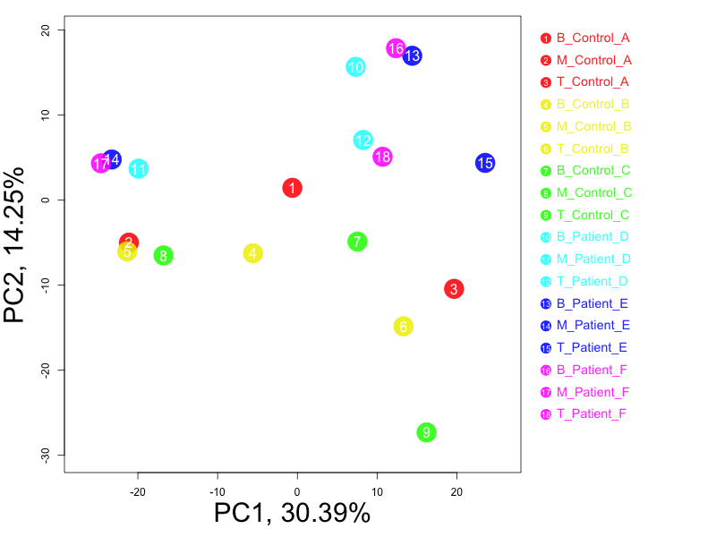

<div style="border:black 1px solid; padding: 0.5cm 0.5cm">

**Introduction** This procedure analyzes the RNA-seq data of multiple samples for quality control purpose, using the gene-level read counts. The read counts can be provided as one or multiple integer data matrixes, corresponding to different mapping types, such as unique vs. multiple mapping and sense vs. antisense strands. The following steps will be applied to the read count data:

  - **Summary statistics**: the read count data is summarized by sample, gene and mapping type.
  - **Dispersion and normalization**: different normalization methods are compared based on between-sample variance of all genes before and after normalization. 
  - **Sample analysis**: X/Y genes are used to predict sample gender; and autosomal genes are used for unsupervised sample clustering.

</div>

&nbsp;


<div align='right'>_[Go to project home](http://zhezhangsh.github.io/RoCA)_</div> 

# Description {.tabset}

## Project


Transcriptome in immune cells of control-patient samples


## Data


Rna-seq data was generated from of 3 types of immune cells of 3 controls and 3 patients. Raw data was processed to get gene-level read counts.


## Analysis


This is a demo.


<div align='right'>_[Go to project home](http://zhezhangsh.github.io/RoCA)_</div>

# Summary statistics

- Number of samples: _18_
- Number of genes: _25,207_
- Average number of reads per gene: _6,329_
- Total number of reads per sample: _8,862,836_

## Read count by sample


The total read count per sample is the sum of sequence reads of one sample mapped to all genes. Inconsistency of total reads between samples might suggest data quality issues and affect downstream analysis. For example, low total read count could be caused by high level of RNA degradation or high rate of sequencing errors. _Shapiro-Wilk_ normality test shows that the total read counts of this data set is normally distributed (p = 0.21). Samples with extreme total read counts comparing to the others:

- Samples with extremly low read count: ***none***
- Samples with extremly high read count: ***none***

<div align='center'>

</div>

<div style="color:darkblue; padding:0 3cm">
**Figure 1.** Distribution of total read counts of all samples. Total read count per sample (millions):  

```
##    Min. 1st Qu.  Median    Mean 3rd Qu.    Max. 
##   6.446   7.491   8.600   8.863  10.050  12.370
```
</div>

## Read count by gene


Due to the variability of gene length and expression level, it is expected that a large portion of the sequence reads are mapped to a small number of genes. At the same time, a large portion of the genes will have no or few reads mapped to them, making them unsuitable for statistical analysis. The distribution of read counts across genes and the consistency of such distribution between samples also provide information about RNA-seq data quality. In this data set,

- 10.52% genes have no reads mapped to them in any sample.
- 35.27% genes have less 1 read mapped to them per sample.
- 48.29% genes have less 5 reads mapped to them per sample .

<div align='center'>

</div>

<div style="color:darkblue; padding:0 2cm">
**Figure 2.** The total read count of all samples mapped to each gene is used to sort genes from high to low. The cumulative percent of top genes is plotted along gene ranking. 
</div>

&nbsp;

<div align='center'>

</div>

<div style="color:darkblue; padding:0 1cm">
**Figure 3.** The cumulative read counts of [top 10 genes](table/top_gene_count.html) and the percent of total reads by these genes are calculated for each sample. Samples are ordered by the percents from low to high on the x-axis in this figure. The 2 samples with the lowest and the highest cumulative percents are labeled. The cumulative percents of all samples are then compared to each other to identify samples with extremely lower or higher percents than the other samples: 

- Samples with extremely low percent of reads from top 10 genes: ***none***
- Samples with extremely high percent of reads from top 10 genes: ***none***
</div>

## Read count by mapping type

The read-to-gene mapping could be complicated by at least 3 conditions corresponding to 8 mapping types: 

- Whether the read is mapped to one and only one gene or multiple genes: ***unique vs. multiple***
- Whether both ends of paired end reads are mapped to the same gene or only one end is mapped: ***paired vs. unpaired***
- Whether the read is mapped to the sense strand or antisense strand of a gene: ***sense vs. antisense***

This analysis accepts multiple matching matrixes of read counts corresponding to different mapping types. By default, the first matrix corresponds to the most common mapping type and will be used for all the other analyses in this report. In this section, however, read counts of different mapping types are summarized and compared to each other when multiple matrixes are provided. 

<div align='left'>

</div>

<div style="color:darkblue; padding:0 1cm">
**Figure 4.** Total mapped reads of all samples are split by mapping types, such as unique vs. multiple, paired vs. unpaired, and sense vs. antisense. Among the 8 mapping type(s), 

- The most common mapping type is _Unique_Paired_As_ (_48.4133%_ of total mapped reads)
- The least common mapping type is _Multiple_Unpaired_As_, (_0.065%_ of total mapped reads)
</div>

&nbsp;

When the gene-level read counts of two mapping types are strongly correlated to each other, they can be combined to increase total read counts and hence statistical power of data analysis. Negative or lack of correlation between mapping types might also provide useful information. 

<div align='left'>

</div>

<div style="color:darkblue; padding:0 1cm">
**Figure 5.** The mapping type has the strongest correlation to the first and most common mapping type is identified based on Spearman's correlation coefficients. The gene-level read counts of both mapping types are plotted in this figure. Click [here](table/corr_mapping_type.html) to view correlation coefficients between all pairs of mapping types.
</div>

&nbsp;

By comparing read counts of different mapping types to each other, the ratios can be compared between samples for consistency. A sample might have quality issue if it has reads of a mapping type much less or more than the other samples.

<div align='center'>

</div>

<div style="color:darkblue; padding:0 1cm">
**Figure 6.** The relative frequecy of mapping types are calculated for each sample, using the first read count matrix as reference. The frequency of each mapping type are normalized across all samples (Mean = 0 and SD = 1.0). This figure shows the normalized frequency of each mapping type in each sample (red = high). 
- Mapping type _Multiple_Unpaired_Sense_ has the most "abnormally" high relative frequency (# of standard deviations = _0.42_) in sample _T_Patient_F, B_Control_C_. 
- Mapping type _Unique_Unpaired_As_ has the most "abnormally" low relative frequency (# of standard deviations = _-1_) in sample _T_Patient_F_. 
</div>

<div align='right'>_[Go to project home](http://zhezhangsh.github.io/RoCA)_</div>

# Dispersion and normalization


Gene-specific dispersion of RNA-seq read counts is commonly used to evaluate between-sample variance of a data set. Here, the dispersion is estimated by the overall pattern of coefficient of variation (standard deviation devided by average read count) of all genes. 

<div align='center'>

</div>

<div style="color:darkblue; padding:0 1cm">
**Figure 7.** Left: the distribution of average gene expression level (read count divided by gene length). Right: the dispersion of gene expression level between samples, measured as the coefficient of variation. Usually, genes with lower expression will have larger dispersion on average. 
</div>

There are many ways to normalize RNA-seq data to remove systematic bias between samples, usually based on the assumption that all the samples have the same global distribution. The following analysis performs several different normalization methods and evaluate their impact on data dispersion:

- **Original**: The un-normalized gene-level read counts.
- **Total_Count**: Rescale data so all the samples have the same total read count.
- **Median**: Rescale data so all the samples have the same median read count.
- **Quantile_Quantile**: Make all the samples have exactly the same distribution.
- **Upper_Quantile**: Rescale data so all the samples have the same upper quantile read count.
- **Trimmed_Mean**: The "weighted trimmed mean of M-values" method implemented by the [edgeR](https://bioconductor.org/packages/release/bioc/html/edgeR.html) package.
- **Relative_Log**: The "relative log expression" method implemented by the [edgeR](https://bioconductor.org/packages/release/bioc/html/edgeR.html) package.
- **DESeq**: The normalization method of the [DESeq](https://bioconductor.org/packages/release/bioc/html/DESeq.html) package.
- **FPKM**: Fragments Per Kilobase of transcript per Million mapped reads.
- **TPM**: Transcript per Million mapped reads.
- **Loess**: Make all the samples have the similar distribution by fitting them to same Loess distribution.
- **Cyclic_Loess**: The "cyclic loess" method implemented by the [limma](https://bioconductor.org/packages/release/bioc/html/limma.html) package.

Check [this](http://bib.oxfordjournals.org/content/early/2012/09/15/bib.bbs046.long) paper for detailed comparison of normalization methods, and [this](https://raw.githubusercontent.com/zhezhangsh/DEGandMore/master/R/NormWrapper.R) function for R code of these normalization methods. 

<div align='center'>

</div>

<div style="color:darkblue; padding:0 0.5cm">
**Figure 8.** Each panel corresponds to a normalization method, including the boxplots of all samples. Samples are colored by their **Group**.
</div>

<div align='center'>

</div>

<div style="color:darkblue; padding:0 0.5cm">
**Figure 9.** Each boxplot corresponds to a normalization method and the overall distribution of change in coefficient of variation of all genes. The means of all genes are labeled as the read stars. Click [here](table/Coeff_of_Var.html) to view the table of coefficients of variation of all genes. 
</div>

&nbsp;

<div style="color:darkblue; padding:0 2cm">
**Table 1** Summary of coefficient of variation (CV) from each normalization method. The columns are 1) average CV of all genes; 2) correlation of CV between the original read counts and normalized read counts of all genes; 3) the number of gene with decreased CV; 4) the number of genes with increased CV; and 5) the ratio of decreased to increased genes. 
</div>

<div align='center', style="padding:0 2cm">


|Method            |   Mean| Corr2Original| Num_Decrease| Num_Increase| Decrease_vs_Increase|
|:-----------------|------:|-------------:|------------:|------------:|--------------------:|
|Original          | 1.0695|          1.00|            0|            0|                  NaN|
|Total_Count       | 1.1161|          1.00|         5372|        16591|               0.3238|
|Median            | 1.0496|          1.00|        13328|         8561|               1.5568|
|Quantile_Quantile | 1.0376|          0.91|        13016|         7613|               1.7097|
|Upper_Quantile    | 1.0329|          1.00|        13455|         7861|               1.7116|
|Trimmed_Mean      | 1.0588|          0.99|        11259|        10438|               1.0787|
|Relative_Log      | 1.0588|          0.99|        11259|        10438|               1.0787|
|DESeq             | 1.0442|          0.99|        14207|         8032|               1.7688|
|FPKM              | 1.1161|          1.00|         5253|        16590|               0.3166|
|TPM               | 1.1403|          1.00|         4349|        17477|               0.2488|
|Loess             | 1.0832|          0.96|        17831|         7376|               2.4174|
|Cyclic_Loess      | 1.1540|          0.89|        16524|         8683|               1.9030|


</div>

<div align='right'>_[Go to project home](http://zhezhangsh.github.io/RoCA)_</div>

# Sample analysis

This section uses read count data to perform several sample-level analyses. The results can be used to identify potential mislabeling, outlier, confounding variable, etc. Read counts normalized by the _Loess_ method are used for all analyses in this section. 

## Gender prediction


When enough genes on X and Y chromosomes have detectable expression, these genes can be used to predict the gender of samples. In case the gender information is already available, the predicted gender can be used to identify potential mislabeling.  

<div style="color:darkblue; padding:0 2cm">

</div>

<div style="color:darkblue; padding:0 2cm">
**Figure 10.** The average of Log2(Read Count+1) is calculated for X and Y chromosomes when there are at least 5 genes having detectable expression. The averages of each sample are plotted in this figure as X and Y axes. The averages of each chromosome are used separately to cluster samples using the pamk {fpc} function. If the optimal number of clusters is 2 for both chromosomes, gender prediction will be made, and the samples having predicted gender agreed byt the two chromosomes will be labeled with red (female) or blue (male). Click [here](table/gender_prediction.html) to veiw the full table of gender prediction. 
</div>

<div align='right'>_[Go to project home](http://zhezhangsh.github.io/RoCA)_</div>

## Hierarchical clustering

Hierarchical clustering groups samples based on their glabal correlation of all genes. It is a iterative procedure that merges two most similar samples/groups at each step. 

<div style="color:darkblue; padding:0 2cm">

</div>

<div style="color:darkblue; padding:0 2cm">
**Figure 11.** Hierarchical clustering of samples using all autosomal genes. Normalized read counts are log2-transformed before clustering. The vertical position of the common node of two samples indicates their similarity (lower = more similar).
</div>

<div align='right'>_[Go to project home](http://zhezhangsh.github.io/RoCA)_</div>

## Principal components analysis {.tabset}

Principal components analysis 


### Group 

  

### Cell 

  

### Disease 

  

### Donor 

  


<div style="color:darkblue; padding:0 1cm">
**Figure 12.** PCA is performed using all autosomal genes after read counts are log2-transformed. The same plot is made in multiple tabs while samples are color-coded based on known sample features. 
</div>

<div align='right'>_[Go to project home](http://zhezhangsh.github.io/RoCA)_</div>

***

# Appendix 

Check out the **[RoCA home page](http://zhezhangsh.github.io/RoCA)** for more information.  

## Reproduce this report

To reproduce this report: 

1. Find the data analysis template you want to use and an example of its pairing YAML file  [here](https://github.com/zhezhangsh/RoCA/wiki/Templates-and-examples) and download the YAML example to your working directory

2. To generate a new report using your own input data and parameter, edit the following items in the YAML file:

- _output_        : where you want to put the output files
- _home_          : the URL if you have a home page for your project
- _analyst_       : your name
- _description_   : background information about your project, analysis, etc.
- _input_         : where are your input data, read instruction for preparing them
- _parameter_     : parameters for this analysis; read instruction about how to prepare input data

3. Run the code below within ***R Console*** or ***RStudio***, preferablly with a new R session:


```r
if (!require(devtools)) { install.packages('devtools'); require(devtools); }
if (!require(RCurl)) { install.packages('RCurl'); require(RCurl); }
if (!require(RoCA)) { install_github('zhezhangsh/RoCAR'); require(RoCA); }

CreateReport(filename.yaml);  # filename.yaml is the YAML file you just downloaded and edited for your analysis
```

If there is no complaint, go to the _output_ folder and open the ***index.html*** file to view report. 

## Session information


```
## R version 3.2.2 (2015-08-14)
## Platform: x86_64-apple-darwin13.4.0 (64-bit)
## Running under: OS X 10.10.5 (Yosemite)
## 
## locale:
## [1] en_US.UTF-8/en_US.UTF-8/en_US.UTF-8/C/en_US.UTF-8/en_US.UTF-8
## 
## attached base packages:
## [1] parallel  stats4    stats     graphics  grDevices utils     datasets 
## [8] methods   base     
## 
## other attached packages:
##  [1] Rnaseq_0.0.0.9000       DEGandMore_0.0.0.9000  
##  [3] samr_2.0                matrixStats_0.14.2     
##  [5] impute_1.42.0           DESeq_1.20.0           
##  [7] lattice_0.20-33         locfit_1.5-9.1         
##  [9] Biobase_2.28.0          gplots_3.0.1           
## [11] fpc_2.1-10              vioplot_0.2            
## [13] sm_2.2-5.4              htmlwidgets_0.5        
## [15] DT_0.1                  yaml_2.1.13            
## [17] rmarkdown_0.9.6         knitr_1.13             
## [19] edgeR_3.10.2            awsomics_0.0.0.9000    
## [21] RoCA_0.0.0.9000         RCurl_1.95-4.8         
## [23] bitops_1.0-6            RankProd_2.42.0        
## [25] devtools_1.11.1         DESeq2_1.8.1           
## [27] RcppArmadillo_0.5.300.4 Rcpp_0.12.4            
## [29] GenomicRanges_1.22.4    GenomeInfoDb_1.6.3     
## [31] IRanges_2.4.8           S4Vectors_0.8.11       
## [33] BiocGenerics_0.16.1     limma_3.26.9           
## [35] snow_0.4-1             
## 
## loaded via a namespace (and not attached):
##  [1] RColorBrewer_1.1-2   httr_1.2.0           prabclus_2.2-6      
##  [4] tools_3.2.2          R6_2.1.2             KernSmooth_2.23-15  
##  [7] rpart_4.1-10         Hmisc_3.16-0         DBI_0.3.1           
## [10] colorspace_1.2-6     trimcluster_0.1-2    nnet_7.3-10         
## [13] withr_1.0.1          gridExtra_2.0.0      curl_0.9.7          
## [16] git2r_0.15.0         formatR_1.3          caTools_1.17.1      
## [19] diptest_0.75-7       scales_0.2.5         DEoptimR_1.0-3      
## [22] mvtnorm_1.0-3        robustbase_0.92-5    genefilter_1.50.0   
## [25] stringr_1.0.0        digest_0.6.9         foreign_0.8-66      
## [28] XVector_0.10.0       htmltools_0.3.5      highr_0.5.1         
## [31] RSQLite_1.0.0        jsonlite_0.9.22      mclust_5.0.2        
## [34] BiocParallel_1.2.20  gtools_3.5.0         acepack_1.3-3.3     
## [37] magrittr_1.5         modeltools_0.2-21    Formula_1.2-1       
## [40] futile.logger_1.4.1  munsell_0.4.2        proto_0.3-10        
## [43] stringi_1.0-1        MASS_7.3-43          zlibbioc_1.14.0     
## [46] flexmix_2.3-13       plyr_1.8.3           grid_3.2.2          
## [49] gdata_2.17.0         splines_3.2.2        annotate_1.46.1     
## [52] geneplotter_1.46.0   reshape2_1.4.1       futile.options_1.0.0
## [55] XML_3.98-1.3         evaluate_0.9         latticeExtra_0.6-26 
## [58] lambda.r_1.1.7       gtable_0.1.2         kernlab_0.9-22      
## [61] ggplot2_1.0.1        xtable_1.7-4         e1071_1.6-7         
## [64] class_7.3-13         survival_2.38-3      AnnotationDbi_1.30.1
## [67] memoise_1.0.0        cluster_2.0.3
```

<div align='right'>_[Go to project home](http://zhezhangsh.github.io/RoCA)_</div>

***
_END OF DOCUMENT_
