

**Introduction** This analysis compares a set of high-throughput sequencing libraries based on their [FastQC](http://www.bioinformatics.babraham.ac.uk/projects/fastqc/) reports. Please refer to the original FastQC documentation for details about FastQC statistics. This analysis only requires the _fastqc.zip_ file generated by each FastQC run and don't use the original .fastq or .bam file.

[FastQC](http://www.bioinformatics.babraham.ac.uk/projects/fastqc/) aims to provide a simple way to do some quality control checks on raw sequence data coming from high throughput sequencing pipelines. It provides a modular set of analyses which you can use to give a quick impression of whether your data has any problems of which you should be aware before doing any further analysis. The main functions of FastQC are

 - Import of data from BAM, SAM or FastQ files (any variant)
 - Providing a quick overview to tell you in which areas there may be problems
 - Summary graphs and tables to quickly assess your data
 - Export of results to an HTML based permanent report
 - Offline operation to allow automated generation of reports without running the interactive application

&nbsp;

_[Go to project home](http://zhezhangsh.github.io/RoCA)_

# Description

# Description

## Project

Compare the transcriptomes of early embryos of lean and obese mice.

## Experiment

Prepare RNA-seq libraries using Clontech's Low Input SMARTer® Stranded RNA-Seq Kit and did a paired-end 2x75bp NextSeq run.

## Analysis

Diagnosis of RNA-seq libaries with low alignment rate. The sequencing reads of this data set have low alignment rate (TopHat~=50% STAR~=65%). One pair of .fastq files, **CtrlM201A2_S16_L001**, with ~12 million reads were selected for diagnosis purpose. Each of the original .fastq files were split into 2 files with just aligned and unaligned reads according to STAR alignment result. This analysis compares the FastQC reports of the original, aligned, and unaligned fastq files.

_[Go to project home](http://zhezhangsh.github.io/RoCA)_

# Summary statistics

Summary statistics were compared across libraries. Inconsistence of a statistics might indicate quality issues of some libraries. 

_[Go to project home](http://zhezhangsh.github.io/RoCA)_

## Quick evaluation

**FastQC** makes a quick evaluation on each summary statistic whether it is entirely normal (**green**), slightly abnormal (**orange**) or abnormal (**red**). The figure below compiles the evaluation results of all summary statistics from all libraries. 

  - **[Quick evaluation results of all libraries](table/quick_evaluation.html)**

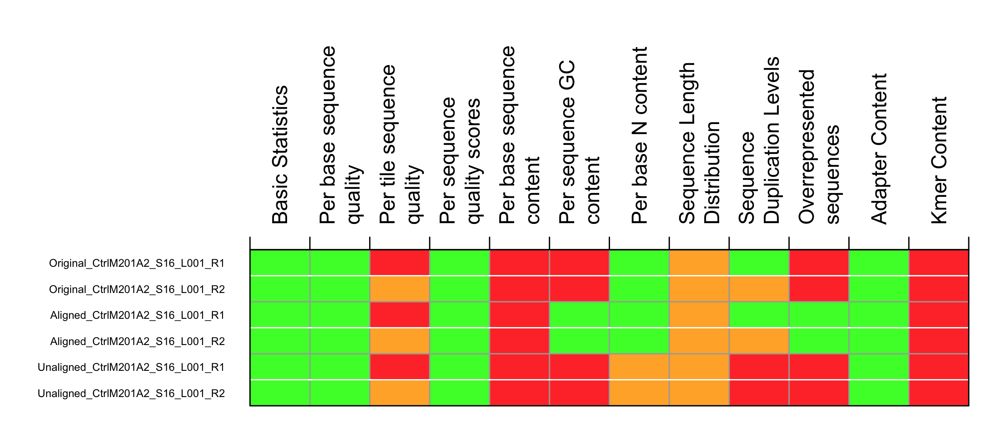

**Figure 1.** The summary statistics are color-coded (green=normal, orange=slightly abnormal, and red=abnormal). Please refer to FastQC manual for intepretation of each statistic.

_[Go to project home](http://zhezhangsh.github.io/RoCA)_

## Total reads

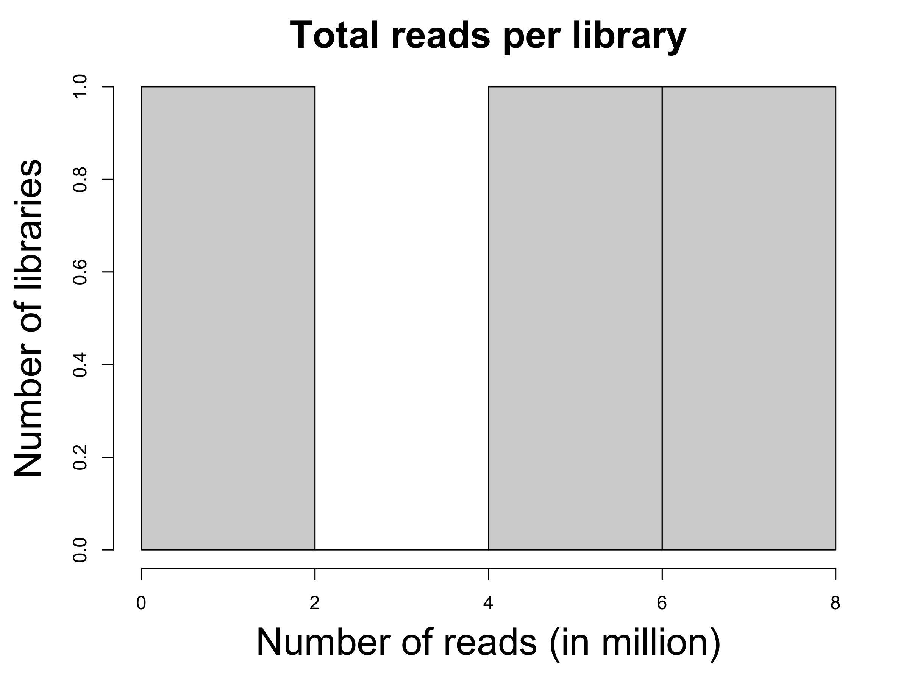

**Figure 2.** The distribution of library size (number of total reads). One pair of paired reads is counted as one read.

_[Go to project home](http://zhezhangsh.github.io/RoCA)_

## Paired read correlation

Compare the consistency of several key summary statistics between paired sequence reads. Strong agreement between pairs is expected.

  - **[Summary statistics to be compared between paired reads](table/summary_stats.html)**

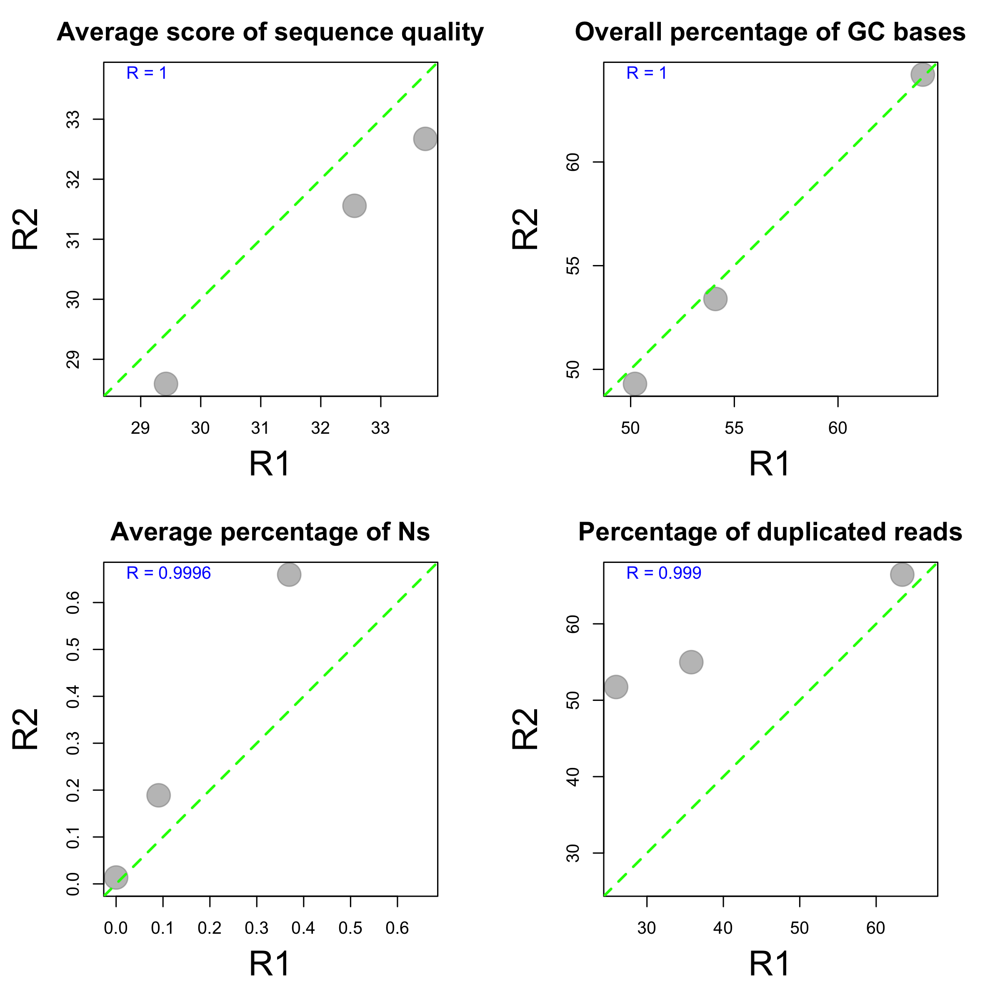

**Figure 3.** These plots compare the summary statistics of paired reads (R1 = read1 and R2 = read2). Each dot represents a library. No plots will be shown if the sequencing reads are single-ended. 

_[Go to project home](http://zhezhangsh.github.io/RoCA)_

## Per read statistics

### Sequencing quality

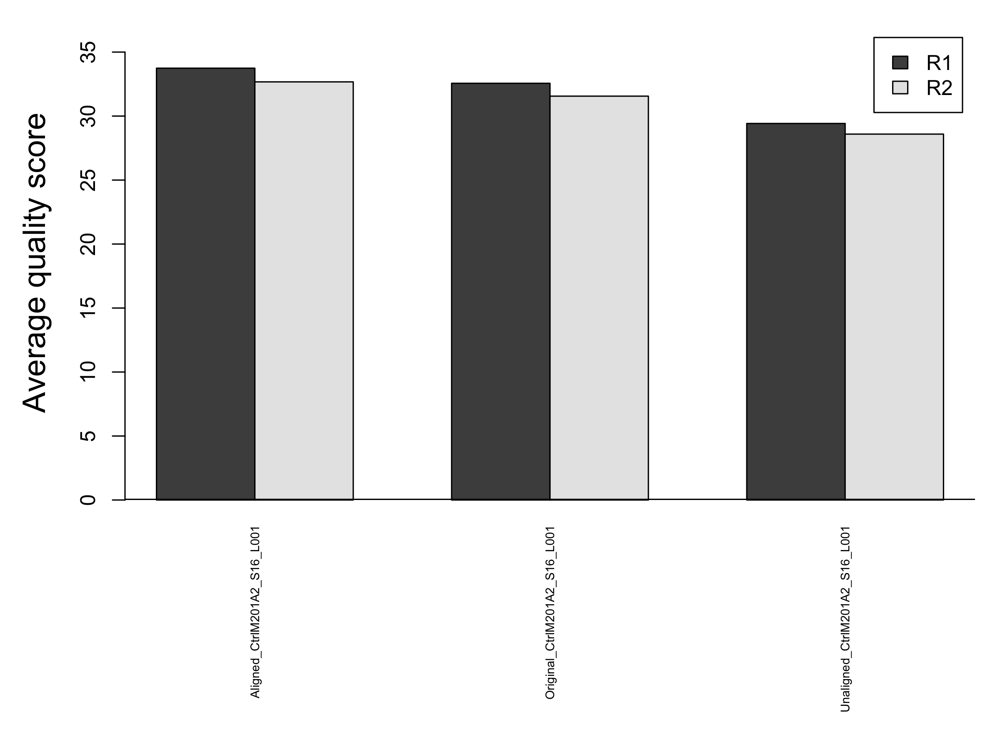

**Figure 4.** Each base in a sequencing read got a quality score. This plot shows the average quality score of all bases and all reads in each library. The scores from Illumina sequencers usually range from 0 (p=1) to 40 (p=1E-4). 

### GC percent

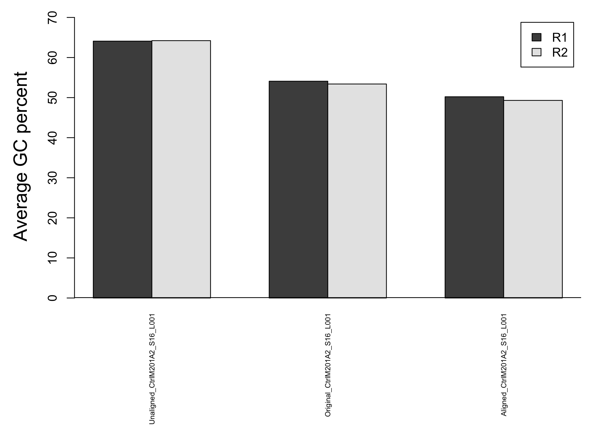

**Figure 5.** The average GC percent of all reads in each library.

### N percent

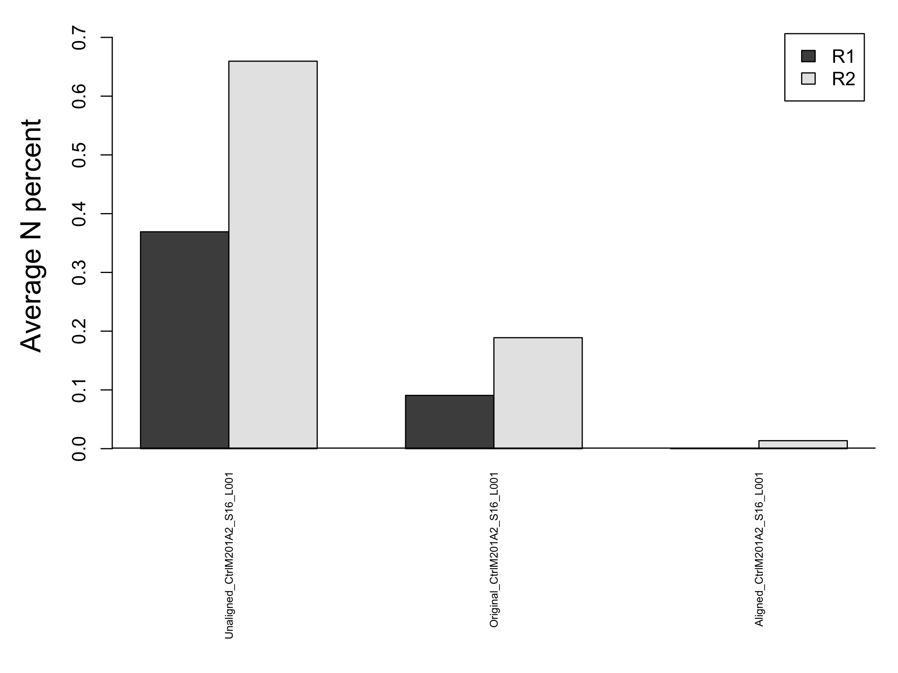

**Figure 6.** The average N frequency of all reads in each library. 

### Duplication level

Duplicated reads have the exact same sequences. Duplicated reads are often treated as one read in variant calling, so higher percentage of duplicated reads reduces the total number of usable reads. However, the duplication of paired end reads is evaluated separately by FastQC, so the actual level of duplication might be lower than the number in FastQC report. 

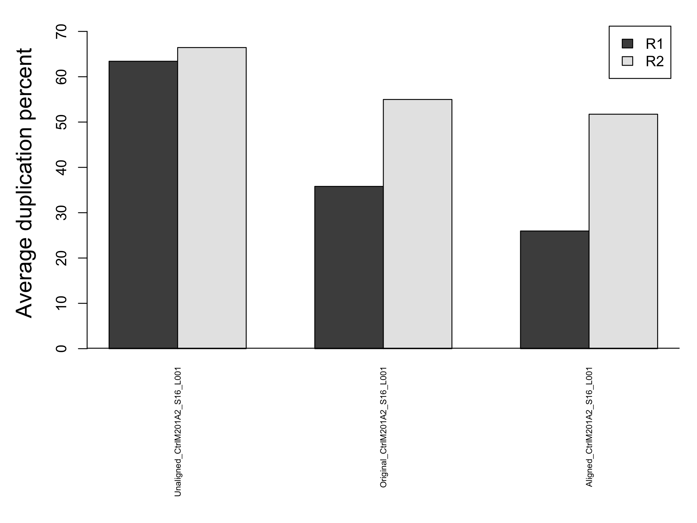

**Figure 7.** The average frequency of duplicated reads in each library. 

_[Go to project home](http://zhezhangsh.github.io/RoCA)_

## Per base statistics

### Sequence quality

Sequence quality of single bases is often position-dependent, with later positions usually having lower quality scores. 

  - **[Position-specific quality scores of all libraries](table/perbase_quality.html)** 

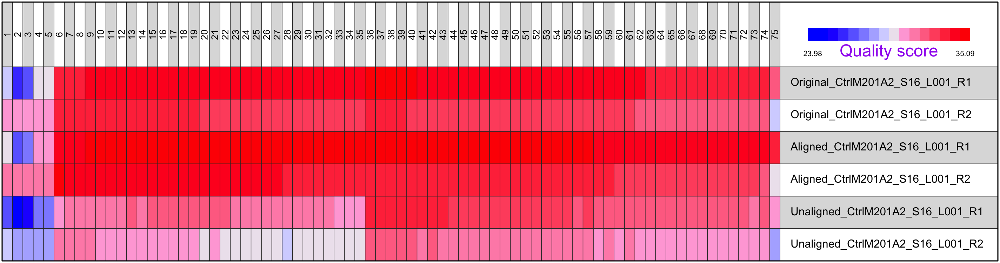

**Figure 8.** The average of position-specific quality scores in each library (red = higher).

### GC content

Sequence GC content of single bases is often position-dependent too.

  - **[Position-specific GC content of all libraries](table/perbase_content.html)** 

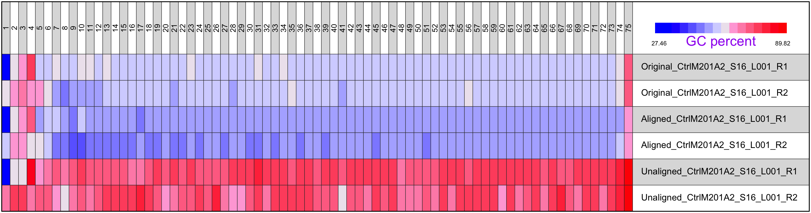

**Figure 9.** The average of position-specific GC content in each library (red = higher).

### N content

The occurance of Ns is also position-specific. 

  - **[Position-specific occurance of Ns in all libraries](table/perbase_N_content.html)** 

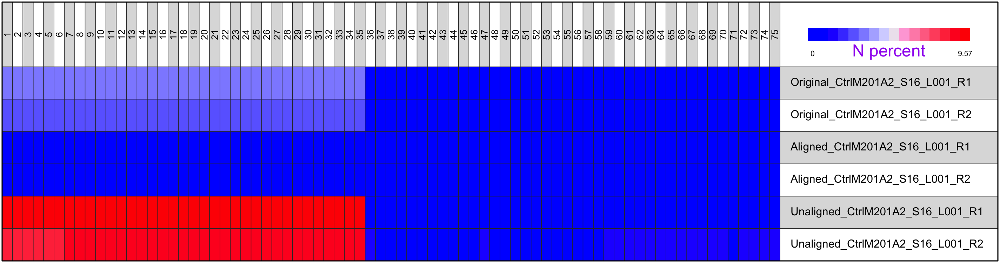

**Figure 10.** The average of position-specific GC content in each library (red = higher).

### Adaptor content

Among commonly known adaptor sequences, ***Illumina Universal Adapter***, had the highest occurances in the sequencing reads. So, only the occurance of this adaptor was summarized.

  - **[Occurance of adaptor sequence at different positions in reads](table/adaptor_content.html)** 

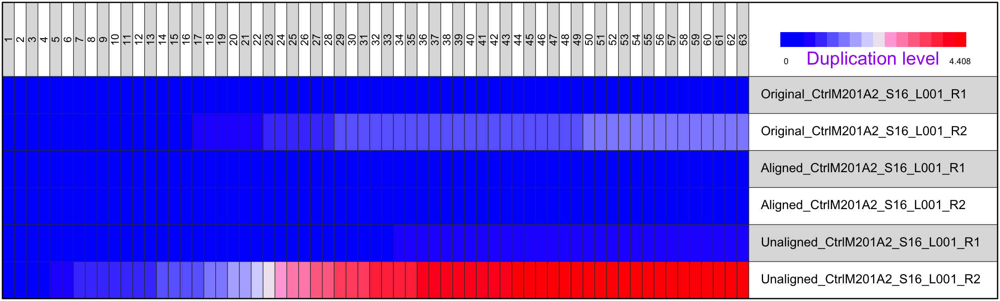

**Figure 11.** The position-specific percent of the occurance of adaptor sequence, ***Illumina Universal Adapter*** (red = higher).

_[Go to project home](http://zhezhangsh.github.io/RoCA)_

## K-mer enrichment

**FastQC** identifies top Kmers that were enriched in each library with their total occurance (count), significance (p value), enrichment (observed/expected), and the base position with maximum enrichment. Kmers of all libraries were summarized below. Use **Table 2** for details about Kmers in individual libraries.

  - [Kmer count](table/kmer_count.html)
  - [Kmer max enrichment](table/kmer_enrichment.html)
  - [Kmer max positioin](table/kmer_position.html)

**Table 1** Top 21 Kmers that were enriched in multiple libraries.

|        | Library|      Count|  Obs/Exp| Position_Mean| Position_Min| Position_Max|
|:-------|-------:|----------:|--------:|-------------:|------------:|------------:|
|TATCGCG |       3|   148.3333| 32.49667|      18.33333|            1|           53|
|AACGCTC |       2|  1737.5000| 33.31000|       3.00000|            3|            3|
|AAGTCGG |       2|  1712.5000| 45.03500|       1.00000|            1|            1|
|ACCCTTC |       2|  6367.5000| 55.94500|       3.00000|            3|            3|
|ACGTACG |       2|   452.5000| 36.99000|      67.00000|           67|           67|
|AGTCGGC |       2|  1820.0000| 48.19500|       2.00000|            2|            2|
|CGACCAA |       2|  1257.5000| 35.43500|      23.00000|           23|           23|
|CGTTGCG |       2|   905.0000| 47.15000|       1.00000|            1|            1|
|GACCCTT |       2|  3845.0000| 48.18500|       2.00000|            2|            2|
|GCACGAC |       2|  2130.0000| 45.53000|       3.00000|            3|            3|
|GGCACGA |       2|  1725.0000| 37.84000|       2.00000|            2|            2|
|GTACGCG |       2|   525.0000| 47.52500|      69.00000|           69|           69|
|GTTGCGG |       2|  1200.0000| 44.15500|       2.00000|            2|            2|
|TAACCCT |       2|  1327.5000| 47.45500|       1.00000|            1|            1|
|TACCTCG |       2|  1195.0000| 47.11500|       4.00000|            4|            4|
|TAGCGCG |       2|   387.5000| 35.94000|       1.00000|            1|            1|
|TCACGAC |       2|  1040.0000| 36.54500|       3.00000|            3|            3|
|TCGGCGC |       2| 20690.0000| 64.98000|      69.00000|           69|           69|
|TGCGACG |       2|   617.5000| 34.27000|       2.00000|            2|            2|
|TTGCGAC |       2|   680.0000| 36.32500|       1.00000|            1|            1|
|TTTCTCG |       2|  2527.5000| 47.87000|       4.00000|            4|            4|

_[Go to project home](http://zhezhangsh.github.io/RoCA)_

# FastQC reports

## Per read

**Table 2** Click links to view full reports and individual plots of per read statistics.

|Library                                                                                                  |Quality                                                                                                                                                                                       |GC_percent                                                                                                                                                                                   |Length                                                                                                                                                                                                 |Duplication                                                                                                                                                                                 |Overrepresented                                                                                        |Kmer                                                                                      |
|:--------------------------------------------------------------------------------------------------------|:---------------------------------------------------------------------------------------------------------------------------------------------------------------------------------------------|:--------------------------------------------------------------------------------------------------------------------------------------------------------------------------------------------|:------------------------------------------------------------------------------------------------------------------------------------------------------------------------------------------------------|:-------------------------------------------------------------------------------------------------------------------------------------------------------------------------------------------|:------------------------------------------------------------------------------------------------------|:-----------------------------------------------------------------------------------------|
|[Original_CtrlM201A2_S16_L001_R1](input/CtrlM201A2_S16_L001_R1_001_fastqc/fastqc_report.html)            |[image](input/CtrlM201A2_S16_L001_R1_001_fastqc/Images/per_sequence_quality.png);[table](input/CtrlM201A2_S16_L001_R1_001_fastqc/Tables/per_sequence_quality_scores.html)                     |[image](input/CtrlM201A2_S16_L001_R1_001_fastqc/Images/per_sequence_gc_content.png);[table](input/CtrlM201A2_S16_L001_R1_001_fastqc/Tables/per_sequence_gc_content.html)                     |[image](input/CtrlM201A2_S16_L001_R1_001_fastqc/Images/sequence_length_distribution.png);[table](input/CtrlM201A2_S16_L001_R1_001_fastqc/Tables/sequence_length_distribution.html)                     |[image](input/CtrlM201A2_S16_L001_R1_001_fastqc/Images/duplication_levels.png);[table](input/CtrlM201A2_S16_L001_R1_001_fastqc/Tables/sequence_duplication_levels.html)                     |image;[table](input/CtrlM201A2_S16_L001_R1_001_fastqc/Tables/overrepresented_sequences.html)           |image;[table](input/CtrlM201A2_S16_L001_R1_001_fastqc/Tables/kmer_content.html)           |
|[Original_CtrlM201A2_S16_L001_R2](input/CtrlM201A2_S16_L001_R2_001_fastqc/fastqc_report.html)            |[image](input/CtrlM201A2_S16_L001_R2_001_fastqc/Images/per_sequence_quality.png);[table](input/CtrlM201A2_S16_L001_R2_001_fastqc/Tables/per_sequence_quality_scores.html)                     |[image](input/CtrlM201A2_S16_L001_R2_001_fastqc/Images/per_sequence_gc_content.png);[table](input/CtrlM201A2_S16_L001_R2_001_fastqc/Tables/per_sequence_gc_content.html)                     |[image](input/CtrlM201A2_S16_L001_R2_001_fastqc/Images/sequence_length_distribution.png);[table](input/CtrlM201A2_S16_L001_R2_001_fastqc/Tables/sequence_length_distribution.html)                     |[image](input/CtrlM201A2_S16_L001_R2_001_fastqc/Images/duplication_levels.png);[table](input/CtrlM201A2_S16_L001_R2_001_fastqc/Tables/sequence_duplication_levels.html)                     |image;[table](input/CtrlM201A2_S16_L001_R2_001_fastqc/Tables/overrepresented_sequences.html)           |image;[table](input/CtrlM201A2_S16_L001_R2_001_fastqc/Tables/kmer_content.html)           |
|[Aligned_CtrlM201A2_S16_L001_R1](input/Aligned_CtrlM201A2_S16_L001_R1_001_fastqc/fastqc_report.html)     |[image](input/Aligned_CtrlM201A2_S16_L001_R1_001_fastqc/Images/per_sequence_quality.png);[table](input/Aligned_CtrlM201A2_S16_L001_R1_001_fastqc/Tables/per_sequence_quality_scores.html)     |[image](input/Aligned_CtrlM201A2_S16_L001_R1_001_fastqc/Images/per_sequence_gc_content.png);[table](input/Aligned_CtrlM201A2_S16_L001_R1_001_fastqc/Tables/per_sequence_gc_content.html)     |[image](input/Aligned_CtrlM201A2_S16_L001_R1_001_fastqc/Images/sequence_length_distribution.png);[table](input/Aligned_CtrlM201A2_S16_L001_R1_001_fastqc/Tables/sequence_length_distribution.html)     |[image](input/Aligned_CtrlM201A2_S16_L001_R1_001_fastqc/Images/duplication_levels.png);[table](input/Aligned_CtrlM201A2_S16_L001_R1_001_fastqc/Tables/sequence_duplication_levels.html)     |image;table                                                                                            |image;[table](input/Aligned_CtrlM201A2_S16_L001_R1_001_fastqc/Tables/kmer_content.html)   |
|[Aligned_CtrlM201A2_S16_L001_R2](input/Aligned_CtrlM201A2_S16_L001_R2_001_fastqc/fastqc_report.html)     |[image](input/Aligned_CtrlM201A2_S16_L001_R2_001_fastqc/Images/per_sequence_quality.png);[table](input/Aligned_CtrlM201A2_S16_L001_R2_001_fastqc/Tables/per_sequence_quality_scores.html)     |[image](input/Aligned_CtrlM201A2_S16_L001_R2_001_fastqc/Images/per_sequence_gc_content.png);[table](input/Aligned_CtrlM201A2_S16_L001_R2_001_fastqc/Tables/per_sequence_gc_content.html)     |[image](input/Aligned_CtrlM201A2_S16_L001_R2_001_fastqc/Images/sequence_length_distribution.png);[table](input/Aligned_CtrlM201A2_S16_L001_R2_001_fastqc/Tables/sequence_length_distribution.html)     |[image](input/Aligned_CtrlM201A2_S16_L001_R2_001_fastqc/Images/duplication_levels.png);[table](input/Aligned_CtrlM201A2_S16_L001_R2_001_fastqc/Tables/sequence_duplication_levels.html)     |image;table                                                                                            |image;[table](input/Aligned_CtrlM201A2_S16_L001_R2_001_fastqc/Tables/kmer_content.html)   |
|[Unaligned_CtrlM201A2_S16_L001_R1](input/Unaligned_CtrlM201A2_S16_L001_R1_001_fastqc/fastqc_report.html) |[image](input/Unaligned_CtrlM201A2_S16_L001_R1_001_fastqc/Images/per_sequence_quality.png);[table](input/Unaligned_CtrlM201A2_S16_L001_R1_001_fastqc/Tables/per_sequence_quality_scores.html) |[image](input/Unaligned_CtrlM201A2_S16_L001_R1_001_fastqc/Images/per_sequence_gc_content.png);[table](input/Unaligned_CtrlM201A2_S16_L001_R1_001_fastqc/Tables/per_sequence_gc_content.html) |[image](input/Unaligned_CtrlM201A2_S16_L001_R1_001_fastqc/Images/sequence_length_distribution.png);[table](input/Unaligned_CtrlM201A2_S16_L001_R1_001_fastqc/Tables/sequence_length_distribution.html) |[image](input/Unaligned_CtrlM201A2_S16_L001_R1_001_fastqc/Images/duplication_levels.png);[table](input/Unaligned_CtrlM201A2_S16_L001_R1_001_fastqc/Tables/sequence_duplication_levels.html) |image;[table](input/Unaligned_CtrlM201A2_S16_L001_R1_001_fastqc/Tables/overrepresented_sequences.html) |image;[table](input/Unaligned_CtrlM201A2_S16_L001_R1_001_fastqc/Tables/kmer_content.html) |
|[Unaligned_CtrlM201A2_S16_L001_R2](input/Unaligned_CtrlM201A2_S16_L001_R2_001_fastqc/fastqc_report.html) |[image](input/Unaligned_CtrlM201A2_S16_L001_R2_001_fastqc/Images/per_sequence_quality.png);[table](input/Unaligned_CtrlM201A2_S16_L001_R2_001_fastqc/Tables/per_sequence_quality_scores.html) |[image](input/Unaligned_CtrlM201A2_S16_L001_R2_001_fastqc/Images/per_sequence_gc_content.png);[table](input/Unaligned_CtrlM201A2_S16_L001_R2_001_fastqc/Tables/per_sequence_gc_content.html) |[image](input/Unaligned_CtrlM201A2_S16_L001_R2_001_fastqc/Images/sequence_length_distribution.png);[table](input/Unaligned_CtrlM201A2_S16_L001_R2_001_fastqc/Tables/sequence_length_distribution.html) |[image](input/Unaligned_CtrlM201A2_S16_L001_R2_001_fastqc/Images/duplication_levels.png);[table](input/Unaligned_CtrlM201A2_S16_L001_R2_001_fastqc/Tables/sequence_duplication_levels.html) |image;[table](input/Unaligned_CtrlM201A2_S16_L001_R2_001_fastqc/Tables/overrepresented_sequences.html) |image;[table](input/Unaligned_CtrlM201A2_S16_L001_R2_001_fastqc/Tables/kmer_content.html) |

_[Go to project home](http://zhezhangsh.github.io/RoCA)_

## Per base

**Table 3** Click links to view full reports and individual plots of per base statistics.

|Library                                                                                                  |Base_quality                                                                                                                                                                            |Tile_quality                                                                                                                                                                            |GC_content                                                                                                                                                                                       |N_content                                                                                      |Kmer_profile                                                                                                                                                            |Adapter_content                                                                                                                                                              |
|:--------------------------------------------------------------------------------------------------------|:---------------------------------------------------------------------------------------------------------------------------------------------------------------------------------------|:---------------------------------------------------------------------------------------------------------------------------------------------------------------------------------------|:------------------------------------------------------------------------------------------------------------------------------------------------------------------------------------------------|:----------------------------------------------------------------------------------------------|:-----------------------------------------------------------------------------------------------------------------------------------------------------------------------|:----------------------------------------------------------------------------------------------------------------------------------------------------------------------------|
|[Original_CtrlM201A2_S16_L001_R1](input/CtrlM201A2_S16_L001_R1_001_fastqc/fastqc_report.html)            |[image](input/CtrlM201A2_S16_L001_R1_001_fastqc/Images/per_base_quality.png);[table](input/CtrlM201A2_S16_L001_R1_001_fastqc/Tables/per_base_sequence_quality.html)                     |[image](input/CtrlM201A2_S16_L001_R1_001_fastqc/Images/per_tile_quality.png);[table](input/CtrlM201A2_S16_L001_R1_001_fastqc/Tables/per_tile_sequence_quality.html)                     |[image](input/CtrlM201A2_S16_L001_R1_001_fastqc/Images/per_base_sequence_content.png);[table](input/CtrlM201A2_S16_L001_R1_001_fastqc/Tables/per_base_sequence_content.html)                     |[image](input/CtrlM201A2_S16_L001_R1_001_fastqc/Images/per_base_n_content.png);table           |[image](input/CtrlM201A2_S16_L001_R1_001_fastqc/Images/kmer_profiles.png);[table](input/CtrlM201A2_S16_L001_R1_001_fastqc/Tables/kmer_content.html)                     |[image](input/CtrlM201A2_S16_L001_R1_001_fastqc/Images/adapter_content.png);[table](input/CtrlM201A2_S16_L001_R1_001_fastqc/Tables/adapter_content.html)                     |
|[Original_CtrlM201A2_S16_L001_R2](input/CtrlM201A2_S16_L001_R2_001_fastqc/fastqc_report.html)            |[image](input/CtrlM201A2_S16_L001_R2_001_fastqc/Images/per_base_quality.png);[table](input/CtrlM201A2_S16_L001_R2_001_fastqc/Tables/per_base_sequence_quality.html)                     |[image](input/CtrlM201A2_S16_L001_R2_001_fastqc/Images/per_tile_quality.png);[table](input/CtrlM201A2_S16_L001_R2_001_fastqc/Tables/per_tile_sequence_quality.html)                     |[image](input/CtrlM201A2_S16_L001_R2_001_fastqc/Images/per_base_sequence_content.png);[table](input/CtrlM201A2_S16_L001_R2_001_fastqc/Tables/per_base_sequence_content.html)                     |[image](input/CtrlM201A2_S16_L001_R2_001_fastqc/Images/per_base_n_content.png);table           |[image](input/CtrlM201A2_S16_L001_R2_001_fastqc/Images/kmer_profiles.png);[table](input/CtrlM201A2_S16_L001_R2_001_fastqc/Tables/kmer_content.html)                     |[image](input/CtrlM201A2_S16_L001_R2_001_fastqc/Images/adapter_content.png);[table](input/CtrlM201A2_S16_L001_R2_001_fastqc/Tables/adapter_content.html)                     |
|[Aligned_CtrlM201A2_S16_L001_R1](input/Aligned_CtrlM201A2_S16_L001_R1_001_fastqc/fastqc_report.html)     |[image](input/Aligned_CtrlM201A2_S16_L001_R1_001_fastqc/Images/per_base_quality.png);[table](input/Aligned_CtrlM201A2_S16_L001_R1_001_fastqc/Tables/per_base_sequence_quality.html)     |[image](input/Aligned_CtrlM201A2_S16_L001_R1_001_fastqc/Images/per_tile_quality.png);[table](input/Aligned_CtrlM201A2_S16_L001_R1_001_fastqc/Tables/per_tile_sequence_quality.html)     |[image](input/Aligned_CtrlM201A2_S16_L001_R1_001_fastqc/Images/per_base_sequence_content.png);[table](input/Aligned_CtrlM201A2_S16_L001_R1_001_fastqc/Tables/per_base_sequence_content.html)     |[image](input/Aligned_CtrlM201A2_S16_L001_R1_001_fastqc/Images/per_base_n_content.png);table   |[image](input/Aligned_CtrlM201A2_S16_L001_R1_001_fastqc/Images/kmer_profiles.png);[table](input/Aligned_CtrlM201A2_S16_L001_R1_001_fastqc/Tables/kmer_content.html)     |[image](input/Aligned_CtrlM201A2_S16_L001_R1_001_fastqc/Images/adapter_content.png);[table](input/Aligned_CtrlM201A2_S16_L001_R1_001_fastqc/Tables/adapter_content.html)     |
|[Aligned_CtrlM201A2_S16_L001_R2](input/Aligned_CtrlM201A2_S16_L001_R2_001_fastqc/fastqc_report.html)     |[image](input/Aligned_CtrlM201A2_S16_L001_R2_001_fastqc/Images/per_base_quality.png);[table](input/Aligned_CtrlM201A2_S16_L001_R2_001_fastqc/Tables/per_base_sequence_quality.html)     |[image](input/Aligned_CtrlM201A2_S16_L001_R2_001_fastqc/Images/per_tile_quality.png);[table](input/Aligned_CtrlM201A2_S16_L001_R2_001_fastqc/Tables/per_tile_sequence_quality.html)     |[image](input/Aligned_CtrlM201A2_S16_L001_R2_001_fastqc/Images/per_base_sequence_content.png);[table](input/Aligned_CtrlM201A2_S16_L001_R2_001_fastqc/Tables/per_base_sequence_content.html)     |[image](input/Aligned_CtrlM201A2_S16_L001_R2_001_fastqc/Images/per_base_n_content.png);table   |[image](input/Aligned_CtrlM201A2_S16_L001_R2_001_fastqc/Images/kmer_profiles.png);[table](input/Aligned_CtrlM201A2_S16_L001_R2_001_fastqc/Tables/kmer_content.html)     |[image](input/Aligned_CtrlM201A2_S16_L001_R2_001_fastqc/Images/adapter_content.png);[table](input/Aligned_CtrlM201A2_S16_L001_R2_001_fastqc/Tables/adapter_content.html)     |
|[Unaligned_CtrlM201A2_S16_L001_R1](input/Unaligned_CtrlM201A2_S16_L001_R1_001_fastqc/fastqc_report.html) |[image](input/Unaligned_CtrlM201A2_S16_L001_R1_001_fastqc/Images/per_base_quality.png);[table](input/Unaligned_CtrlM201A2_S16_L001_R1_001_fastqc/Tables/per_base_sequence_quality.html) |[image](input/Unaligned_CtrlM201A2_S16_L001_R1_001_fastqc/Images/per_tile_quality.png);[table](input/Unaligned_CtrlM201A2_S16_L001_R1_001_fastqc/Tables/per_tile_sequence_quality.html) |[image](input/Unaligned_CtrlM201A2_S16_L001_R1_001_fastqc/Images/per_base_sequence_content.png);[table](input/Unaligned_CtrlM201A2_S16_L001_R1_001_fastqc/Tables/per_base_sequence_content.html) |[image](input/Unaligned_CtrlM201A2_S16_L001_R1_001_fastqc/Images/per_base_n_content.png);table |[image](input/Unaligned_CtrlM201A2_S16_L001_R1_001_fastqc/Images/kmer_profiles.png);[table](input/Unaligned_CtrlM201A2_S16_L001_R1_001_fastqc/Tables/kmer_content.html) |[image](input/Unaligned_CtrlM201A2_S16_L001_R1_001_fastqc/Images/adapter_content.png);[table](input/Unaligned_CtrlM201A2_S16_L001_R1_001_fastqc/Tables/adapter_content.html) |
|[Unaligned_CtrlM201A2_S16_L001_R2](input/Unaligned_CtrlM201A2_S16_L001_R2_001_fastqc/fastqc_report.html) |[image](input/Unaligned_CtrlM201A2_S16_L001_R2_001_fastqc/Images/per_base_quality.png);[table](input/Unaligned_CtrlM201A2_S16_L001_R2_001_fastqc/Tables/per_base_sequence_quality.html) |[image](input/Unaligned_CtrlM201A2_S16_L001_R2_001_fastqc/Images/per_tile_quality.png);[table](input/Unaligned_CtrlM201A2_S16_L001_R2_001_fastqc/Tables/per_tile_sequence_quality.html) |[image](input/Unaligned_CtrlM201A2_S16_L001_R2_001_fastqc/Images/per_base_sequence_content.png);[table](input/Unaligned_CtrlM201A2_S16_L001_R2_001_fastqc/Tables/per_base_sequence_content.html) |[image](input/Unaligned_CtrlM201A2_S16_L001_R2_001_fastqc/Images/per_base_n_content.png);table |[image](input/Unaligned_CtrlM201A2_S16_L001_R2_001_fastqc/Images/kmer_profiles.png);[table](input/Unaligned_CtrlM201A2_S16_L001_R2_001_fastqc/Tables/kmer_content.html) |[image](input/Unaligned_CtrlM201A2_S16_L001_R2_001_fastqc/Images/adapter_content.png);[table](input/Unaligned_CtrlM201A2_S16_L001_R2_001_fastqc/Tables/adapter_content.html) |

_[Go to project home](http://zhezhangsh.github.io/RoCA)_

***
_END OF DOCUMENT_
