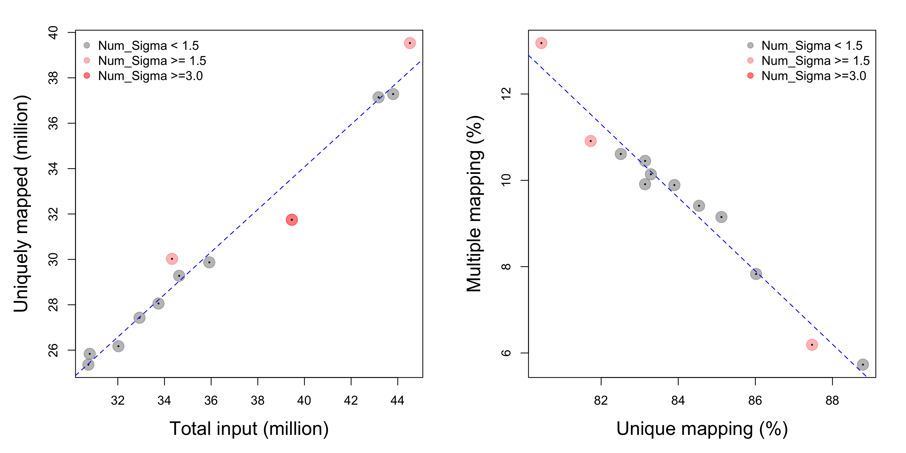
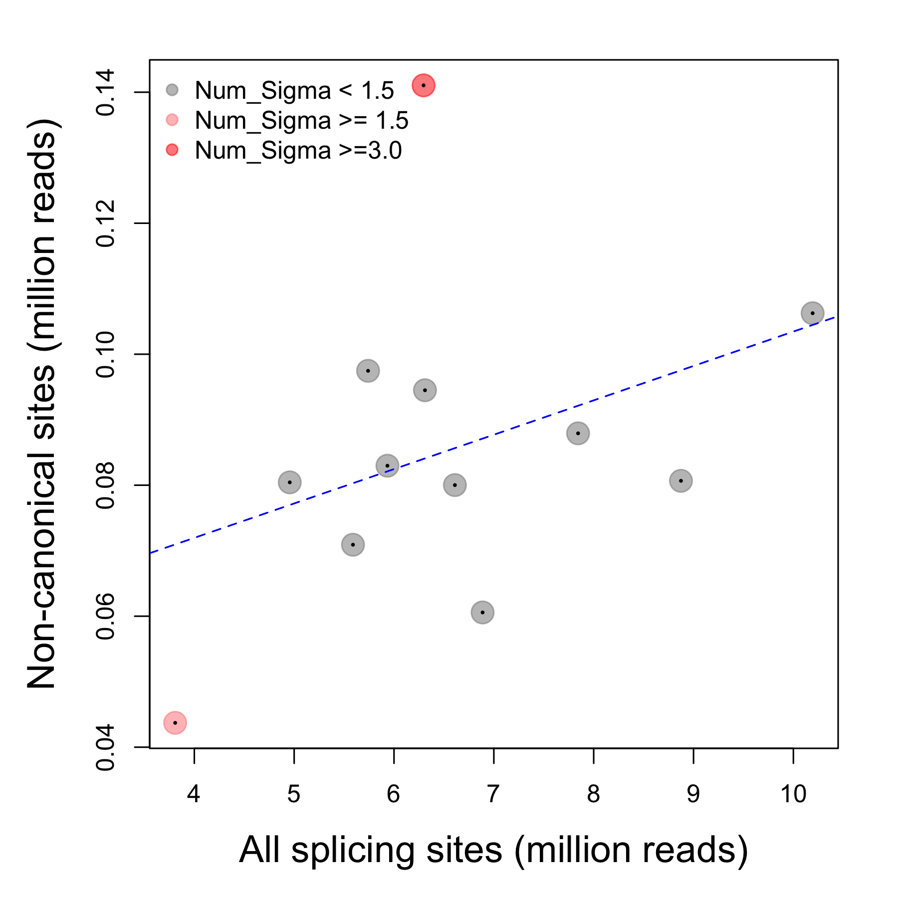
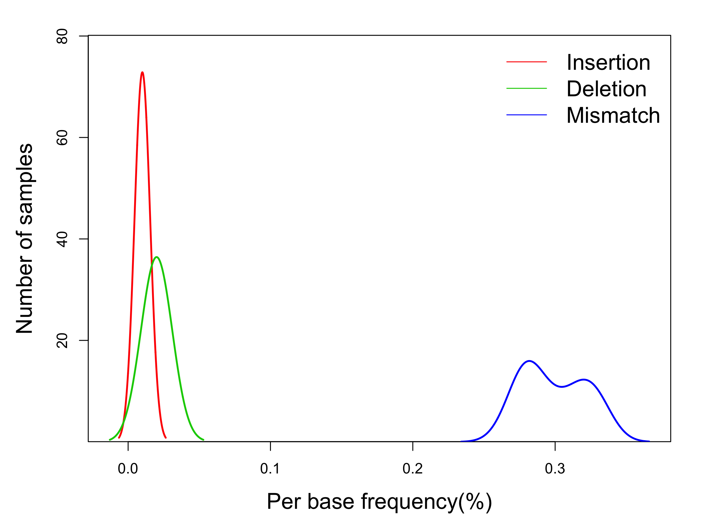
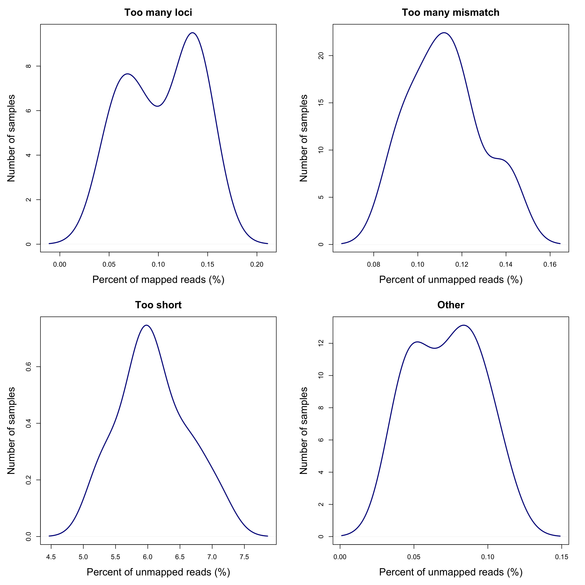

<div style="border:black 1px solid; padding: 0.5cm 0.5cm">

**Introduction** This report is a summary of outputs from the STAR program that aligned the sequence reads of a set of RNA-seq libraries. It uses information provided by the ***Log.final.out*** file generated by STAR from each RNA-seq library.

</div>

&nbsp;


<div align='right'>_[Go to project home](http://zhezhangsh.github.io/RoCA)_</div>

# Description

## Project


RNA-seq data in 3 immune cells of 4 donors


## Analysis


This is a demo.


<div align='right'>_[Go to project home](http://zhezhangsh.github.io/RoCA)_</div>

# STAR options


STAR was run using the following options:

  - **program**: STAR-STAR_2.4.1c/bin/Linux_x86_64_static/STAR
  - **output**: star/pass_2
  - **genome**: refs/hg38/star
  - **transcriptome**: refs/hg38/genes.gtf
  - **star**:
    - **runThreadN**: 8
    - **readFilesCommand**: zcat
    - **outSAMtype**: BAM
    - **chimSegmentMin**: 32
    - **outFilterType**: BySJout
    - **outFilterMultimapNmax**: 20
    - **alignSJoverhangMin**: 8
    - **alignSJDBoverhangMin**: 1
    - **outFilterMismatchNmax**: 999
    - **outFilterMismatchNoverLmax**: 0.04
    - **alignIntronMin**: 20
    - **alignIntronMax**: 1000000
    - **alignMatesGapMax**: 1000000

<div align='right'>_[Go to project home](http://zhezhangsh.github.io/RoCA)_</div>

# Summary statistics


<div style="color:darkblue; padding:0 2cm">
**Table 1.** Summary of the summary statistics of all libraries, including the total number of sequence reads, percent of uniquely mapped reads, etc. Click here to see the summary statistics of individual libraries.
</div>

<div align='center', style="padding:0 2cm">


|                                      |  Min.| 1st Qu.| Median|    Mean| 3rd Qu.|  Max.|
|:-------------------------------------|-----:|-------:|------:|-------:|-------:|-----:|
|Total input, million reads            | 30.74| 32.7000| 34.480| 36.3400| 40.3900| 44.52|
|Alignment rate (%), unique mapping    | 80.45| 82.9800| 83.600| 84.1800| 85.3400| 88.79|
|Alignment rate (%), unique + multiple | 92.64| 93.3500| 93.640| 93.6200| 93.8700| 94.52|
|Mismatch rate (%)                     |  0.27|  0.2800|  0.295|  0.2992|  0.3200|  0.33|
|Deletion rate (%)                     |  0.02|  0.0200|  0.020|  0.0200|  0.0200|  0.02|
|Insertion rate (%)                    |  0.01|  0.0100|  0.010|  0.0100|  0.0100|  0.01|
|Too many loci (%)                     |  0.05|  0.0675|  0.110|  0.1033|  0.1325|  0.15|
|Too many mismatch (%)                 |  0.09|  0.1000|  0.110|  0.1125|  0.1200|  0.14|
|Too short (%)                         |  5.23|  5.7850|  6.055|  6.0860|  6.4050|  7.10|


</div>

## Alignment rate

In most RNA-seq data sets, the percentage of total input reads that can be aligned to reference genome/transcriptome could range between 50% and 90%. Alignment rate is an important quality index of RNA-seq library and high throughput sequencing. However, it also highly depends on the experimental material and protocol, so it is hard to have a predefined cutoff of “high” alignment rate for all data sets. On the other hand, the consistence of alignment rates between samples of the same data set is at least equally important. Inconsistency of alignment rates is usually the consequence of systematic bias during the whole experimental procedure. It adds unwanted between-sample variance into data and might have profound impact on statistic analysis, such as differential gene expression. Therefore, the focus of this analysis is whether there are libraries having much lower alignment rates than the others.

The rate of unique vs. multiple alignment is a similar index of data quality. High percent of multiple alignment might indicate low complexity of sequence reads, higher sequencing error rate, and other issues. This analysis also evaluates the consistency of unique vs. multiple alignment between samples.

<div align='center'>

</div>

<div style="color:darkblue; padding:0 2cm">
**Figure 1.** The global alignment rate (left) and the rate of unique vs. multiple alignment (right). Each spot represents a RNA-seq library and is colored based on number of sigma. For each library, a linear model is built with all the other libraries and the value of sigma (variance of random error) is obtained from the model. The number of sigma is then calculated by dividing the observed-predicted difference of that library with the sigma value.
</div>

## Non-canonical splice sites
An important aspect of processing RNA-seq data is to alignment sequence reads to splicing sites, called gap alignment. Most commonly, STAR performs gap alignment first by using the known splicing sites based on the reference transcriptome and then by detecting novel splicing sites based on the reference genome. Most splicing sites have canonical donor/acceptor bases, such as GT/AG. While non-canonical splicing sites have been observed, they are relatively rare and often suggestive of false positives.

<div align='center'>

</div>

<div style="color:darkblue; padding:0 2cm">
**Figure 2.** The total number of reads gap-aligned reads and the number of gap-aligned with non-canonical splicing sites are fitted to linear models as in **Figure 1**. On average of all samples in this data set, 1.128% of all gap-aligned reads have non-canonical splicing sites.
</div>

## Mismatches and INDELs

STAR alignment reports the frequency of mismatch, deletion, and insertion bases. The consistency of these statistics should also be evaluated.

<div align='center'>

</div>

<div style="color:darkblue; padding:0 2cm">
**Figure 3.** Distribution of insertion/deletion/mismatch frequency in all samples.
</div>

## Unmapped reads

STAR alignment also reports the percent of unmapped reads due to different reasons, including too many mismatches, too short, and other. Additionally, it reports to percent of reads that were mapped, but to too many loci. Again, the focus here is the consistency of these percents between samples.

<div align='center'>

</div>

<div style="color:darkblue; padding:0 2cm">
**Figure 4.** Distribution of the frequency of poorly aligned reads due to different reasons. The frequency is relative to all mapped reads in the first plot, and relative to all unmapped reads in the others.
</div>

## Alerts


Listed below are samples with potentially quality problem, based on consistency of summary statistics between samples:

  - Low alignment rate: none
  - High multiple alignment rate: none
  - High rate of noncanonical splice: none
  - High insertion rate: none
  - High deletion rate: none
  - High mismatch rate: none
  - High rate of _too many loci_: none
  - High rate of _too many mismatch_: none
  - High rate of _too short_: none
  - High rate of _other_: none

## More details


Click links to view full tables of summary statistics of all samples:

  - [STAR run information](table/run_info.html)
    * Speed: mapping speed, million of reads per hour
  - Mapped reads: [count](table/count_mapped.html), [percent](table/percent_mapped.html)
    * Unique: reads mapped to one and only one genomic loci
    * Splice: reads mapped to splice junctions
    * Multiple: reads mapped to multiple genomic loci
  - [Splice sites](table/count_splice.html)
  - [Mismatch and INDEL](table/mismatch_indel.html)
  - [Unmapped](table/percent_unmapped.html)
  
# Appendix 

Check out the ***[RoCA project](http://zhezhangsh.github.io/RoCA)*** for more information.  

## Reproduce this report

To reproduce this report: 

  1. Copy this ***[YAML](https://raw.githubusercontent.com/zhezhangsh/RoCA/master/template/qc/summarize_star/summarize_star.yaml)*** file to your working directory

  2. To use your own data and parameters, edit the ***YAML*** file:

    - _output_: where you want to put the output files
    - _home_: the URL if you have a home page for your project
    - _analyst_: your name
    - _description_: background information about your project, analysis, etc.
    - _input_: where are your input data, read instruction for preparing them
    - _parameter_: parameters for this analysis; read instruction about how to prepare input data

  3. Run the code below within ***R Console*** or ***RStudio***, preferablly with a new R session:


```r
if (!require(devtools)) { install.packages('devtools'); require(devtools); }
if (!require(RCurl)) { install.packages('RCurl'); require(RCurl); }
if (!require(RoCA)) { install_github('zhezhangsh/RoCAR'); require(RoCA); }

CreateReport("cnv_impact.yaml");
```

If there is no complaint, go to the _output_ folder and open the ***index.html*** file to view report. 

## Session information


```
## R version 3.2.2 (2015-08-14)
## Platform: x86_64-apple-darwin13.4.0 (64-bit)
## Running under: OS X 10.10.5 (Yosemite)
## 
## locale:
## [1] en_US.UTF-8/en_US.UTF-8/en_US.UTF-8/C/en_US.UTF-8/en_US.UTF-8
## 
## attached base packages:
## [1] stats     graphics  grDevices utils     datasets  methods   base     
## 
## other attached packages:
##  [1] awsomics_0.0.0.9000 htmlwidgets_0.5     DT_0.1             
##  [4] knitr_1.12.3        rmarkdown_0.9.6     RoCA_0.0.0.9000    
##  [7] RCurl_1.95-4.8      bitops_1.0-6        devtools_1.11.1    
## [10] yaml_2.1.13        
## 
## loaded via a namespace (and not attached):
##  [1] Rcpp_0.12.4     magrittr_1.5    R6_2.1.2        highr_0.5.1    
##  [5] stringr_1.0.0   httr_1.1.0      tools_3.2.2     parallel_3.2.2 
##  [9] git2r_0.15.0    withr_1.0.1     htmltools_0.3.5 digest_0.6.9   
## [13] formatR_1.3     curl_0.9.7      memoise_1.0.0   evaluate_0.9   
## [17] stringi_1.0-1   jsonlite_0.9.20
```

<div align='right'>_[Go to project home](http://zhezhangsh.github.io/RoCA)_</div>

***

_END OF DOCUMENT_

