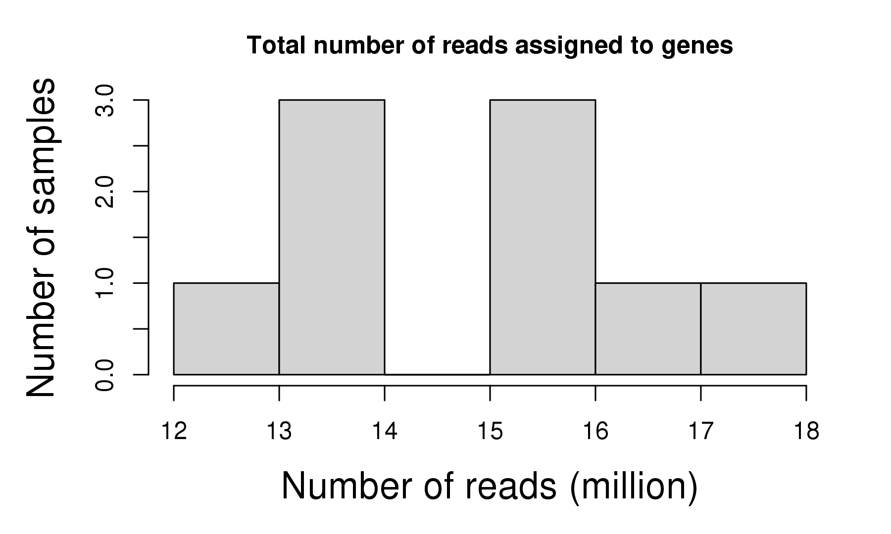
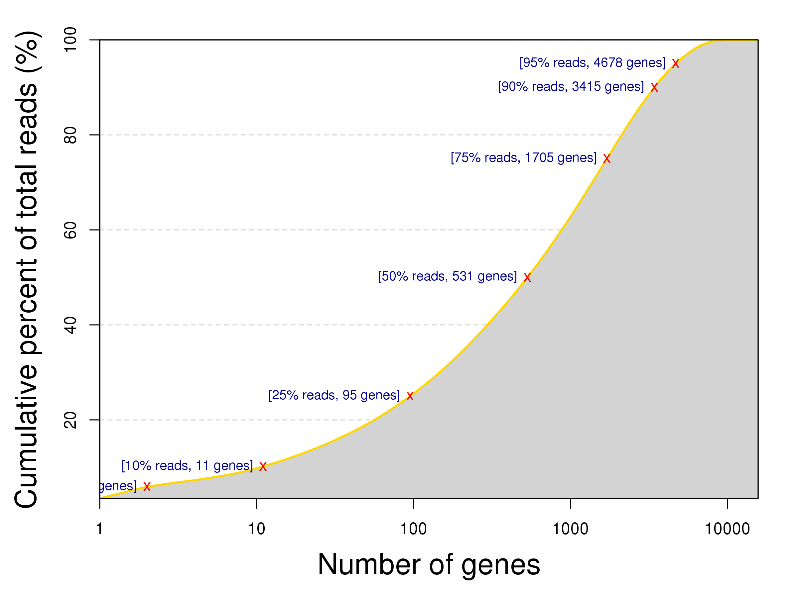
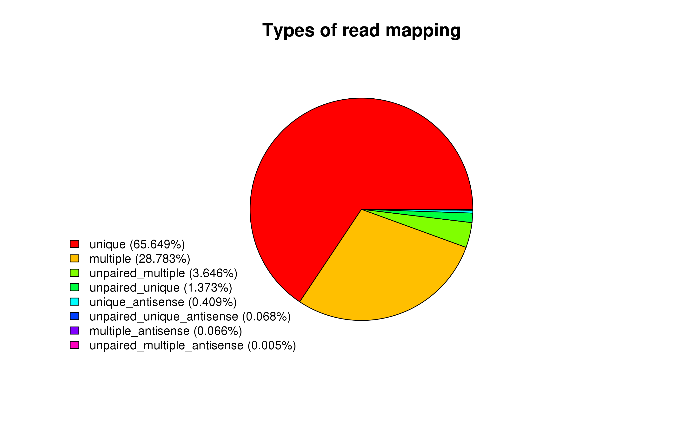
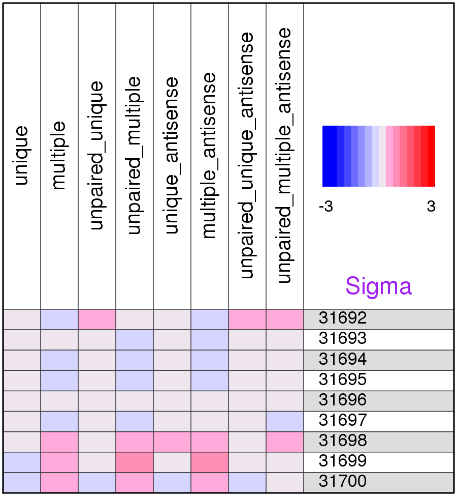
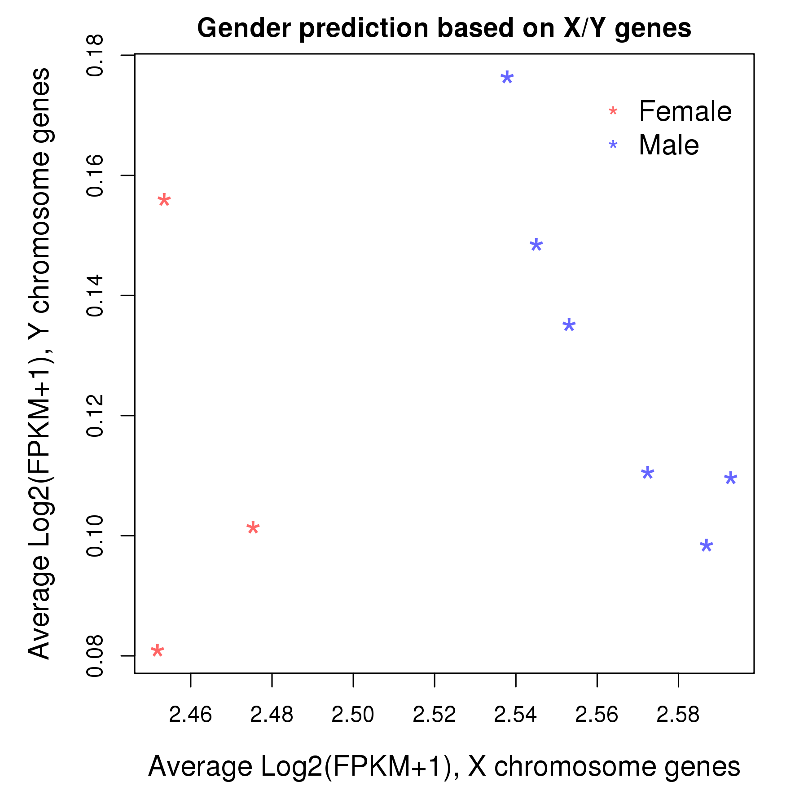
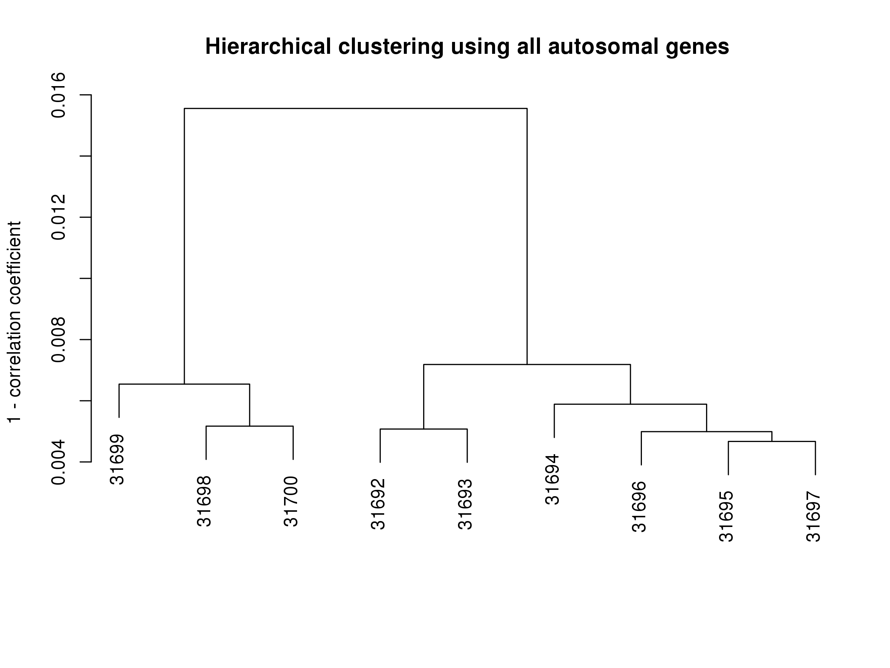
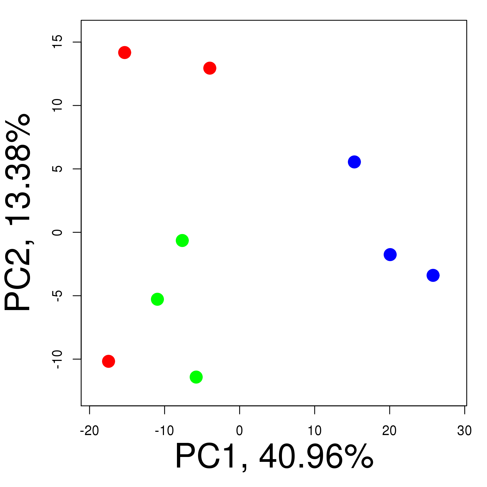

**Introduction** This procedure analyzes RNA-seq samples of quality control purpose. It uses count of reads mapped to genes in different ways: unique/multiple, sense/antisense, and paired/unpaired, as input to draw summary statistics and compare global pattern of samples.

**_[Go back to project home](http://mybic.chop.edu/labs/Krantz_lab/Fly_NIPPEDB/)_**

# Description

## Project

Fruit fly RNA-seq samples with NIPPEDB mutations

## Analyst

Zhe Zhang

**_[Go back to project home](http://mybic.chop.edu/labs/Krantz_lab/Fly_NIPPEDB/)_**

# Summary statistics

- Number of samples: _9_
- Number of genes: _15,637_
- Total number of reads assigned to genes per sample: _14.8_ (million)
- Type of reads to be assigned to genes: _unique_

## Read count distribution, samples

**Figure 1:** Distribution of total read count per sample. The total read counts were calculated by summing the read count of all genes. Highly inconsistent read counts between samples might suggest data quality issues and affect downstream analysis. For example, extremely low read count could be caused by insufficient RNA material due to degradation or high sequencing error rate. _Shapiro-Wilk_ normality test shows that the total read counts of this data set is normally distributed (p = 0.7400594).
  
- The mean and median of total read count are respectively **14.8** and **15.15** millions. 
- The first and third quantiles are respectively **13.59** and **15.75** millions.. 
- The minimum and maximum are respectively: **12.48** (sample _31693_) and **17.21** (sample _31699_) millions..

## Read count distribution, genes

 

**Figure 2:** Unbalanced read counts across genes. Due to difference in RNA abundance and gene length, most of the squencing reads were contributed by a small portion of all genes. For example, more than 90% of the reads in this data set were contributed by 21.84% of the genes. Additionally, 

- 1577 genes have 0 read mapped to them,
- 3962 genes have less 1 read per sample mapped to them,
- 5478 genes have less 5 reads per sample mapped to them

## Read count distribution, mapping types

**Figure 3:** The share of mapping types in total read counts, all samples combined.

  - There are 8 types of mapped reads:  _unique | multiple | unpaired_unique | unpaired_multiple | unique_antisense | multiple_antisense | unpaired_unique_antisense | unpaired_multiple_antisense_
  - The most common type of read mapping is __, corresponding to _95%_ of total read count.
  - The least common type of read mapping is __, corresponding to _5%_ of total read count.
  

**Figure 4:** The relative frequency (sigma) of read mapping types of each sample comparing to all the other samples. Sigma lower than -3 or higher than 3 suggests the type of reads has "abnormally" low or high frequency and there is an insistence between samples.

  - The largest number of sigma is _0.79_ of type _multiple_antisense_ and sample _31699_
 - The smallest number of sigma is _-0.59_ of type _unpaired_unique_ and sample _31694_
 

**_[Go back to project home](http://mybic.chop.edu/labs/Krantz_lab/Fly_NIPPEDB/)_**

# Sample analysis

For all analyses in this section, between-sample normalization was first done by converting read counts of genes to FPKM (fragments per kilobase per million reads). 

## Gender prediction

 

## Hierarchical clustering

## Principal components analysis

 

Same PCA plot color-coded by different sample attributes:   
- [Group](PCA_Group.pdf)

**_[Go back to project home](http://mybic.chop.edu/labs/Krantz_lab/Fly_NIPPEDB/)_**

# Tables

## Read count

|      |   unique   |  multiple  | unpaired_unique | unpaired_multiple | unique_antisense | multiple_antisense | unpaired_unique_antisense | unpaired_multiple_antisense |
|:-----|:----------:|:----------:|:---------------:|:-----------------:|:----------------:|:------------------:|:-------------------------:|:---------------------------:|
|31692 | 13,592,954 | 4,767,065  |     305,649     |      679,325      |      79,675      |       9,162        |          16,587           |            1,012            |
|31693 | 12,475,439 | 4,742,118  |     261,151     |      518,137      |      66,287      |       8,695        |          12,732           |             774             |
|31694 | 15,151,861 | 4,960,616  |     293,591     |      516,814      |      85,344      |       9,779        |          14,376           |             865             |
|31695 | 15,465,697 | 5,471,840  |     319,652     |      649,581      |      93,718      |       11,358       |          15,721           |            1,077            |
|31696 | 16,456,988 | 6,061,114  |     328,295     |      803,421      |     102,643      |       14,579       |          16,123           |            1,041            |
|31697 | 15,751,378 | 5,458,540  |     318,722     |      640,803      |      88,034      |       13,587       |          13,799           |             846             |
|31698 | 13,713,004 | 7,197,480  |     306,996     |      936,484      |     105,475      |       18,569       |          17,221           |            1,169            |
|31699 | 17,205,902 | 11,325,560 |     379,900     |     1,602,660     |     128,388      |       31,504       |          19,826           |            1,384            |
|31700 | 13,408,650 | 8,425,083  |     273,286     |     1,052,308     |      80,333      |       17,516       |          11,817           |             999             |

## Read percent

|      | unique | multiple | unpaired_unique | unpaired_multiple | unique_antisense | multiple_antisense | unpaired_unique_antisense | unpaired_multiple_antisense |
|:-----|:------:|:--------:|:---------------:|:-----------------:|:----------------:|:------------------:|:-------------------------:|:---------------------------:|
|31692 | 69.882 |  24.508  |      1.571      |       3.492       |      0.410       |       0.047        |           0.085           |            0.005            |
|31693 | 68.981 |  26.221  |      1.444      |       2.865       |      0.367       |       0.048        |           0.070           |            0.004            |
|31694 | 72.038 |  23.585  |      1.396      |       2.457       |      0.406       |       0.046        |           0.068           |            0.004            |
|31695 | 70.207 |  24.840  |      1.451      |       2.949       |      0.425       |       0.052        |           0.071           |            0.005            |
|31696 | 69.193 |  25.484  |      1.380      |       3.378       |      0.432       |       0.061        |           0.068           |            0.004            |
|31697 | 70.679 |  24.493  |      1.430      |       2.875       |      0.395       |       0.061        |           0.062           |            0.004            |
|31698 | 61.503 |  32.281  |      1.377      |       4.200       |      0.473       |       0.083        |           0.077           |            0.005            |
|31699 | 56.054 |  36.897  |      1.238      |       5.221       |      0.418       |       0.103        |           0.065           |            0.005            |
|31700 | 57.622 |  36.206  |      1.174      |       4.522       |      0.345       |       0.075        |           0.051           |            0.004            |

**_[Go back to project home](http://mybic.chop.edu/labs/Krantz_lab/Fly_NIPPEDB/)_**

---
**_END OF DOCUMENT_**

